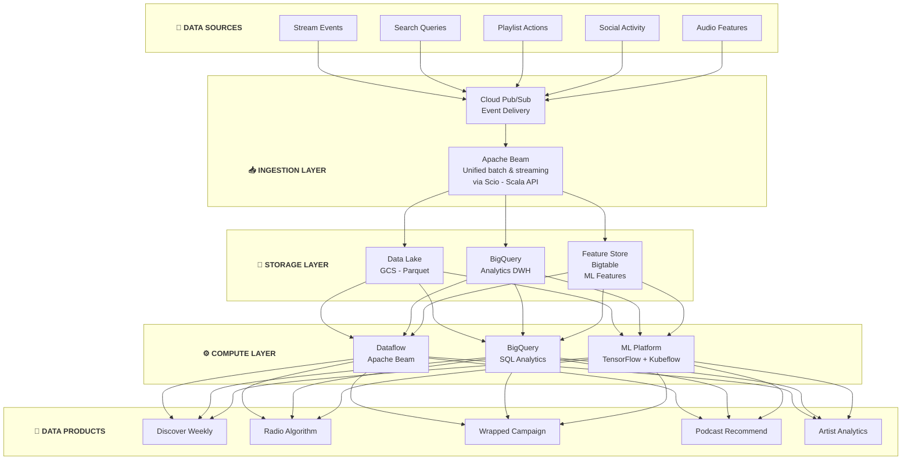

# Spotify Data Platform Architecture

## Kiến Trúc Data Platform Của Spotify - The Audio Streaming Leader

---

## 🏢 TỔNG QUAN CÔNG TY

- **Quy mô:** 600+ triệu users, 220+ triệu premium subscribers
- **Content:** 100+ triệu tracks, 5+ triệu podcasts
- **Scale:** 70+ markets, billions of streams/day
- **Open source contributions:** Luigi, Backstage, Scio, Heroic

---

## 🏗️ TỔNG QUAN KIẾN TRÚC



---

## 🔧 TECH STACK CHI TIẾT

### 1. Google Cloud Platform (Primary Cloud)

```
SPOTIFY ON GCP:

┌─────────────────────────────────────────────────────────────────┐
│                    GCP SERVICES USED                             │
│                                                                  │
│  Compute:                                                        │
│  ├── Google Kubernetes Engine (GKE)                             │
│  ├── Cloud Dataflow (Apache Beam)                               │
│  └── Cloud Composer (Airflow managed)                           │
│                                                                  │
│  Storage:                                                        │
│  ├── Google Cloud Storage (GCS) - Data lake                    │
│  ├── BigQuery - Analytics warehouse                             │
│  ├── Cloud Bigtable - Feature serving                          │
│  └── Cloud Spanner - Global metadata                           │
│                                                                  │
│  Streaming:                                                      │
│  └── Cloud Pub/Sub - Event streaming                            │
│                                                                  │
│  ML:                                                             │
│  ├── Vertex AI                                                  │
│  └── TensorFlow Extended (TFX)                                  │
└─────────────────────────────────────────────────────────────────┘


WHY GCP:

- BigQuery: Excellent for analytics at scale
- Dataflow: Unified batch/streaming
- Managed services: Less operational overhead
- Cost: Competitive for their workload
```

### 2. Scio (Spotify Created)

```
SCIO - SCALA API FOR APACHE BEAM:

┌─────────────────────────────────────────────────────────────────┐
│                        SCIO                                      │
│          (Scala library for Apache Beam on GCP)                 │
│                                                                  │
│  Example Pipeline:                                               │
│  ┌──────────────────────────────────────────────────────────┐   │
│  │                                                           │   │
│  │  import com.spotify.scio._                                │   │
│  │  import com.spotify.scio.bigquery._                       │   │
│  │                                                           │   │
│  │  object StreamsETL {                                      │   │
│  │    def main(args: Array[String]): Unit = {                │   │
│  │      val sc = ScioContext(args)                           │   │
│  │                                                           │   │
│  │      sc.pubsubSubscription("streams-sub")                 │   │
│  │        .map(parseStreamEvent)                             │   │
│  │        .filter(_.duration > 30000) // > 30 sec           │   │
│  │        .groupByKey(_.userId)                              │   │
│  │        .mapValues(calculateMetrics)                       │   │
│  │        .saveAsBigQuery("streams.daily_metrics")           │   │
│  │                                                           │   │
│  │      sc.run()                                             │   │
│  │    }                                                      │   │
│  │  }                                                        │   │
│  │                                                           │   │
│  └──────────────────────────────────────────────────────────┘   │
│                                                                  │
│  Benefits:                                                       │
│  - Type-safe Scala API                                          │
│  - Same code for batch and streaming                            │
│  - BigQuery, Bigtable, Pub/Sub integration                      │
│  - Functional programming style                                 │
└─────────────────────────────────────────────────────────────────┘
```

### 3. Luigi (Spotify Created - Legacy)

```
LUIGI HISTORY:

Created: 2012 (before Airflow)
Status: Still maintained, but Spotify uses Cloud Composer now

┌─────────────────────────────────────────────────────────────────┐
│                        LUIGI                                     │
│              (Python workflow framework)                        │
│                                                                  │
│  class ProcessStreams(luigi.Task):                              │
│      date = luigi.DateParameter()                               │
│                                                                  │
│      def requires(self):                                        │
│          return ExtractStreams(date=self.date)                  │
│                                                                  │
│      def output(self):                                          │
│          return luigi.LocalTarget(                              │
│              f"/data/processed/{self.date}.parquet"             │
│          )                                                      │
│                                                                  │
│      def run(self):                                             │
│          # Processing logic                                     │
│          with self.output().open('w') as f:                     │
│              f.write(processed_data)                            │
│                                                                  │
│  Key Concepts:                                                   │
│  - Task = unit of work                                          │
│  - Target = output (idempotency check)                          │
│  - Dependency resolution                                        │
│  - Central scheduler                                            │
└─────────────────────────────────────────────────────────────────┘

Luigi vs Airflow:
- Luigi: Task-centric, simpler
- Airflow: DAG-centric, more features
- Both influenced by Spotify/Airbnb needs
```

### 4. Backstage (Developer Portal)

```
BACKSTAGE ARCHITECTURE:

┌─────────────────────────────────────────────────────────────────┐
│                        BACKSTAGE                                 │
│              (Developer Portal Platform)                        │
│                                                                  │
│  ┌──────────────────────────────────────────────────────────┐   │
│  │                   Software Catalog                        │   │
│  │  - All services, libraries, data pipelines               │   │
│  │  - Ownership information                                  │   │
│  │  - Dependencies graph                                     │   │
│  │  - Documentation links                                    │   │
│  └──────────────────────────────────────────────────────────┘   │
│                                                                  │
│  ┌──────────────────────────────────────────────────────────┐   │
│  │                   Software Templates                      │   │
│  │  - Create new services (scaffolding)                     │   │
│  │  - Standard project structure                            │   │
│  │  - CI/CD setup                                           │   │
│  │  - Best practices embedded                               │   │
│  └──────────────────────────────────────────────────────────┘   │
│                                                                  │
│  ┌──────────────────────────────────────────────────────────┐   │
│  │                   TechDocs                                │   │
│  │  - Documentation as code                                 │   │
│  │  - Markdown in repo                                      │   │
│  │  - Rendered in Backstage                                 │   │
│  └──────────────────────────────────────────────────────────┘   │
│                                                                  │
│  ┌──────────────────────────────────────────────────────────┐   │
│  │                   Plugins                                 │   │
│  │  - CI/CD status                                          │   │
│  │  - Cost tracking                                         │   │
│  │  - Data lineage                                          │   │
│  │  - API documentation                                     │   │
│  └──────────────────────────────────────────────────────────┘   │
│                                                                  │
│  Now: CNCF Incubating Project                                   │
│  Used by: 2000+ companies                                       │
└─────────────────────────────────────────────────────────────────┘
```

---

## 🎯 KEY DATA PRODUCTS

### 1. Discover Weekly (Personalized Playlist)

**WHAT - Mục tiêu:**
- Personalized music discovery for 600M+ users
- 30 new songs every Monday
- Balance familiarity với novelty
- Drive user engagement và retention

**HOW - Implementation:**

```
DISCOVER WEEKLY PIPELINE:

┌─────────────────────────────────────────────────────────────────┐
│                    DISCOVER WEEKLY                               │
│              (30 songs every Monday)                            │
│                                                                  │
│  Step 1: User Taste Profile                                      │
│  ┌──────────────────────────────────────────────────────────┐   │
│  │  - Listening history (weighted by recency)               │   │
│  │  - Skip patterns                                          │   │
│  │  - Saves and likes                                        │   │
│  │  - Playlist additions                                     │   │
│  │  => User embedding vector                                 │   │
│  └──────────────────────────────────────────────────────────┘   │
│                                                                  │
│  Step 2: Collaborative Filtering                                 │
│  ┌──────────────────────────────────────────────────────────┐   │
│  │  Users who listen to similar tracks...                   │   │
│  │  also listen to: [candidate tracks]                      │   │
│  │                                                           │   │
│  │  User A: [Track1, Track2, Track3, Track7]                │   │
│  │  User B: [Track1, Track2, Track4, Track8] <- similar    │   │
│  │                                                           │   │
│  │  Recommend Track4, Track8 to User A                      │   │
│  └──────────────────────────────────────────────────────────┘   │
│                                                                  │
│  Step 3: Audio Analysis (Content-based)                          │
│  ┌──────────────────────────────────────────────────────────┐   │
│  │  Track Features:                                          │   │
│  │  - Tempo, key, mode                                      │   │
│  │  - Energy, danceability                                  │   │
│  │  - Acousticness, instrumentalness                        │   │
│  │  - Deep learning audio embeddings                        │   │
│  │                                                           │   │
│  │  Find tracks with similar audio features                 │   │
│  └──────────────────────────────────────────────────────────┘   │
│                                                                  │
│  Step 4: NLP (Taste Analysis)                                    │
│  ┌──────────────────────────────────────────────────────────┐   │
│  │  Analyze:                                                 │   │
│  │  - Blog posts about artists                              │   │
│  │  - News articles                                         │   │
│  │  - User reviews                                          │   │
│  │  => Track cultural context embeddings                    │   │
│  └──────────────────────────────────────────────────────────┘   │
│                                                                  │
│  Step 5: Final Ranking                                           │
│  ┌──────────────────────────────────────────────────────────┐   │
│  │  - Combine signals                                       │   │
│  │  - Filter already-heard tracks                           │   │
│  │  - Ensure diversity (genres, artists)                    │   │
│  │  - Novelty vs familiarity balance                        │   │
│  │  => 30 tracks for the week                               │   │
│  └──────────────────────────────────────────────────────────┘   │
└─────────────────────────────────────────────────────────────────┘


MODELS USED:

1. Matrix Factorization:
   - User-item interactions
   - Implicit feedback (plays, skips)

2. Deep Learning:
   - Audio CNN for feature extraction
   - Transformer for NLP

3. Approximate Nearest Neighbor:
   - ANNOY (Spotify created)
   - Fast similarity search at scale
```

**WHY - Lý do & Impact:**
- Most popular personalization feature
- Billions of streams from Discover Weekly alone
- Major differentiator vs competitors
- Drives Premium conversions

---

### 2. Spotify Wrapped

**WHAT - Mục tiêu:**
- Annual personalized listening summary
- Create shareable content for users
- Viral marketing (free PR)
- Celebrate user engagement

**HOW - Implementation:**

```
WRAPPED PIPELINE:

┌─────────────────────────────────────────────────────────────────┐
│                    SPOTIFY WRAPPED                               │
│              (Annual listening summary)                         │
│                                                                  │
│  Data Collection (Year-round):                                   │
│  ┌──────────────────────────────────────────────────────────┐   │
│  │  Stream events -> BigQuery                               │   │
│  │  - Every play, skip, save                                │   │
│  │  - Context (playlist, search, home)                      │   │
│  │  - Duration played                                       │   │
│  └──────────────────────────────────────────────────────────┘   │
│                              │                                   │
│                              v                                   │
│  Aggregation (November):                                         │
│  ┌──────────────────────────────────────────────────────────┐   │
│  │  Per-user aggregates:                                    │   │
│  │  - Top artists (by time)                                 │   │
│  │  - Top songs (by plays)                                  │   │
│  │  - Top genres                                            │   │
│  │  - Total minutes                                         │   │
│  │  - Listening personality                                 │   │
│  │  - Unique stats (e.g., "top 0.1% listener")             │   │
│  └──────────────────────────────────────────────────────────┘   │
│                              │                                   │
│                              v                                   │
│  Pre-computation (December 1):                                   │
│  ┌──────────────────────────────────────────────────────────┐   │
│  │  - Generate 600M+ personalized reports                   │   │
│  │  - Store in Bigtable for fast access                    │   │
│  │  - Pre-render some visualizations                        │   │
│  └──────────────────────────────────────────────────────────┘   │
│                              │                                   │
│                              v                                   │
│  Launch Day:                                                     │
│  ┌──────────────────────────────────────────────────────────┐   │
│  │  - Massive traffic spike                                 │   │
│  │  - Bigtable handles read load                           │   │
│  │  - Social sharing integration                            │   │
│  └──────────────────────────────────────────────────────────┘   │
└─────────────────────────────────────────────────────────────────┘
```

**WHY - Lý do & Impact:**
- Billions of social media impressions
- Equivalent to $100M+ in advertising value
- Reinforces user identity with music
- Drives year-end engagement spike

---

### 3. Radio/Autoplay

**WHAT - Mục tiêu:**
- Continuous music experience
- Keep users engaged when content ends
- Discover related music naturally
- Maximize listening time

**HOW - Implementation:**

```
RADIO ALGORITHM:

User finishes playlist/album
         │
         v
┌──────────────────────────────────────────┐
│ Seed Selection                            │
│ - Last played tracks                      │
│ - Playlist theme                          │
│ - User current mood (inferred)            │
└─────────────────┬────────────────────────┘
                  │
                  v
┌──────────────────────────────────────────┐
│ Candidate Generation                      │
│ - Similar tracks (audio features)         │
│ - Artist relations (graph)                │
│ - Collaborative filtering                 │
└─────────────────┬────────────────────────┘
                  │
                  v
┌──────────────────────────────────────────┐
│ Real-time Ranking                         │
│ - User preferences                        │
│ - Context (time, device)                  │
│ - Variety constraints                     │
└─────────────────┬────────────────────────┘
                  │
                  v
┌──────────────────────────────────────────┐
│ Continuous Adaptation                     │
│ - Track user actions (skips)              │
│ - Adjust on the fly                       │
│ - Learn session preferences               │
└──────────────────────────────────────────┘
```

### 4. Podcast Recommendations

```
PODCAST DISCOVERY:

┌─────────────────────────────────────────────────────────────────┐
│                    PODCAST RECOMMENDATIONS                       │
│                                                                  │
│  Content Understanding:                                          │
│  ┌──────────────────────────────────────────────────────────┐   │
│  │  - Automatic Speech Recognition (ASR)                    │   │
│  │  - Topic modeling from transcripts                       │   │
│  │  - Episode embeddings                                    │   │
│  │  - Show-level features                                   │   │
│  └──────────────────────────────────────────────────────────┘   │
│                                                                  │
│  User Signals:                                                   │
│  ┌──────────────────────────────────────────────────────────┐   │
│  │  - Follow patterns                                       │   │
│  │  - Completion rates (listened to end?)                   │   │
│  │  - Skip patterns                                         │   │
│  │  - Cross-media preferences (music -> podcasts)           │   │
│  └──────────────────────────────────────────────────────────┘   │
│                                                                  │
│  Challenges:                                                     │
│  - Cold start (new podcasts)                                    │
│  - Long-form content (1hr+ episodes)                            │
│  - Different consumption patterns vs music                      │
│  - Episode vs show recommendations                              │
└─────────────────────────────────────────────────────────────────┘
```

---

## 🛠️ SPOTIFY OPEN SOURCE CONTRIBUTIONS

```
SPOTIFY OSS ECOSYSTEM:

Data Engineering:
├── Scio              - Scala API for Apache Beam
├── Luigi             - Workflow management
├── ANNOY             - Approximate Nearest Neighbors
└── Heroic            - Time series database

Developer Experience:
├── Backstage         - Developer portal (CNCF)
├── Tingle            - Push notification library
└── Mobius            - Reactive framework

Audio/ML:
├── Pedalboard        - Audio effects library
├── Basic-pitch       - Audio-to-MIDI
└── Klio              - Audio ML pipelines
```

---

## 📊 SCALE & NUMBERS

```
SPOTIFY BY THE NUMBERS:

Content:
- 600M+ monthly active users
- 100M+ tracks
- 5M+ podcasts
- 4B+ playlists

Data:
- Billions of stream events/day
- Petabytes in BigQuery
- Exabytes in GCS
- 1000s of ML models

Infrastructure:
- 100s of microservices
- 10,000s of Dataflow jobs/day
- Multi-region GCP deployment
```

---

## 🔑 KEY LESSONS

### 1. Cloud-Native from Early Days
- GCP partnership since 2016
- Managed services reduce ops burden
- Focus on product, not infrastructure

### 2. Audio Features are Unique
- Deep learning on audio
- Content-based + collaborative filtering
- Audio analysis at petabyte scale

### 3. Developer Experience Matters
- Backstage created for internal use
- Now CNCF project
- Reduces cognitive load

### 4. Personalization at Scale
- Every user gets unique experience
- Balance exploration vs exploitation
- Context-aware recommendations

### 5. Real-time + Batch Hybrid
- Scio/Beam for unified processing
- Near-real-time for recommendations
- Batch for analytics and Wrapped

---

## 🔗 OPEN-SOURCE REPOS (Verified)

Spotify đóng góp nhiều tools cho cộng đồng, đặc biệt về developer experience:

| Repo | Stars | Mô Tả |
|------|-------|--------|
| [spotify/luigi](https://github.com/spotify/luigi) | 18.7k⭐ | Python batch pipeline framework — **Spotify tạo ra** (Erik Bernhardsson). Tiền bối của Airflow. |
| [backstage/backstage](https://github.com/backstage/backstage) | 29k⭐ | Developer portal platform — **Spotify tạo ra**, donated cho CNCF. |
| [spotify/scio](https://github.com/spotify/scio) | 2.5k⭐ | Scala API cho Apache Beam — **Spotify tạo ra** cho data processing. |

> 💡 **Hands-on:** `backstage/backstage` có hướng dẫn setup nhanh với `npx @backstage/create-app`. `spotify/luigi` dễ bắt đầu với `pip install luigi`.

---

## 📚 REFERENCES

**Engineering Blog:**
- Spotify Engineering: https://engineering.atspotify.com/

**Key Articles:**
- How Discover Weekly Works
- Backstage: https://backstage.io/
- Scio: https://spotify.github.io/scio/

**Talks:**
- Personalization at Spotify
- Building the World's Largest Music Catalog

---

*Document Version: 1.1*
*Last Updated: February 2026*
