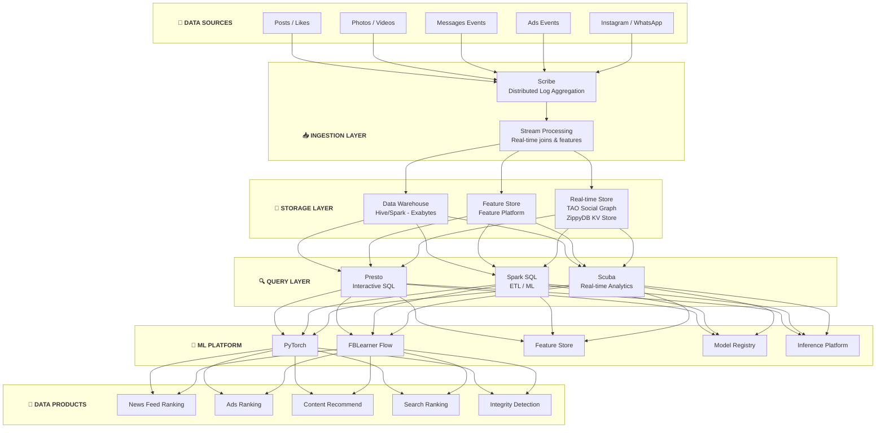
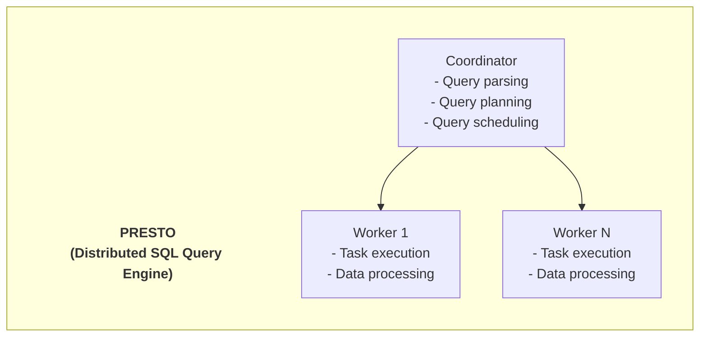
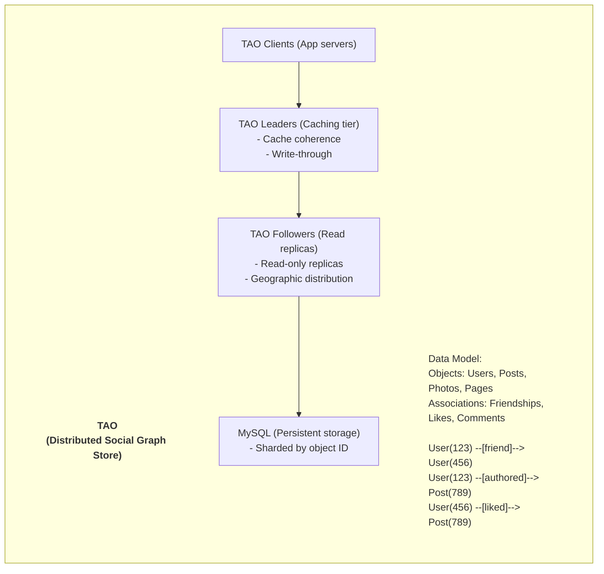
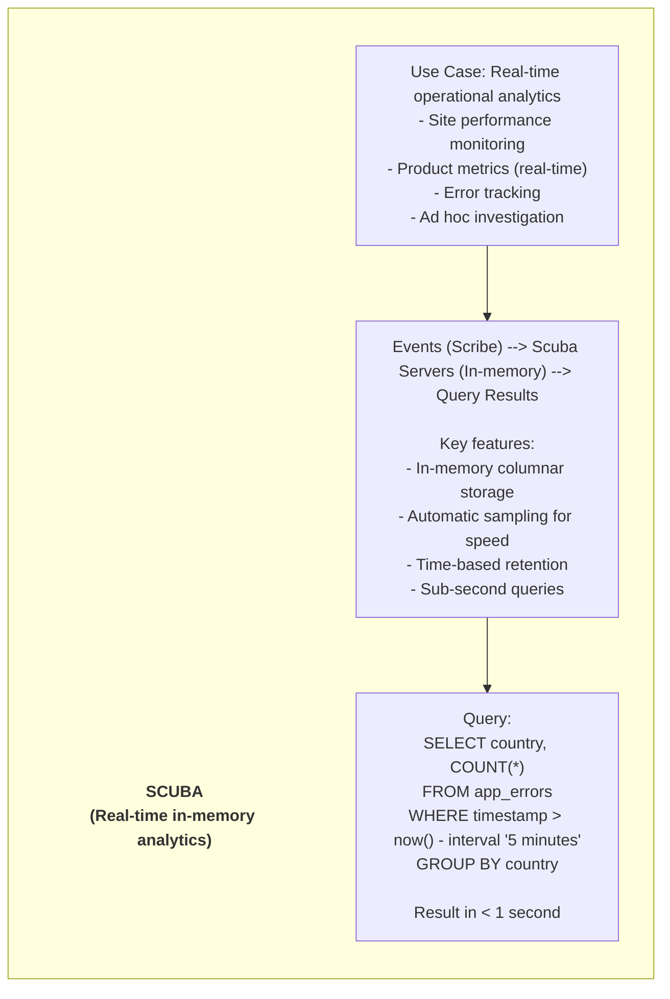
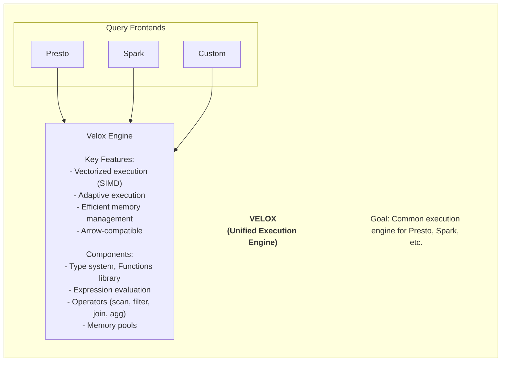
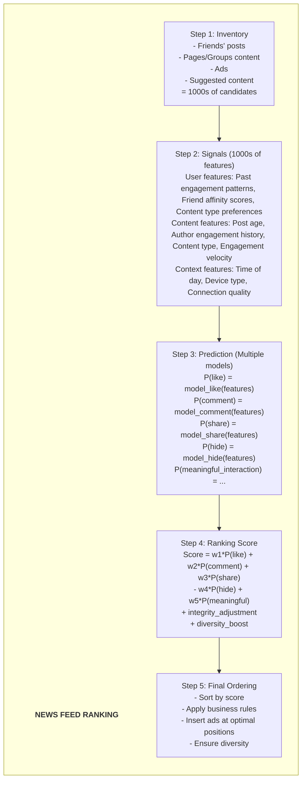
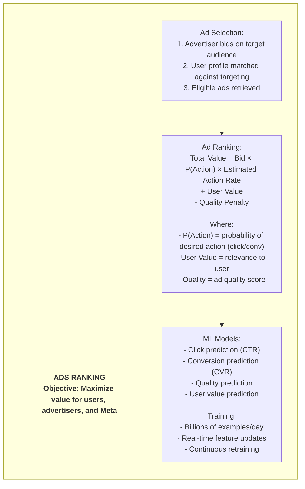
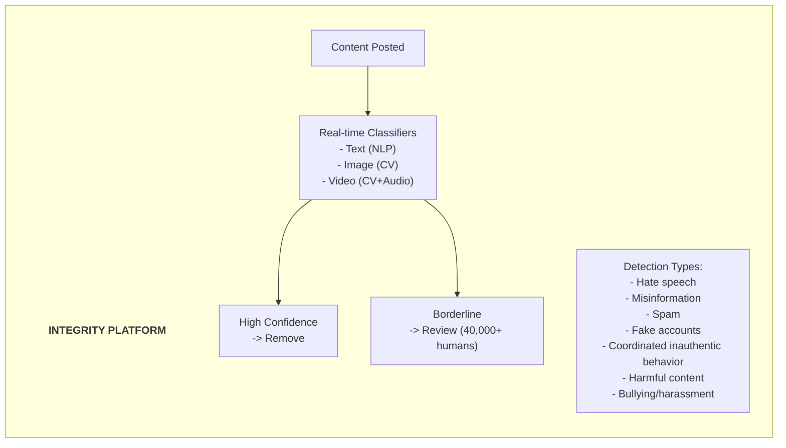

# Meta/Facebook Data Platform Architecture

## Kiến Trúc Data Platform Của Meta - The Social Network Giant

---

## 🏢 TỔNG QUAN CÔNG TY

- **Quy mô:** 3+ tỷ monthly active users (Facebook, Instagram, WhatsApp)
- **Data scale:** Exabytes of data, largest data warehouse in the world
- **Innovation:** Pioneers of many data technologies
- **Open source contributions:** Presto, Spark improvements, RocksDB, Velox, PyTorch

---

## 🏗️ TỔNG QUAN KIẾN TRÚC



---

## 🔧 TECH STACK CHI TIẾT

### 1. Presto (Meta Created)

**Origin:** Created by Facebook in 2012, now Trino (fork) and PrestoDB

```


> **Connectors:** Hive (HDFS/S3), MySQL, Kafka, Cassandra, Custom connectors
> 
> **PRESTO AT META:**
> 
> * **Scale:** 1000s of queries/second, 300+ PB scanned/day, 10,000s of users
> * **Use cases:** Interactive analytics (seconds), A/B test analysis, Ad-hoc exploration, Dashboard backend
```

### 2. Spark at Meta Scale

```
> **SPARK AT META:**
> 
> * **Scale:**
>   * 10,000s of jobs/day
>   * 1,000s of TB processed/day
>   * Multi-exabyte data lake
> 
> * **Optimizations by Meta:**
>   1. **Shuffle Optimization:** Custom shuffle service, Disaggregated shuffle storage
>   2. **Adaptive Query Execution:** Runtime re-optimization, Dynamic partition coalescing
>   3. **Resource Management:** Custom YARN scheduler, Preemption for priority jobs
>   4. **Caching:** Distributed cache (Alluxio-like), Hot data acceleration
> 
> * **Use cases:**
>   * ETL pipelines
>   * ML training data preparation
>   * Data quality checks
>   * Privacy compliance (data deletion)
```

### 3. TAO (The Associations and Objects)

```


> **TAO Scale:**
> - Billions of objects
> - Trillions of associations
> - 100B+ queries/day
> - 99.9999% cache hit rate
```

### 4. Scuba (Real-time Analytics)

```

```

### 5. Velox (Execution Engine)

```


> **Open sourced:** 2022
> 
> **Used by:** Presto, potentially Spark, custom engines
```

### 6. PyTorch (Deep Learning)

```
> **PYTORCH AT META:**
> 
> * **Created:** 2016 by Facebook AI Research (FAIR)
> * **Status:** Most popular research framework
> 
> * **Use at Meta:**
>   * News Feed ranking
>   * Ads prediction
>   * Content understanding (CV, NLP)
>   * Integrity/safety detection
>   * Recommendations (Reels, Stories)
>   * AR/VR (Reality Labs)
>   * Large Language Models (LLaMA)
> 
> * **Scale:**
>   * 1000s of models in production
>   * 100s of billions of inferences/day
>   * Custom hardware (training + inference)
>   * Largest GPU clusters in the world
```

---

## 🎯 KEY DATA PRODUCTS

### 1. News Feed Ranking

**WHAT - Mục tiêu:**
- Personalized feed for 3B+ users
- Maximize meaningful engagement
- Balance content types (friends, pages, ads)
- Reduce harmful content exposure

**HOW - Implementation:**

```

```

**WHY - Lý do & Impact:**
- Core product driving daily engagement
- Higher relevance = longer session times
- Critical for user retention
- Enables advertising business model

---

### 2. Ads System

**WHAT - Mục tiêu:**
- $100B+/year advertising revenue
- Match ads với relevant users
- Maximize ROI for advertisers
- Maintain good user experience

**HOW - Implementation:**

```


> **Revenue:** $100B+/year from ads
```

**WHY - Lý do & Impact:**
- Primary revenue source
- Better targeting = higher advertiser ROI
- Relevant ads = better user experience
- Self-serve platform = massive scalability

---

### 3. Integrity & Safety

**WHAT - Mục tiêu:**
- Protect 3B+ users from harmful content
- Remove hate speech, misinformation, spam
- Detect fake accounts và coordinated behavior
- Maintain platform trust

**HOW - Implementation:**

```


> **Scale:**
> - Billions of content pieces/day reviewed
> - 100s of languages
> - Milliseconds latency
> - 40,000+ human reviewers for edge cases

**WHY - Lý do & Impact:**
- Critical for platform trust
- Billions of harmful content removed/year
- Regulatory compliance required
- User safety = platform longevity
```

---

## 🛠️ META OPEN SOURCE CONTRIBUTIONS

```
> **META OSS ECOSYSTEM:**
> 
> * **Data Engineering:**
>   * Presto - Distributed SQL (now Trino fork too)
>   * RocksDB - Embedded key-value store
>   * Velox - Unified execution engine
>   * Scribe - Distributed log aggregation
> 
> * **ML/AI:**
>   * PyTorch - Deep learning framework
>   * FAISS - Similarity search
>   * LLaMA - Large language model
>   * Detectron2 - Object detection
>   * fairseq - Sequence modeling
> 
> * **Infrastructure:**
>   * React - UI framework
>   * GraphQL - Query language
>   * Cassandra - Distributed database (co-creator)
>   * Open Compute - Hardware designs
>   * Katran - Load balancer
> 
> * **Mobile:**
>   * React Native - Mobile development
>   * Hermes - JavaScript engine
>   * Litho - UI framework
```

---

## 📊 SCALE & NUMBERS

```
> **META BY THE NUMBERS:**
> 
> * **Users:**
>   * 3.1B daily active users (family of apps)
>   * 3.9B monthly active users
>   * 100+ billion messages/day (WhatsApp + Messenger)
> 
> * **Data:**
>   * Exabytes of data in warehouse
>   * 300+ PB scanned daily by Presto
>   * 100+ trillion edges in social graph
>   * Millions of ML model inferences/second
> 
> * **Infrastructure:**
>   * 100s of thousands of servers
>   * Custom data centers worldwide
>   * Custom hardware (training chips, inference)
>   * One of largest AI compute installations
```

---

## 🔑 KEY LESSONS

### 1. Build for Massive Scale
- Everything designed for billions of users
- Horizontal scaling everywhere
- Caching is critical (TAO)

### 2. Unified Platforms
- Single query engine (Presto)
- Single ML framework (PyTorch)
- Single execution engine (Velox)
- Reduces complexity, improves efficiency

### 3. Open Source Strategy
- Open source core infrastructure
- Community improves products
- Industry standardization benefits everyone

### 4. Real-time is Essential
- Scuba for operational analytics
- Streaming for features
- Sub-second integrity decisions

### 5. ML at the Core
- Every product uses ML
- Custom hardware for scale
- Continuous model improvement

---

## 🔗 OPEN-SOURCE REPOS (Verified)

Meta (Facebook) đóng góp nhiều infrastructure tools trở thành industry standard:

| Repo | Stars | Mô Tả |
|------|-------|--------|
| [prestodb/presto](https://github.com/prestodb/presto) | 16k⭐ | Distributed SQL query engine — **Facebook tạo ra**. Nhánh chính thức. |
| [trinodb/trino](https://github.com/trinodb/trino) | 10k⭐ | Fork của Presto bởi original creators (Martin Traverso, Dain Sundstrom, David Phillips). |
| [pytorch/pytorch](https://github.com/pytorch/pytorch) | 87k⭐ | ML framework — **Meta tạo ra**. Nền tảng cho ML platform của Meta. |
| [facebookincubator/velox](https://github.com/facebookincubator/velox) | 3.4k⭐ | Unified execution engine — **Meta tạo ra**. C++ vectorized execution. |

> 💡 **Lưu ý:** Presto có 2 forks — `prestodb/presto` (Meta maintain) và `trinodb/trino` (original creators). Trino có community active hơn.

---

## 📚 REFERENCES

**Engineering Blog:**
- Meta Engineering: https://engineering.fb.com/

**Key Articles:**
- Presto: https://prestodb.io/
- TAO: https://engineering.fb.com/2013/06/25/core-infra/tao-the-power-of-the-graph/
- Velox: https://velox-lib.io/

**Papers:**
- Presto: SQL on Everything (ICDE 2019)
- TAO: Facebook's Distributed Data Store (USENIX ATC 2013)
- Scuba: Diving into Data at Facebook (VLDB 2013)

---

*Document Version: 1.1*
*Last Updated: February 2026*
