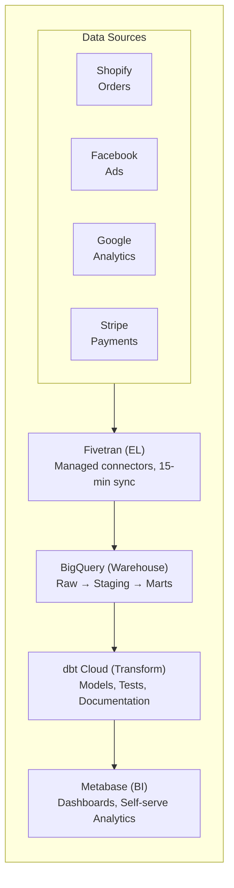
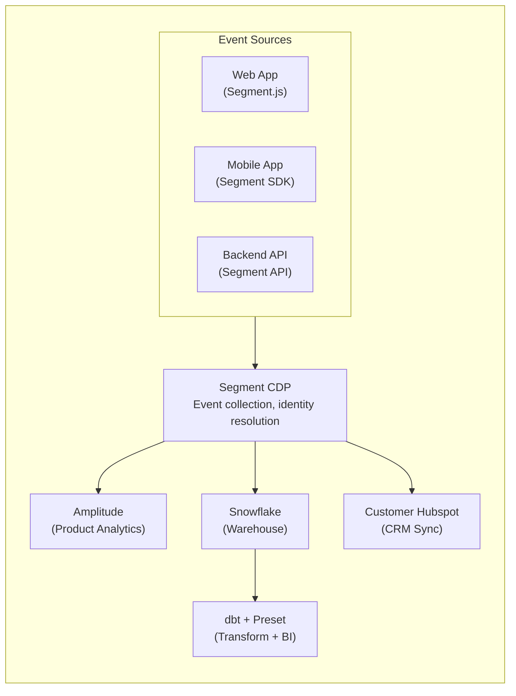
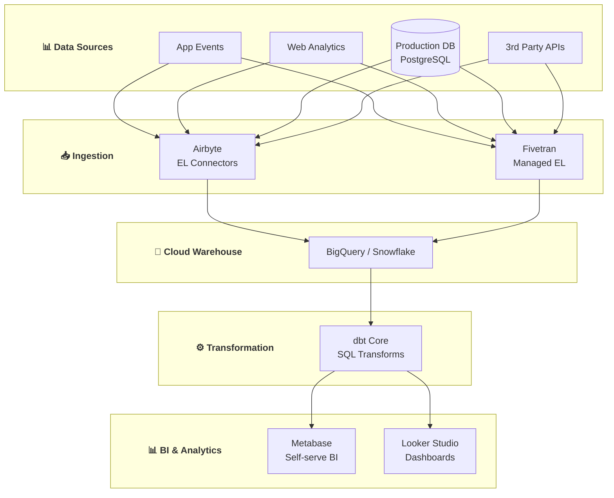

# 🚀 Startup Data Platform Use Cases

> **Data Engineering cho Startups (5-50 nhân viên) - Từ MVP đến Product-Market Fit**

---

## 📋 Mục Lục

1. [Tổng Quan](#-tổng-quan)
2. [E-commerce Startup](#-use-case-1-e-commerce-startup)
3. [SaaS Analytics Startup](#-use-case-2-saas-analytics-startup)
4. [Mobile App Startup](#-use-case-3-mobile-app-startup)
5. [Marketplace Startup](#-use-case-4-marketplace-startup)
6. [Stack Recommendations](#-stack-recommendations)

---

## 🎯 Tổng Quan

### Đặc Điểm Startup Data Engineering

**Constraints:**
- Budget hạn chế (~$500-5000/tháng cho data)
- Team nhỏ (1-3 data engineers hoặc full-stack)
- Time-to-market quan trọng
- Scale chưa lớn (GB đến low TB)

**Priorities:**
- Tốc độ iteration nhanh
- Cost-effective solutions
- Managed services > self-hosted
- Simple architecture > complex

---

## 🛒 Use Case 1: E-commerce Startup

### Scenario: Fashion E-commerce (D2C Brand)

**Company Profile:**
- 20 nhân viên, 2 năm hoạt động
- 50K orders/tháng
- 500K monthly active users
- $2M ARR

---

### 📊 Analytics Pipeline

#### WHAT: Xây dựng Real-time Sales Dashboard

**Business Need:**
- CEO cần biết revenue real-time
- Marketing cần attribution data
- Operations cần inventory alerts

**Deliverables:**
- Real-time sales dashboard
- Daily cohort analysis
- Inventory prediction alerts
- Marketing ROI reports

#### HOW: Implementation

**Architecture:**



**Tech Stack:**

- **Ingestion**: Fivetran ($500/month)
  - Shopify connector
  - Facebook Ads connector
  - Google Analytics connector
  - Stripe connector

- **Warehouse**: BigQuery
  - Pay-per-query pricing
  - ~$100/month at current scale

- **Transform**: dbt Cloud (Developer tier - free)
  - SQL-based transformations
  - Version controlled
  - Automated testing

- **BI**: Metabase (Open source, self-hosted on Cloud Run)
  - ~$30/month hosting

**dbt Models Structure:**

```
models/
├── staging/
│   ├── shopify/
│   │   ├── stg_shopify__orders.sql
│   │   ├── stg_shopify__products.sql
│   │   └── stg_shopify__customers.sql
│   ├── facebook/
│   │   └── stg_facebook__ad_insights.sql
│   └── stripe/
│       └── stg_stripe__charges.sql
├── intermediate/
│   ├── int_orders_enriched.sql
│   └── int_customer_orders.sql
└── marts/
    ├── core/
    │   ├── dim_customers.sql
    │   ├── dim_products.sql
    │   └── fct_orders.sql
    └── marketing/
        ├── fct_daily_ad_performance.sql
        └── fct_customer_acquisition.sql
```

**Sample dbt Model - Customer LTV:**

```sql
-- models/marts/core/fct_customer_ltv.sql

with orders as (
    select * from {{ ref('fct_orders') }}
),

customer_orders as (
    select
        customer_id,
        min(order_date) as first_order_date,
        max(order_date) as last_order_date,
        count(*) as total_orders,
        sum(order_total) as lifetime_value,
        avg(order_total) as avg_order_value,
        datediff('day', min(order_date), max(order_date)) as customer_lifespan_days
    from orders
    group by customer_id
),

customer_cohorts as (
    select
        *,
        date_trunc('month', first_order_date) as cohort_month,
        case
            when total_orders = 1 then 'One-time'
            when total_orders between 2 and 3 then 'Repeat'
            when total_orders >= 4 then 'Loyal'
        end as customer_segment
    from customer_orders
)

select
    customer_id,
    cohort_month,
    first_order_date,
    last_order_date,
    total_orders,
    lifetime_value,
    avg_order_value,
    customer_lifespan_days,
    customer_segment,
    -- Predicted 12-month LTV (simple model)
    lifetime_value * (365.0 / nullif(customer_lifespan_days, 0)) as projected_annual_ltv
from customer_cohorts
```

#### WHY: Business Impact

**Results after 3 months:**

- **Decision Speed**: Từ 1 tuần → 1 ngày cho data-driven decisions
- **Marketing Efficiency**: 35% giảm CAC nhờ attribution chính xác
- **Inventory**: 40% giảm stockouts với demand forecasting
- **Team Productivity**: Marketing tự làm reports, không cần dev

**ROI Calculation:**

```
Monthly Investment:
- Fivetran: $500
- BigQuery: $100  
- Metabase hosting: $30
- dbt Cloud: $0 (free tier)
Total: $630/month

Monthly Savings:
- 1 analyst hour/day saved: $3,000
- Reduced marketing waste: $2,000
- Fewer stockouts: $5,000
- Faster decisions: $2,000 (estimated)
Total Savings: $12,000/month

ROI: 1,805%
```

---

### 🎯 Customer 360 View

#### WHAT: Unified Customer Profile

**Business Need:**
- Customer support cần full context
- Marketing cần segmentation
- Product cần behavior insights

#### HOW: Implementation

**Data Model:**

```sql
-- Customer 360 unified view

create or replace view analytics.customer_360 as
with customer_base as (
    select
        c.customer_id,
        c.email,
        c.first_name,
        c.last_name,
        c.phone,
        c.created_at as registration_date
    from {{ ref('dim_customers') }} c
),

order_metrics as (
    select
        customer_id,
        count(*) as total_orders,
        sum(order_total) as lifetime_value,
        avg(order_total) as avg_order_value,
        min(order_date) as first_purchase_date,
        max(order_date) as last_purchase_date,
        datediff('day', max(order_date), current_date) as days_since_last_purchase
    from {{ ref('fct_orders') }}
    group by customer_id
),

support_metrics as (
    select
        customer_id,
        count(*) as total_tickets,
        avg(resolution_time_hours) as avg_resolution_time,
        sum(case when sentiment = 'negative' then 1 else 0 end) as negative_tickets
    from {{ ref('stg_zendesk__tickets') }}
    group by customer_id
),

email_engagement as (
    select
        customer_id,
        count(*) as emails_received,
        sum(case when opened then 1 else 0 end) as emails_opened,
        sum(case when clicked then 1 else 0 end) as emails_clicked
    from {{ ref('stg_klaviyo__events') }}
    group by customer_id
),

rfm_scores as (
    select
        customer_id,
        -- Recency (1-5, 5 = most recent)
        ntile(5) over (order by days_since_last_purchase desc) as recency_score,
        -- Frequency (1-5, 5 = most frequent)
        ntile(5) over (order by total_orders) as frequency_score,
        -- Monetary (1-5, 5 = highest value)
        ntile(5) over (order by lifetime_value) as monetary_score
    from order_metrics
)

select
    cb.*,
    
    -- Order metrics
    coalesce(om.total_orders, 0) as total_orders,
    coalesce(om.lifetime_value, 0) as lifetime_value,
    om.avg_order_value,
    om.first_purchase_date,
    om.last_purchase_date,
    om.days_since_last_purchase,
    
    -- Support metrics
    coalesce(sm.total_tickets, 0) as support_tickets,
    sm.avg_resolution_time,
    coalesce(sm.negative_tickets, 0) as negative_tickets,
    
    -- Email engagement
    coalesce(ee.emails_opened, 0) * 1.0 / nullif(ee.emails_received, 0) as email_open_rate,
    coalesce(ee.emails_clicked, 0) * 1.0 / nullif(ee.emails_received, 0) as email_click_rate,
    
    -- RFM
    rfm.recency_score,
    rfm.frequency_score,
    rfm.monetary_score,
    (rfm.recency_score + rfm.frequency_score + rfm.monetary_score) as rfm_total,
    
    -- Customer segment
    case
        when om.total_orders is null then 'Never Purchased'
        when om.days_since_last_purchase > 365 then 'Churned'
        when om.days_since_last_purchase > 180 then 'At Risk'
        when om.total_orders >= 5 and om.lifetime_value >= 500 then 'VIP'
        when om.total_orders >= 3 then 'Loyal'
        when om.total_orders >= 2 then 'Repeat'
        else 'New'
    end as customer_segment

from customer_base cb
left join order_metrics om using (customer_id)
left join support_metrics sm using (customer_id)
left join email_engagement ee using (customer_id)
left join rfm_scores rfm using (customer_id)
```

#### WHY: Impact

- **Support**: 50% faster ticket resolution với full context
- **Marketing**: 3x email conversion với proper segmentation
- **Retention**: 25% improvement với churn prediction

---

## 💻 Use Case 2: SaaS Analytics Startup

### Scenario: B2B SaaS Product Analytics

**Company Profile:**
- 15 nhân viên
- 200 paying customers
- $500K ARR
- Product-led growth model

---

### 📈 Product Analytics Pipeline

#### WHAT: Self-serve Product Analytics

**Business Need:**
- Product team cần user behavior insights
- Growth team cần funnel analytics
- CS team cần health scores

#### HOW: Implementation

**Architecture:**



**Event Tracking Plan:**

```yaml
# tracking_plan.yaml

events:
  # User Lifecycle
  - name: User Signed Up
    properties:
      - name: signup_source
        type: string
        enum: [organic, paid, referral, product_hunt]
      - name: plan
        type: string
        enum: [free, starter, pro]
  
  - name: User Activated
    description: User completes onboarding and performs key action
    properties:
      - name: activation_method
        type: string
      - name: time_to_activate_hours
        type: number
  
  # Core Product Events
  - name: Feature Used
    properties:
      - name: feature_name
        type: string
      - name: feature_category
        type: string
      - name: usage_duration_seconds
        type: number
  
  - name: Report Created
    properties:
      - name: report_type
        type: string
      - name: data_sources_count
        type: number
      - name: is_shared
        type: boolean
  
  # Expansion Signals
  - name: Upgrade Viewed
    properties:
      - name: current_plan
        type: string
      - name: viewed_plan
        type: string
      - name: trigger
        type: string
        enum: [limit_hit, feature_gate, manual]
  
  # Churn Signals
  - name: Export Data Requested
    properties:
      - name: data_type
        type: string

identify:
  traits:
    - name: company_name
      type: string
    - name: company_size
      type: string
      enum: [1-10, 11-50, 51-200, 201-500, 500+]
    - name: industry
      type: string
    - name: plan
      type: string
    - name: mrr
      type: number
```

**dbt Models - Product Analytics:**

```sql
-- models/marts/product/fct_user_activity.sql

{{ config(
    materialized='incremental',
    unique_key='activity_date || user_id',
    partition_by={'field': 'activity_date', 'data_type': 'date'}
) }}

with events as (
    select * from {{ ref('stg_segment__events') }}
    
    where event_date >= dateadd('day', -3, current_date)
    
),

daily_activity as (
    select
        user_id,
        date_trunc('day', event_timestamp) as activity_date,
        
        -- Session metrics
        count(distinct session_id) as sessions,
        sum(case when event_name = 'Page Viewed' then 1 else 0 end) as page_views,
        
        -- Feature usage
        sum(case when event_name = 'Feature Used' then 1 else 0 end) as features_used,
        count(distinct case when event_name = 'Feature Used' 
            then event_properties:feature_name end) as unique_features,
        
        -- Core actions
        sum(case when event_name = 'Report Created' then 1 else 0 end) as reports_created,
        sum(case when event_name = 'Dashboard Viewed' then 1 else 0 end) as dashboards_viewed,
        sum(case when event_name = 'Data Exported' then 1 else 0 end) as exports,
        
        -- Engagement depth
        sum(coalesce(event_properties:usage_duration_seconds, 0)) as total_time_seconds,
        
        -- Expansion signals
        sum(case when event_name = 'Upgrade Viewed' then 1 else 0 end) as upgrade_views,
        sum(case when event_name = 'Invite Sent' then 1 else 0 end) as invites_sent,
        
        -- Churn signals
        sum(case when event_name = 'Export Data Requested' then 1 else 0 end) as export_requests,
        sum(case when event_name = 'Cancel Flow Started' then 1 else 0 end) as cancel_attempts

    from events
    group by 1, 2
)

select
    activity_date,
    user_id,
    sessions,
    page_views,
    features_used,
    unique_features,
    reports_created,
    dashboards_viewed,
    exports,
    total_time_seconds,
    round(total_time_seconds / 60.0, 2) as total_time_minutes,
    upgrade_views,
    invites_sent,
    export_requests,
    cancel_attempts,
    
    -- Engagement score (0-100)
    least(100, 
        (sessions * 10) + 
        (unique_features * 5) + 
        (reports_created * 15) +
        (total_time_seconds / 60.0)
    ) as daily_engagement_score

from daily_activity
```

**Customer Health Score:**

```sql
-- models/marts/product/customer_health_score.sql

with customer_base as (
    select * from {{ ref('dim_accounts') }}
    where status = 'active'
),

usage_last_30d as (
    select
        account_id,
        count(distinct user_id) as active_users,
        count(distinct activity_date) as active_days,
        sum(sessions) as total_sessions,
        sum(features_used) as total_feature_usage,
        sum(reports_created) as total_reports,
        avg(daily_engagement_score) as avg_engagement_score
    from {{ ref('fct_user_activity') }} ua
    join {{ ref('dim_users') }} u using (user_id)
    where activity_date >= dateadd('day', -30, current_date)
    group by account_id
),

usage_trend as (
    select
        account_id,
        -- Compare last 14 days vs previous 14 days
        sum(case when activity_date >= dateadd('day', -14, current_date) 
            then daily_engagement_score else 0 end) as recent_engagement,
        sum(case when activity_date between dateadd('day', -28, current_date) 
            and dateadd('day', -15, current_date) 
            then daily_engagement_score else 0 end) as previous_engagement
    from {{ ref('fct_user_activity') }} ua
    join {{ ref('dim_users') }} u using (user_id)
    where activity_date >= dateadd('day', -28, current_date)
    group by account_id
),

support_signals as (
    select
        account_id,
        count(*) as tickets_last_30d,
        avg(csat_score) as avg_csat,
        sum(case when priority = 'urgent' then 1 else 0 end) as urgent_tickets
    from {{ ref('stg_zendesk__tickets') }}
    where created_at >= dateadd('day', -30, current_date)
    group by account_id
),

billing_signals as (
    select
        account_id,
        max(case when status = 'failed' then 1 else 0 end) as has_failed_payment,
        max(case when event_type = 'downgrade' then 1 else 0 end) as has_downgraded
    from {{ ref('stg_stripe__events') }}
    where created_at >= dateadd('day', -90, current_date)
    group by account_id
)

select
    cb.account_id,
    cb.account_name,
    cb.plan,
    cb.mrr,
    cb.contract_end_date,
    datediff('day', current_date, cb.contract_end_date) as days_until_renewal,
    
    -- Usage metrics
    coalesce(u.active_users, 0) as active_users_30d,
    cb.total_seats,
    round(coalesce(u.active_users, 0) * 100.0 / nullif(cb.total_seats, 0), 1) as seat_utilization_pct,
    coalesce(u.active_days, 0) as active_days_30d,
    coalesce(u.avg_engagement_score, 0) as avg_engagement_score,
    
    -- Trend
    case 
        when ut.previous_engagement = 0 then null
        else round((ut.recent_engagement - ut.previous_engagement) * 100.0 
            / ut.previous_engagement, 1)
    end as engagement_trend_pct,
    
    -- Support
    coalesce(ss.tickets_last_30d, 0) as support_tickets_30d,
    ss.avg_csat,
    
    -- Health Score Components (each 0-25, total 0-100)
    -- Engagement (0-25)
    least(25, coalesce(u.avg_engagement_score, 0) / 4) as engagement_component,
    
    -- Adoption (0-25)
    least(25, coalesce(u.active_users, 0) * 100.0 / nullif(cb.total_seats, 0) / 4) as adoption_component,
    
    -- Growth (0-25)
    case
        when ut.recent_engagement > ut.previous_engagement * 1.1 then 25
        when ut.recent_engagement > ut.previous_engagement then 20
        when ut.recent_engagement > ut.previous_engagement * 0.9 then 15
        when ut.recent_engagement > ut.previous_engagement * 0.7 then 10
        else 5
    end as growth_component,
    
    -- Support Health (0-25)
    case
        when coalesce(ss.tickets_last_30d, 0) = 0 then 20
        when coalesce(ss.avg_csat, 5) >= 4.5 then 25
        when coalesce(ss.avg_csat, 5) >= 4.0 then 20
        when coalesce(ss.avg_csat, 5) >= 3.5 then 15
        else 10
    end - coalesce(ss.urgent_tickets, 0) * 5 as support_component,
    
    -- Churn risks
    coalesce(bs.has_failed_payment, 0) as has_failed_payment,
    coalesce(bs.has_downgraded, 0) as has_downgraded,
    
    -- Final Health Score
    (
        least(25, coalesce(u.avg_engagement_score, 0) / 4) +
        least(25, coalesce(u.active_users, 0) * 100.0 / nullif(cb.total_seats, 0) / 4) +
        case
            when ut.recent_engagement > ut.previous_engagement * 1.1 then 25
            when ut.recent_engagement > ut.previous_engagement then 20
            when ut.recent_engagement > ut.previous_engagement * 0.9 then 15
            else 10
        end +
        case
            when coalesce(ss.tickets_last_30d, 0) = 0 then 20
            when coalesce(ss.avg_csat, 5) >= 4.5 then 25
            else 15
        end
        - coalesce(bs.has_failed_payment, 0) * 10
        - coalesce(bs.has_downgraded, 0) * 15
    ) as health_score,
    
    -- Health category
    case
        when (/* health_score calculation */) >= 80 then 'Healthy'
        when (/* health_score calculation */) >= 60 then 'Neutral'
        when (/* health_score calculation */) >= 40 then 'At Risk'
        else 'Critical'
    end as health_category

from customer_base cb
left join usage_last_30d u using (account_id)
left join usage_trend ut using (account_id)
left join support_signals ss using (account_id)
left join billing_signals bs using (account_id)
```

#### WHY: Business Impact

**Results:**

- **Churn Reduction**: 40% decrease trong churn rate
- **Expansion Revenue**: 2x tăng expansion MRR với upsell signals
- **Product Decisions**: Feature prioritization dựa trên actual usage
- **CS Efficiency**: 60% giảm time-to-value cho new customers

---

## 📱 Use Case 3: Mobile App Startup

### Scenario: Fitness App

**Company Profile:**
- 10 nhân viên
- 100K MAU (free + premium)
- $200K ARR
- Freemium model

---

### 📲 Mobile Analytics Pipeline

#### WHAT: User Journey Analytics

**Goals:**
- Understand activation funnel
- Optimize free-to-paid conversion
- Reduce Day 7/30 churn

#### HOW: Implementation

**Stack (Budget-optimized):**

```
Mobile App → Mixpanel (Free tier, 1M events/month)
                  ↓
              Mixpanel Warehouse Connector
                  ↓
              BigQuery (Pay per query)
                  ↓
              dbt + Looker Studio (Free)
```

**Activation Funnel Analysis:**

```sql
-- models/marts/growth/activation_funnel.sql

with user_signups as (
    select
        user_id,
        signup_date,
        signup_platform,
        acquisition_source
    from {{ ref('dim_users') }}
    where signup_date >= dateadd('day', -90, current_date)
),

activation_steps as (
    select
        u.user_id,
        u.signup_date,
        u.acquisition_source,
        
        -- Step 1: Completed onboarding
        min(case when e.event_name = 'Onboarding Completed' 
            then e.event_timestamp end) as onboarding_completed_at,
        
        -- Step 2: Created first workout
        min(case when e.event_name = 'Workout Created' 
            then e.event_timestamp end) as first_workout_at,
        
        -- Step 3: Completed first workout
        min(case when e.event_name = 'Workout Completed' 
            then e.event_timestamp end) as first_workout_completed_at,
        
        -- Step 4: Day 2 return
        min(case when e.event_name = 'App Opened' 
            and date(e.event_timestamp) = dateadd('day', 1, u.signup_date)
            then e.event_timestamp end) as day2_return_at,
        
        -- Step 5: Activated (completed 3+ workouts in first 7 days)
        sum(case when e.event_name = 'Workout Completed'
            and e.event_timestamp <= dateadd('day', 7, u.signup_date)
            then 1 else 0 end) as workouts_first_7_days

    from user_signups u
    left join {{ ref('stg_mixpanel__events') }} e 
        on u.user_id = e.user_id
    group by 1, 2, 3
)

select
    signup_date,
    acquisition_source,
    count(*) as signups,
    
    -- Funnel steps
    sum(case when onboarding_completed_at is not null then 1 else 0 end) as completed_onboarding,
    sum(case when first_workout_at is not null then 1 else 0 end) as created_workout,
    sum(case when first_workout_completed_at is not null then 1 else 0 end) as completed_workout,
    sum(case when day2_return_at is not null then 1 else 0 end) as day2_retained,
    sum(case when workouts_first_7_days >= 3 then 1 else 0 end) as activated,
    
    -- Conversion rates
    round(sum(case when onboarding_completed_at is not null then 1 else 0 end) 
        * 100.0 / count(*), 1) as onboarding_rate,
    round(sum(case when first_workout_completed_at is not null then 1 else 0 end) 
        * 100.0 / count(*), 1) as first_workout_rate,
    round(sum(case when workouts_first_7_days >= 3 then 1 else 0 end) 
        * 100.0 / count(*), 1) as activation_rate

from activation_steps
group by 1, 2
order by 1 desc
```

**Retention Cohort:**

```sql
-- models/marts/growth/retention_cohort.sql

with user_cohorts as (
    select
        user_id,
        date_trunc('week', signup_date) as cohort_week,
        signup_date
    from {{ ref('dim_users') }}
),

weekly_activity as (
    select
        user_id,
        date_trunc('week', activity_date) as activity_week
    from {{ ref('fct_user_activity') }}
    group by 1, 2
),

cohort_retention as (
    select
        uc.cohort_week,
        datediff('week', uc.cohort_week, wa.activity_week) as weeks_since_signup,
        count(distinct wa.user_id) as active_users,
        count(distinct uc.user_id) as cohort_size
    from user_cohorts uc
    left join weekly_activity wa on uc.user_id = wa.user_id
    group by 1, 2
)

select
    cohort_week,
    weeks_since_signup,
    active_users,
    cohort_size,
    round(active_users * 100.0 / cohort_size, 1) as retention_rate
from cohort_retention
where weeks_since_signup between 0 and 12
order by cohort_week desc, weeks_since_signup
```

#### WHY: Impact

- **Activation**: +25% activation rate với optimized onboarding
- **Retention**: D7 retention improved từ 25% → 35%
- **Conversion**: Free-to-paid conversion +40%
- **CAC**: Reduced vì tập trung vào high-performing channels

---

## 🏪 Use Case 4: Marketplace Startup

### Scenario: B2B Services Marketplace

**Profile:**
- 25 nhân viên
- Two-sided marketplace
- 1,000 service providers, 5,000 buyers
- $1M GMV/month

---

### 🔄 Marketplace Analytics

#### WHAT: Supply-Demand Analytics

**Goals:**
- Balance supply and demand
- Optimize matching algorithm
- Detect fraud

#### HOW: Implementation

```sql
-- models/marts/marketplace/supply_demand_balance.sql

with daily_supply as (
    select
        date,
        category,
        geography,
        count(distinct provider_id) as active_providers,
        sum(available_capacity) as total_capacity,
        avg(avg_response_time_hours) as avg_response_time
    from {{ ref('fct_provider_daily') }}
    group by 1, 2, 3
),

daily_demand as (
    select
        date,
        category,
        geography,
        count(*) as total_requests,
        count(case when status = 'fulfilled' then 1 end) as fulfilled_requests,
        count(case when status = 'unfulfilled' then 1 end) as unfulfilled_requests,
        avg(time_to_first_response_hours) as avg_time_to_response
    from {{ ref('fct_service_requests') }}
    group by 1, 2, 3
)

select
    coalesce(s.date, d.date) as date,
    coalesce(s.category, d.category) as category,
    coalesce(s.geography, d.geography) as geography,
    
    -- Supply metrics
    coalesce(s.active_providers, 0) as active_providers,
    coalesce(s.total_capacity, 0) as total_capacity,
    
    -- Demand metrics
    coalesce(d.total_requests, 0) as total_requests,
    coalesce(d.fulfilled_requests, 0) as fulfilled_requests,
    coalesce(d.unfulfilled_requests, 0) as unfulfilled_requests,
    
    -- Balance metrics
    round(d.fulfilled_requests * 100.0 / nullif(d.total_requests, 0), 1) as fulfillment_rate,
    round(d.total_requests * 1.0 / nullif(s.active_providers, 0), 2) as requests_per_provider,
    
    -- Capacity utilization
    round(d.fulfilled_requests * 100.0 / nullif(s.total_capacity, 0), 1) as capacity_utilization,
    
    -- Market health indicator
    case
        when d.fulfilled_requests * 100.0 / nullif(d.total_requests, 0) >= 90 
            and d.total_requests * 1.0 / nullif(s.active_providers, 0) between 3 and 10
            then 'Healthy'
        when d.unfulfilled_requests > d.fulfilled_requests then 'Supply Constrained'
        when d.total_requests * 1.0 / nullif(s.active_providers, 0) < 2 then 'Demand Constrained'
        else 'Watch'
    end as market_health

from daily_supply s
full outer join daily_demand d 
    on s.date = d.date 
    and s.category = d.category 
    and s.geography = d.geography
```

#### WHY: Impact

- **Fulfillment Rate**: 75% → 92%
- **Provider Retention**: +30% với better demand routing
- **Take Rate Optimization**: +15% revenue với dynamic pricing
- **Fraud Detection**: $50K/month saved

---

## 🛠️ Stack Recommendations

### By Stage and Budget

**Pre-Seed / MVP ($0-200/month)**

```
Data Collection: Google Analytics 4 (free) + Segment (free tier)
Storage: BigQuery (first 10GB free)
Transform: dbt Core (open source)
BI: Looker Studio (free) or Metabase (self-hosted)
```

**Seed Stage ($200-1000/month)**

```
Data Collection: Segment ($120/month)
Ingestion: Fivetran (free tier + pay-as-you-go)
Storage: BigQuery or Snowflake ($100-300/month)
Transform: dbt Cloud (Developer - free)
BI: Metabase Cloud ($85/month) or Preset ($20/user)
```

**Series A ($1000-5000/month)**

```
Data Collection: Segment ($120/month)
Ingestion: Fivetran ($500-1500/month)
Storage: Snowflake ($500-1500/month)
Transform: dbt Cloud Team ($100/month)
BI: Preset or Sigma ($500-1000/month)
Orchestration: Dagster Cloud (free tier)
```

### Quick Decision Guide

**"Tôi chỉ có 1 tuần để setup"**
→ Fivetran + BigQuery + dbt Cloud + Metabase

**"Tôi muốn tự host everything"**
→ Airbyte + Postgres + dbt Core + Metabase (self-hosted)

**"Tôi cần real-time analytics"**
→ Segment + Amplitude + BigQuery cho deep analysis

**"Tôi là solo founder"**
→ Google Analytics 4 + Google Sheets + Looker Studio

---

---

## 🏗️ Architecture Overview



---

## 🔗 OPEN-SOURCE REPOS (Verified)

| Tool | Repository | Stars | Mô tả |
|------|-----------|-------|-------|
| Airbyte | [airbytehq/airbyte](https://github.com/airbytehq/airbyte) | 16k⭐ | EL platform, 300+ connectors |
| dbt Core | [dbt-labs/dbt-core](https://github.com/dbt-labs/dbt-core) | 10k⭐ | SQL-first transformation |
| Metabase | [metabase/metabase](https://github.com/metabase/metabase) | 39k⭐ | Self-serve BI, easy setup |
| Prefect | [PrefectHQ/prefect](https://github.com/PrefectHQ/prefect) | 17k⭐ | Modern workflow orchestration |
| Superset | [apache/superset](https://github.com/apache/superset) | 63k⭐ | Enterprise BI alternative |
| n8n | [n8n-io/n8n](https://github.com/n8n-io/n8n) | 50k⭐ | Workflow automation |
| DuckDB | [duckdb/duckdb](https://github.com/duckdb/duckdb) | 24k⭐ | In-process analytics DB |

---

## 📚 Key Takeaways

### Principles cho Startup Data Engineering

1. **Start Simple**
   - Spreadsheet → SQL → dbt progression
   - Đừng over-engineer từ đầu

2. **Buy vs Build**
   - Managed services cho core infrastructure
   - Build differentiating analytics

3. **Iterate Fast**
   - Weekly sprints for data work
   - "Good enough" > "perfect"

4. **Data Culture**
   - Self-serve từ sớm
   - Document everything in dbt

5. **Cost Conscious**
   - Monitor warehouse spending
   - Use materialized views wisely
   - Archive cold data

---

**Next Steps:**
- [E-commerce SME Platform](08_Ecommerce_SME_Platform.md) - Chi tiết hơn cho e-commerce
- [SaaS Company Platform](09_SaaS_Company_Platform.md) - Full SaaS metrics
- [Fintech SME Platform](10_Fintech_SME_Platform.md) - Compliance + Analytics
