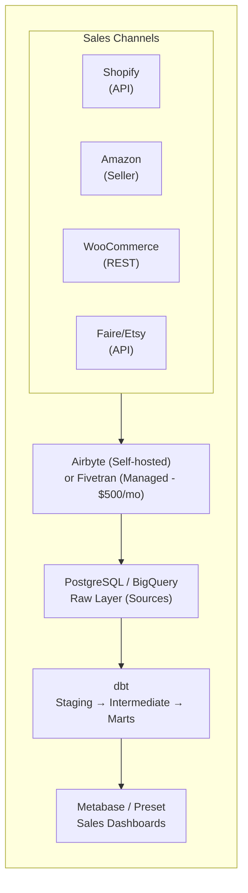
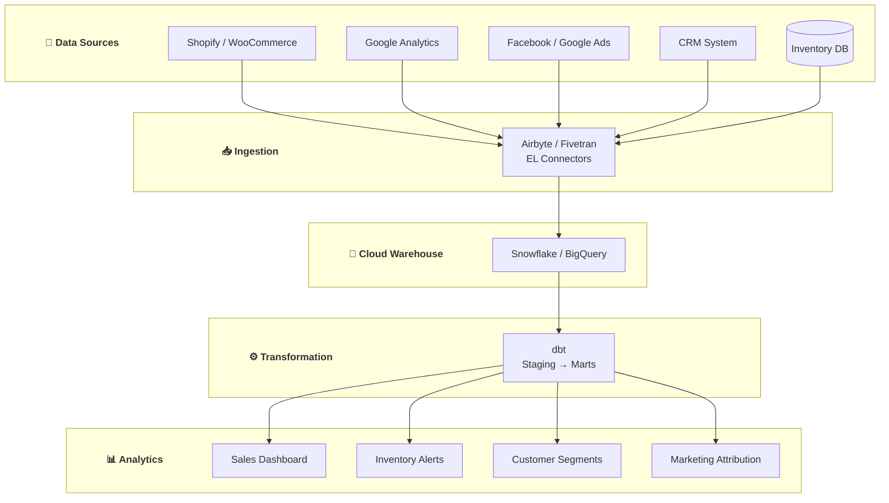

# 🛒 E-commerce SME Data Platform

> **Data Engineering cho E-commerce vừa và nhỏ ($1M - $50M revenue)**

---

## 📋 Mục Lục

1. [Tổng Quan](#-tổng-quan)
2. [Sales Analytics](#-use-case-1-sales-analytics)
3. [Inventory Management](#-use-case-2-inventory-management)
4. [Customer Analytics](#-use-case-3-customer-analytics)
5. [Marketing Attribution](#-use-case-4-marketing-attribution)
6. [Implementation Guide](#-implementation-guide)

---

## 🎯 Tổng Quan

### Company Profile Template

**Typical SME E-commerce:**
- Revenue: $1M - $50M/year
- Orders: 1K - 100K/month
- SKUs: 100 - 10,000
- Channels: Website, Amazon, eBay, Social
- Team: 1-3 people doing data work

### Data Challenges

- Multiple sales channels không synchronized
- Inventory accuracy thấp
- Marketing spend không được track đúng
- Customer data fragmented

---

## 📊 Use Case 1: Sales Analytics

### WHAT: Unified Sales Dashboard

**Business Problem:**
- CEO hỏi "Hôm nay bán được bao nhiêu?" mất 2 giờ để trả lời
- Sales data nằm rải rác: Shopify, Amazon, WooCommerce
- Không biết product nào profitable sau khi tính đủ costs

**Deliverables:**
- Real-time revenue dashboard
- Product profitability analysis
- Channel performance comparison
- Daily/weekly automated reports

---

### HOW: Technical Implementation

**Architecture:**



**Step 1: Data Ingestion Setup**

Airbyte Configuration (Docker Compose):

```yaml
# docker-compose.yml for Airbyte
version: '3.7'
services:
  airbyte-server:
    image: airbyte/airbyte:latest
    ports:
      - "8000:8000"
    volumes:
      - ./airbyte-data:/tmp/airbyte_local
```

**Step 2: dbt Project Structure**

```
ecommerce_analytics/
├── dbt_project.yml
├── models/
│   ├── sources.yml
│   ├── staging/
│   │   ├── shopify/
│   │   │   ├── _shopify__models.yml
│   │   │   ├── stg_shopify__orders.sql
│   │   │   ├── stg_shopify__line_items.sql
│   │   │   ├── stg_shopify__products.sql
│   │   │   ├── stg_shopify__customers.sql
│   │   │   └── stg_shopify__refunds.sql
│   │   ├── amazon/
│   │   │   ├── stg_amazon__orders.sql
│   │   │   ├── stg_amazon__settlements.sql
│   │   │   └── stg_amazon__returns.sql
│   │   └── costs/
│   │       ├── stg_costs__cogs.sql
│   │       └── stg_costs__shipping.sql
│   ├── intermediate/
│   │   ├── int_orders_unioned.sql
│   │   ├── int_orders_with_costs.sql
│   │   └── int_daily_sales.sql
│   └── marts/
│       ├── core/
│       │   ├── dim_products.sql
│       │   ├── dim_customers.sql
│       │   ├── fct_orders.sql
│       │   └── fct_order_items.sql
│       └── sales/
│           ├── sales_daily_summary.sql
│           ├── sales_by_channel.sql
│           └── product_profitability.sql
└── tests/
    └── assert_no_negative_quantities.sql
```

**Step 3: Key dbt Models**

```sql
-- models/staging/shopify/stg_shopify__orders.sql

with source as (
    select * from {{ source('shopify', 'orders') }}
),

renamed as (
    select
        id as order_id,
        'shopify' as channel,
        order_number,
        email as customer_email,
        created_at as order_date,
        updated_at,
        cancelled_at,
        closed_at,
        financial_status,
        fulfillment_status,
        
        -- Monetary
        cast(total_price as decimal(10,2)) as order_total,
        cast(subtotal_price as decimal(10,2)) as subtotal,
        cast(total_discounts as decimal(10,2)) as discount_amount,
        cast(total_tax as decimal(10,2)) as tax_amount,
        cast(total_shipping_price_set:shop_money:amount as decimal(10,2)) as shipping_amount,
        currency,
        
        -- Shipping
        shipping_address:city as shipping_city,
        shipping_address:province as shipping_state,
        shipping_address:country as shipping_country,
        shipping_address:zip as shipping_zip,
        
        -- Attribution
        referring_site,
        source_name as traffic_source,
        landing_site,
        
        -- Metadata
        tags,
        note,
        _airbyte_extracted_at as _loaded_at
        
    from source
    where cancelled_at is null  -- Exclude cancelled orders
)

select * from renamed
```

```sql
-- models/staging/amazon/stg_amazon__orders.sql

with source as (
    select * from {{ source('amazon_seller', 'orders') }}
),

renamed as (
    select
        amazon_order_id as order_id,
        'amazon' as channel,
        amazon_order_id as order_number,
        buyer_email as customer_email,
        purchase_date as order_date,
        last_update_date as updated_at,
        null as cancelled_at,
        null as closed_at,
        order_status as financial_status,
        fulfillment_channel as fulfillment_status,
        
        -- Monetary
        cast(order_total:amount as decimal(10,2)) as order_total,
        cast(item_price as decimal(10,2)) as subtotal,
        cast(promotion_discount as decimal(10,2)) as discount_amount,
        cast(item_tax as decimal(10,2)) as tax_amount,
        cast(shipping_price as decimal(10,2)) as shipping_amount,
        order_total:currency_code as currency,
        
        -- Shipping
        ship_city as shipping_city,
        ship_state as shipping_state,
        ship_country as shipping_country,
        ship_postal_code as shipping_zip,
        
        -- Attribution
        sales_channel as traffic_source,
        
        _airbyte_extracted_at as _loaded_at
        
    from source
    where order_status != 'Cancelled'
)

select * from renamed
```

```sql
-- models/intermediate/int_orders_unioned.sql

{{ config(materialized='view') }}

with shopify_orders as (
    select * from {{ ref('stg_shopify__orders') }}
),

amazon_orders as (
    select * from {{ ref('stg_amazon__orders') }}
),

-- Add more channels as needed

unioned as (
    select * from shopify_orders
    union all
    select * from amazon_orders
)

select
    {{ dbt_utils.generate_surrogate_key(['channel', 'order_id']) }} as order_key,
    *
from unioned
```

```sql
-- models/marts/sales/product_profitability.sql

with order_items as (
    select * from {{ ref('fct_order_items') }}
),

product_costs as (
    select * from {{ ref('stg_costs__cogs') }}
),

product_metrics as (
    select
        oi.product_id,
        oi.product_name,
        oi.channel,
        
        -- Revenue
        count(distinct oi.order_id) as orders,
        sum(oi.quantity) as units_sold,
        sum(oi.line_total) as gross_revenue,
        sum(oi.discount_allocated) as discounts,
        sum(oi.line_total - oi.discount_allocated) as net_revenue,
        
        -- Costs
        sum(oi.quantity * coalesce(pc.unit_cogs, 0)) as cogs,
        sum(oi.quantity * coalesce(pc.unit_shipping_cost, 0)) as shipping_cost,
        sum(case 
            when oi.channel = 'amazon' then oi.line_total * 0.15  -- Amazon fees ~15%
            when oi.channel = 'shopify' then oi.line_total * 0.029 + 0.30  -- Stripe fees
            else oi.line_total * 0.03
        end) as payment_processing_fees,
        
        -- Returns
        sum(oi.returned_quantity) as units_returned,
        sum(oi.refund_amount) as refund_total

    from order_items oi
    left join product_costs pc on oi.sku = pc.sku
    where oi.order_date >= dateadd('day', -90, current_date)
    group by 1, 2, 3
)

select
    product_id,
    product_name,
    channel,
    orders,
    units_sold,
    units_returned,
    round(units_returned * 100.0 / nullif(units_sold, 0), 1) as return_rate,
    
    gross_revenue,
    discounts,
    net_revenue,
    refund_total,
    
    cogs,
    shipping_cost,
    payment_processing_fees,
    
    -- Gross Profit
    net_revenue - refund_total - cogs - shipping_cost - payment_processing_fees as gross_profit,
    
    -- Gross Margin %
    round(
        (net_revenue - refund_total - cogs - shipping_cost - payment_processing_fees) 
        * 100.0 / nullif(net_revenue, 0)
    , 1) as gross_margin_pct,
    
    -- Profit per unit
    round(
        (net_revenue - refund_total - cogs - shipping_cost - payment_processing_fees) 
        / nullif(units_sold - units_returned, 0)
    , 2) as profit_per_unit

from product_metrics
order by gross_profit desc
```

**Step 4: Dashboard Metrics**

Key metrics to display:

```sql
-- models/marts/sales/sales_daily_summary.sql

select
    order_date,
    channel,
    
    -- Volume
    count(distinct order_id) as orders,
    count(distinct customer_email) as customers,
    sum(item_quantity) as units,
    
    -- Revenue
    sum(order_total) as gross_revenue,
    sum(discount_amount) as discounts,
    sum(order_total - discount_amount) as net_revenue,
    
    -- Averages
    round(sum(order_total) / count(distinct order_id), 2) as aov,
    round(sum(item_quantity) / count(distinct order_id), 1) as units_per_order,
    
    -- Comparisons (for dashboards)
    lag(sum(order_total), 7) over (partition by channel order by order_date) as revenue_7d_ago,
    lag(sum(order_total), 30) over (partition by channel order by order_date) as revenue_30d_ago

from {{ ref('fct_orders') }}
group by 1, 2
```

---

### WHY: Business Impact

**Before Implementation:**
- 2-3 hours/day pulling data from different systems
- Monthly financial close took 5 days
- No visibility into true product profitability
- Marketing decisions based on gut feeling

**After Implementation:**

**Time Savings:**
- Real-time dashboard updates → 0 hours pulling data
- Monthly close reduced to 1 day
- **Estimated savings: 60+ hours/month**

**Financial Impact:**
- Discovered 3 products with negative margin → discontinued → saved $15K/year
- Identified best-performing channel → shifted ad spend → +20% ROAS
- Reduced stockouts with better demand visibility → +$50K revenue

**Decision Speed:**
- Daily standups now data-driven
- Price changes implemented within hours based on data
- Promotional decisions backed by historical analysis

---

## 📦 Use Case 2: Inventory Management

### WHAT: Demand Forecasting & Reorder System

**Business Problem:**
- Stockouts costing $20K/month in lost sales
- Overstock tying up $100K in cash
- No visibility into sell-through rates

**Deliverables:**
- Inventory health dashboard
- Automated reorder alerts
- Demand forecasting (basic)

---

### HOW: Technical Implementation

**Data Model:**

```sql
-- models/marts/inventory/inventory_health.sql

with current_inventory as (
    select
        sku,
        product_name,
        warehouse_location,
        quantity_on_hand,
        quantity_reserved,
        quantity_available,
        unit_cost,
        quantity_on_hand * unit_cost as inventory_value
    from {{ ref('stg_inventory__levels') }}
),

sales_velocity as (
    select
        sku,
        
        -- Last 30 days
        sum(case when order_date >= dateadd('day', -30, current_date) 
            then quantity else 0 end) as units_sold_30d,
        
        -- Last 7 days
        sum(case when order_date >= dateadd('day', -7, current_date) 
            then quantity else 0 end) as units_sold_7d,
        
        -- Trend
        sum(case when order_date >= dateadd('day', -14, current_date) 
            then quantity else 0 end) as units_sold_14d_recent,
        sum(case when order_date between dateadd('day', -28, current_date) 
            and dateadd('day', -15, current_date) 
            then quantity else 0 end) as units_sold_14d_previous
        
    from {{ ref('fct_order_items') }}
    where order_date >= dateadd('day', -90, current_date)
    group by sku
),

supplier_lead_times as (
    select
        sku,
        avg_lead_time_days,
        min_order_quantity,
        supplier_name
    from {{ ref('dim_products') }}
)

select
    ci.sku,
    ci.product_name,
    ci.warehouse_location,
    ci.quantity_available,
    ci.inventory_value,
    
    -- Sales velocity
    coalesce(sv.units_sold_30d, 0) as units_sold_30d,
    round(coalesce(sv.units_sold_30d, 0) / 30.0, 2) as daily_run_rate,
    
    -- Days of stock
    case 
        when coalesce(sv.units_sold_30d, 0) = 0 then 999
        else round(ci.quantity_available * 30.0 / sv.units_sold_30d, 0)
    end as days_of_stock,
    
    -- Reorder point (lead time + safety stock)
    round(
        (coalesce(sv.units_sold_30d, 0) / 30.0) 
        * (slt.avg_lead_time_days + 7)  -- 7 days safety stock
    , 0) as reorder_point,
    
    -- Trend
    case
        when sv.units_sold_14d_recent > sv.units_sold_14d_previous * 1.2 then 'Trending Up'
        when sv.units_sold_14d_recent < sv.units_sold_14d_previous * 0.8 then 'Trending Down'
        else 'Stable'
    end as sales_trend,
    
    -- Health status
    case
        when ci.quantity_available <= 0 then 'Out of Stock'
        when ci.quantity_available < round(
            (coalesce(sv.units_sold_30d, 0) / 30.0) * (slt.avg_lead_time_days + 7), 0
        ) then 'Below Reorder Point'
        when ci.quantity_available > coalesce(sv.units_sold_30d, 0) * 3 then 'Overstock'
        else 'Healthy'
    end as stock_status,
    
    -- Recommended action
    case
        when ci.quantity_available <= 0 then 'URGENT: Reorder immediately'
        when ci.quantity_available < round(
            (coalesce(sv.units_sold_30d, 0) / 30.0) * (slt.avg_lead_time_days + 7), 0
        ) then 'Reorder now'
        when ci.quantity_available > coalesce(sv.units_sold_30d, 0) * 6 then 'Consider markdown/promotion'
        else 'No action needed'
    end as recommended_action,
    
    slt.min_order_quantity,
    slt.supplier_name

from current_inventory ci
left join sales_velocity sv using (sku)
left join supplier_lead_times slt using (sku)
```

**Automated Alerts (using dbt + Slack):**

```python
# scripts/inventory_alerts.py

import pandas as pd
from slack_sdk import WebClient
from google.cloud import bigquery

def send_inventory_alerts():
    client = bigquery.Client()
    
    query = """
    SELECT 
        sku,
        product_name,
        quantity_available,
        days_of_stock,
        stock_status,
        recommended_action
    FROM `project.analytics.inventory_health`
    WHERE stock_status IN ('Out of Stock', 'Below Reorder Point')
    ORDER BY days_of_stock
    """
    
    df = client.query(query).to_dataframe()
    
    if len(df) > 0:
        slack = WebClient(token=os.environ['SLACK_TOKEN'])
        
        message = "🚨 *Inventory Alert*\n\n"
        for _, row in df.iterrows():
            emoji = "🔴" if row['stock_status'] == 'Out of Stock' else "🟡"
            message += f"{emoji} *{row['product_name']}* ({row['sku']})\n"
            message += f"   Stock: {row['quantity_available']} | Days left: {row['days_of_stock']}\n"
            message += f"   Action: {row['recommended_action']}\n\n"
        
        slack.chat_postMessage(channel='#inventory-alerts', text=message)

if __name__ == "__main__":
    send_inventory_alerts()
```

---

### WHY: Impact

**Inventory Optimization Results:**

- **Stockouts reduced 70%** → +$14K/month revenue
- **Inventory turnover improved** from 4x to 6x annually
- **Cash freed up**: $40K từ reduced overstock
- **Time saved**: 10 hours/week on manual inventory checks

---

## 👥 Use Case 3: Customer Analytics

### WHAT: Customer Segmentation & LTV

**Business Problem:**
- Treating all customers the same
- No idea which customers are most valuable
- Churn happening without notice

**Deliverables:**
- RFM segmentation
- Customer LTV prediction
- Churn early warning

---

### HOW: Implementation

```sql
-- models/marts/customers/customer_segments.sql

with customer_transactions as (
    select
        customer_email,
        min(order_date) as first_purchase_date,
        max(order_date) as last_purchase_date,
        count(distinct order_id) as total_orders,
        sum(order_total) as lifetime_value,
        avg(order_total) as avg_order_value,
        datediff('day', min(order_date), max(order_date)) as customer_lifespan_days
    from {{ ref('fct_orders') }}
    where customer_email is not null
    group by customer_email
),

rfm_scores as (
    select
        customer_email,
        first_purchase_date,
        last_purchase_date,
        total_orders,
        lifetime_value,
        avg_order_value,
        datediff('day', last_purchase_date, current_date) as days_since_purchase,
        
        -- RFM Scores (1-5, 5 is best)
        ntile(5) over (order by datediff('day', last_purchase_date, current_date) desc) as recency_score,
        ntile(5) over (order by total_orders) as frequency_score,
        ntile(5) over (order by lifetime_value) as monetary_score
        
    from customer_transactions
)

select
    customer_email,
    first_purchase_date,
    last_purchase_date,
    days_since_purchase,
    total_orders,
    lifetime_value,
    avg_order_value,
    
    recency_score,
    frequency_score,
    monetary_score,
    recency_score + frequency_score + monetary_score as rfm_total,
    
    -- Segment based on RFM
    case
        -- Champions: Recent, frequent, high spenders
        when recency_score >= 4 and frequency_score >= 4 and monetary_score >= 4 
            then 'Champions'
        
        -- Loyal: Regular customers with good value
        when frequency_score >= 4 and monetary_score >= 3 
            then 'Loyal Customers'
        
        -- Potential Loyalists: Recent with medium frequency
        when recency_score >= 4 and frequency_score between 2 and 4 
            then 'Potential Loyalists'
        
        -- At Risk: Were good customers, haven't purchased recently
        when recency_score <= 2 and frequency_score >= 3 and monetary_score >= 3 
            then 'At Risk'
        
        -- Can't Lose: Big spenders who are slipping away
        when recency_score <= 2 and monetary_score >= 4 
            then 'Cant Lose Them'
        
        -- Hibernating: Low recent activity
        when recency_score <= 2 and frequency_score <= 2 
            then 'Hibernating'
        
        -- New: First purchase recently
        when total_orders = 1 and recency_score >= 4 
            then 'New Customers'
        
        else 'Others'
    end as customer_segment,
    
    -- Predicted next 12-month value (simple model)
    case
        when recency_score >= 4 and frequency_score >= 3 
            then lifetime_value / nullif(customer_lifespan_days, 0) * 365 * 1.2
        when recency_score <= 2 
            then 0  -- Likely churned
        else lifetime_value / nullif(customer_lifespan_days, 0) * 365 * 0.8
    end as predicted_12m_value

from rfm_scores
```

**Segment Actions:**

```sql
-- models/marts/customers/segment_actions.sql

with segment_stats as (
    select
        customer_segment,
        count(*) as customer_count,
        sum(lifetime_value) as total_ltv,
        avg(lifetime_value) as avg_ltv,
        avg(total_orders) as avg_orders,
        avg(days_since_purchase) as avg_days_since_purchase
    from {{ ref('customer_segments') }}
    group by customer_segment
)

select
    customer_segment,
    customer_count,
    round(customer_count * 100.0 / sum(customer_count) over (), 1) as pct_of_customers,
    total_ltv,
    round(total_ltv * 100.0 / sum(total_ltv) over (), 1) as pct_of_revenue,
    round(avg_ltv, 2) as avg_ltv,
    round(avg_orders, 1) as avg_orders,
    round(avg_days_since_purchase, 0) as avg_days_since_purchase,
    
    -- Recommended actions
    case customer_segment
        when 'Champions' then 'Loyalty rewards, early access, referral program'
        when 'Loyal Customers' then 'Upsell, cross-sell, subscription offers'
        when 'Potential Loyalists' then 'Nurture campaigns, membership offers'
        when 'At Risk' then 'Win-back emails, special offers, survey'
        when 'Cant Lose Them' then 'Personal outreach, exclusive deals, VIP treatment'
        when 'Hibernating' then 'Reactivation campaign, deep discounts'
        when 'New Customers' then 'Onboarding emails, second purchase incentive'
        else 'Standard marketing'
    end as recommended_actions,
    
    -- Email campaign priority
    case customer_segment
        when 'Cant Lose Them' then 1
        when 'At Risk' then 2
        when 'Champions' then 3
        when 'Potential Loyalists' then 4
        when 'Loyal Customers' then 5
        else 6
    end as campaign_priority

from segment_stats
order by campaign_priority
```

---

### WHY: Impact

**Customer Analytics Results:**

- **Repeat purchase rate**: +25% với targeted campaigns
- **Churn prevention**: Saved $30K in "Can't Lose" customers
- **Marketing efficiency**: 40% better email ROI với segmentation
- **Customer LTV**: +15% overall với proper nurturing

---

## 📣 Use Case 4: Marketing Attribution

### WHAT: Multi-touch Attribution

**Business Problem:**
- Không biết marketing channel nào thực sự drive sales
- CAC calculation không chính xác
- Budget allocation dựa trên gut feeling

---

### HOW: Implementation

```sql
-- models/marts/marketing/marketing_attribution.sql

with touchpoints as (
    select
        user_id,
        session_id,
        event_timestamp,
        utm_source,
        utm_medium,
        utm_campaign,
        page_url,
        event_name
    from {{ ref('stg_analytics__events') }}
    where event_timestamp >= dateadd('day', -90, current_date)
),

conversions as (
    select
        customer_email,
        order_id,
        order_date,
        order_total
    from {{ ref('fct_orders') }}
    where order_date >= dateadd('day', -90, current_date)
),

-- Get all touchpoints leading to conversion
user_journey as (
    select
        c.order_id,
        c.order_date,
        c.order_total,
        t.utm_source,
        t.utm_medium,
        t.utm_campaign,
        t.event_timestamp,
        row_number() over (
            partition by c.order_id 
            order by t.event_timestamp
        ) as touch_order,
        row_number() over (
            partition by c.order_id 
            order by t.event_timestamp desc
        ) as reverse_touch_order,
        count(*) over (partition by c.order_id) as total_touches
    from conversions c
    join touchpoints t 
        on c.customer_email = t.user_id
        and t.event_timestamp < c.order_date
        and t.event_timestamp >= dateadd('day', -30, c.order_date)
),

-- Attribution models
attributed as (
    select
        order_id,
        order_total,
        utm_source,
        utm_medium,
        utm_campaign,
        touch_order,
        total_touches,
        
        -- First touch
        case when touch_order = 1 then order_total else 0 end as first_touch_revenue,
        
        -- Last touch
        case when reverse_touch_order = 1 then order_total else 0 end as last_touch_revenue,
        
        -- Linear
        order_total / total_touches as linear_revenue,
        
        -- Position-based (40% first, 40% last, 20% middle)
        case
            when touch_order = 1 then order_total * 0.4
            when reverse_touch_order = 1 then order_total * 0.4
            else order_total * 0.2 / nullif(total_touches - 2, 0)
        end as position_based_revenue
        
    from user_journey
)

select
    coalesce(utm_source, 'direct') as source,
    coalesce(utm_medium, 'none') as medium,
    utm_campaign as campaign,
    
    count(distinct order_id) as conversions,
    count(*) as touchpoints,
    
    sum(first_touch_revenue) as first_touch_revenue,
    sum(last_touch_revenue) as last_touch_revenue,
    sum(linear_revenue) as linear_revenue,
    sum(position_based_revenue) as position_based_revenue

from attributed
group by 1, 2, 3
order by position_based_revenue desc
```

**Channel ROI:**

```sql
-- models/marts/marketing/channel_roi.sql

with attributed_revenue as (
    select * from {{ ref('marketing_attribution') }}
),

ad_spend as (
    select
        date_trunc('month', date) as month,
        source,
        medium,
        sum(spend) as total_spend
    from {{ ref('stg_ads__spend') }}
    group by 1, 2, 3
)

select
    ar.source,
    ar.medium,
    
    -- Revenue (using position-based model)
    sum(ar.position_based_revenue) as attributed_revenue,
    
    -- Spend
    sum(asp.total_spend) as total_spend,
    
    -- ROI metrics
    round(sum(ar.position_based_revenue) / nullif(sum(asp.total_spend), 0), 2) as roas,
    round(sum(asp.total_spend) / nullif(count(distinct ar.order_id), 0), 2) as cac,
    
    -- Efficiency ranking
    rank() over (order by sum(ar.position_based_revenue) / nullif(sum(asp.total_spend), 0) desc) as roas_rank

from attributed_revenue ar
left join ad_spend asp 
    on ar.source = asp.source 
    and ar.medium = asp.medium
group by 1, 2
having sum(asp.total_spend) > 100  -- Minimum spend threshold
order by roas desc
```

---

### WHY: Impact

**Marketing Attribution Results:**

- **ROAS improvement**: +35% với proper attribution
- **Budget reallocation**: Shifted $10K/month to better channels
- **CAC reduction**: -20% với optimized spend
- **Wasted spend eliminated**: $5K/month saved

---

## 🛠️ Implementation Guide

### Phase 1: Foundation (Week 1-2)

**Day 1-3: Infrastructure**
```bash
# Option A: Self-hosted (cost-effective)
docker-compose up -d  # Airbyte + Metabase

# Option B: Managed (faster setup)
# Sign up: Fivetran, BigQuery, Metabase Cloud
```

**Day 4-7: Data Ingestion**
- Connect Shopify/Amazon connectors
- Set up sync schedules (hourly)
- Verify data quality

**Day 8-14: dbt Setup**
```bash
# Initialize dbt project
dbt init ecommerce_analytics
cd ecommerce_analytics

# Install packages
# packages.yml
packages:
  - package: dbt-labs/dbt_utils
    version: 1.1.1
  - package: fivetran/shopify
    version: 0.10.0

dbt deps
```

### Phase 2: Core Models (Week 3-4)

- Build staging models
- Create unified orders model
- Set up tests and documentation

### Phase 3: Analytics (Week 5-6)

- Product profitability
- Customer segments
- Inventory health

### Phase 4: Dashboards & Alerts (Week 7-8)

- Build Metabase dashboards
- Set up Slack alerts
- Train team on self-serve

---

### Cost Summary

**Budget Option (Self-hosted):**
- Airbyte: $0 (open source)
- PostgreSQL: $20/month (small instance)
- dbt Core: $0
- Metabase: $30/month (Cloud Run)
- **Total: ~$50/month**

**Standard Option (Managed):**
- Fivetran: $500/month
- BigQuery: $100/month
- dbt Cloud: $0 (developer)
- Metabase Cloud: $85/month
- **Total: ~$685/month**

**Premium Option:**
- Fivetran: $1,500/month
- Snowflake: $500/month
- dbt Cloud Team: $100/month
- Preset: $300/month
- **Total: ~$2,400/month**

---

---

## 🏗️ Architecture Overview



---

## 🔗 OPEN-SOURCE REPOS (Verified)

| Tool | Repository | Stars | Mô tả |
|------|-----------|-------|-------|
| Airbyte | [airbytehq/airbyte](https://github.com/airbytehq/airbyte) | 16k⭐ | EL connectors (Shopify, GA, Ads) |
| dbt Core | [dbt-labs/dbt-core](https://github.com/dbt-labs/dbt-core) | 10k⭐ | SQL transformation framework |
| Metabase | [metabase/metabase](https://github.com/metabase/metabase) | 39k⭐ | E-commerce dashboards |
| Superset | [apache/superset](https://github.com/apache/superset) | 63k⭐ | Advanced visualization |
| Dagster | [dagster-io/dagster](https://github.com/dagster-io/dagster) | 12k⭐ | Data orchestration |
| Great Expectations | [great-expectations/great_expectations](https://github.com/great-expectations/great_expectations) | 10k⭐ | Data quality checks |
| Saleor | [saleor/saleor](https://github.com/saleor/saleor) | 21k⭐ | E-commerce platform (reference) |

---

## 📚 Key Takeaways

1. **Start with unified orders** - Single source of truth
2. **Product profitability is king** - Know your margins
3. **Customer segments drive growth** - Not all customers are equal
4. **Inventory = Cash** - Optimize aggressively
5. **Attribution = Smart spending** - Stop wasting ad budget

---

**Xem thêm:**
- [SaaS Company Platform](09_SaaS_Company_Platform.md)
- [Fintech SME Platform](10_Fintech_SME_Platform.md)
