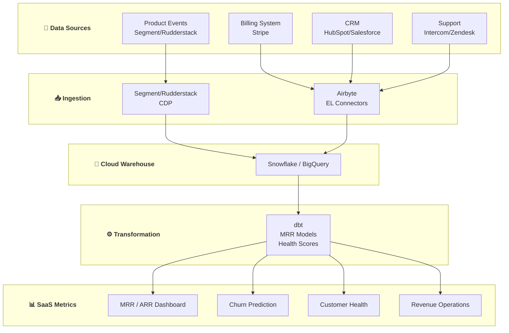

# 💼 SaaS Company Data Platform

> **Data Engineering cho SaaS Companies ($500K - $20M ARR)**

---

## 📋 Mục Lục

1. [Tổng Quan](#-tổng-quan)
2. [Subscription Metrics](#-use-case-1-subscription-metrics)
3. [Product Analytics](#-use-case-2-product-analytics)
4. [Customer Health Scoring](#-use-case-3-customer-health-scoring)
5. [Revenue Operations](#-use-case-4-revenue-operations)
6. [Implementation Guide](#-implementation-guide)

---

## 🎯 Tổng Quan

### Typical SaaS Company Profile

**Company Characteristics:**
- ARR: $500K - $20M
- Customers: 100 - 2,000
- Team: 20 - 200 employees
- Model: B2B subscription (monthly/annual)

### Key Data Challenges

- MRR/ARR calculation phức tạp
- Customer health không được track
- Product usage disconnected từ billing
- Churn prediction reactive, không proactive

---

## 📊 Use Case 1: Subscription Metrics

### WHAT: SaaS Metrics Dashboard

**Business Problem:**
- CFO hỏi "What's our MRR?" - takes 4 hours to calculate
- Board meetings require manual spreadsheet work
- No visibility into MRR movements (new, expansion, churn)

**Deliverables:**
- Real-time MRR/ARR dashboard
- MRR movement breakdown
- Cohort revenue analysis
- Unit economics (LTV, CAC, payback)

---

### HOW: Technical Implementation

**Data Architecture:**

```
┌─────────────────────────────────────────────────────────────┐
│                    Data Sources                              │
├──────────────┬──────────────┬──────────────┬────────────────┤
│   Stripe     │   HubSpot    │   Product    │   Intercom     │
│  (Billing)   │    (CRM)     │   (Events)   │   (Support)    │
└──────┬───────┴──────┬───────┴──────┬───────┴───────┬────────┘
       │              │              │               │
       ▼              ▼              ▼               ▼
┌─────────────────────────────────────────────────────────────┐
│                     Fivetran / Airbyte                       │
└──────────────────────────┬──────────────────────────────────┘
                           │
                           ▼
┌─────────────────────────────────────────────────────────────┐
│                      Snowflake                               │
│                  Raw → Staging → Marts                       │
└──────────────────────────┬──────────────────────────────────┘
                           │
                           ▼
┌─────────────────────────────────────────────────────────────┐
│                          dbt                                 │
│              Subscription Models + Metrics                   │
└──────────────────────────┬──────────────────────────────────┘
                           │
                           ▼
┌─────────────────────────────────────────────────────────────┐
│                    Preset / Sigma                            │
│                  Executive Dashboards                        │
└─────────────────────────────────────────────────────────────┘
```

**Key dbt Models:**

```sql
-- models/staging/stripe/stg_stripe__subscriptions.sql

with source as (
    select * from {{ source('stripe', 'subscriptions') }}
),

renamed as (
    select
        id as subscription_id,
        customer as customer_id,
        
        -- Status
        status as subscription_status,
        cancel_at_period_end,
        canceled_at,
        ended_at,
        
        -- Dates
        created as created_at,
        start_date,
        current_period_start,
        current_period_end,
        trial_start,
        trial_end,
        
        -- Billing
        billing_cycle_anchor,
        collection_method,
        
        -- Plan details (from items)
        items:data[0]:plan:id as plan_id,
        items:data[0]:plan:interval as billing_interval,
        items:data[0]:plan:interval_count as interval_count,
        items:data[0]:quantity as quantity,
        items:data[0]:plan:amount / 100.0 as plan_amount,
        items:data[0]:plan:currency as currency,
        
        -- Calculate MRR
        case
            when items:data[0]:plan:interval = 'month' 
                then items:data[0]:quantity * items:data[0]:plan:amount / 100.0
            when items:data[0]:plan:interval = 'year' 
                then items:data[0]:quantity * items:data[0]:plan:amount / 100.0 / 12
            when items:data[0]:plan:interval = 'week'
                then items:data[0]:quantity * items:data[0]:plan:amount / 100.0 * 52 / 12
        end as mrr,
        
        -- Metadata
        metadata,
        _fivetran_synced as _loaded_at
        
    from source
)

select * from renamed
```

```sql
-- models/intermediate/int_subscription_periods.sql
-- Creates monthly snapshots of subscription status

{{ config(materialized='incremental', unique_key='subscription_month_key') }}

with subscriptions as (
    select * from {{ ref('stg_stripe__subscriptions') }}
),

months as (
    {{ dbt_utils.date_spine(
        datepart="month",
        start_date="'2022-01-01'",
        end_date="dateadd(month, 1, current_date)"
    ) }}
),

subscription_months as (
    select
        s.subscription_id,
        s.customer_id,
        m.date_month,
        s.plan_id,
        s.mrr,
        s.subscription_status,
        s.created_at,
        s.canceled_at,
        s.ended_at,
        
        -- Is subscription active in this month?
        case
            when date_trunc('month', s.start_date) <= m.date_month
                and (s.ended_at is null or date_trunc('month', s.ended_at) >= m.date_month)
                and s.subscription_status in ('active', 'past_due', 'trialing')
            then true
            else false
        end as is_active
        
    from subscriptions s
    cross join months m
    where date_trunc('month', s.created_at) <= m.date_month
)

select
    {{ dbt_utils.generate_surrogate_key(['subscription_id', 'date_month']) }} as subscription_month_key,
    *
from subscription_months
where is_active = true


    and date_month >= dateadd('month', -3, (select max(date_month) from {{ this }}))

```

```sql
-- models/marts/finance/mrr_movements.sql
-- MRR waterfall: New, Expansion, Contraction, Churn, Reactivation

with monthly_mrr as (
    select
        customer_id,
        date_month,
        sum(mrr) as mrr
    from {{ ref('int_subscription_periods') }}
    group by 1, 2
),

mrr_changes as (
    select
        customer_id,
        date_month,
        mrr as current_mrr,
        lag(mrr) over (partition by customer_id order by date_month) as previous_mrr,
        lag(date_month) over (partition by customer_id order by date_month) as previous_month,
        
        -- Months since last MRR
        datediff('month', 
            lag(date_month) over (partition by customer_id order by date_month), 
            date_month
        ) as months_gap
        
    from monthly_mrr
),

categorized as (
    select
        date_month,
        customer_id,
        current_mrr,
        previous_mrr,
        
        -- Categorize MRR movement
        case
            -- New: First month with MRR
            when previous_mrr is null then 'new'
            
            -- Reactivation: Gap > 1 month
            when months_gap > 1 then 'reactivation'
            
            -- Expansion: MRR increased
            when current_mrr > previous_mrr then 'expansion'
            
            -- Contraction: MRR decreased but not zero
            when current_mrr < previous_mrr and current_mrr > 0 then 'contraction'
            
            -- Retained: Same MRR
            when current_mrr = previous_mrr then 'retained'
            
            else 'other'
        end as movement_type,
        
        -- Movement amount
        case
            when previous_mrr is null then current_mrr
            when months_gap > 1 then current_mrr
            else current_mrr - previous_mrr
        end as mrr_change
        
    from mrr_changes
),

-- Add churned customers (had MRR last month, no MRR this month)
churned as (
    select
        dateadd('month', 1, date_month) as date_month,
        customer_id,
        0 as current_mrr,
        mrr as previous_mrr,
        'churn' as movement_type,
        -mrr as mrr_change
    from monthly_mrr
    where not exists (
        select 1 from monthly_mrr m2
        where m2.customer_id = monthly_mrr.customer_id
        and m2.date_month = dateadd('month', 1, monthly_mrr.date_month)
    )
)

select * from categorized
union all
select * from churned
```

```sql
-- models/marts/finance/mrr_summary.sql

with movements as (
    select * from {{ ref('mrr_movements') }}
),

monthly_summary as (
    select
        date_month,
        
        -- Starting MRR (end of previous month)
        sum(case when movement_type = 'retained' then previous_mrr else 0 end) +
        sum(case when movement_type = 'expansion' then previous_mrr else 0 end) +
        sum(case when movement_type = 'contraction' then previous_mrr else 0 end) as starting_mrr,
        
        -- Movements
        sum(case when movement_type = 'new' then mrr_change else 0 end) as new_mrr,
        sum(case when movement_type = 'expansion' then mrr_change else 0 end) as expansion_mrr,
        sum(case when movement_type = 'reactivation' then mrr_change else 0 end) as reactivation_mrr,
        sum(case when movement_type = 'contraction' then mrr_change else 0 end) as contraction_mrr,
        sum(case when movement_type = 'churn' then mrr_change else 0 end) as churned_mrr,
        
        -- Ending MRR
        sum(current_mrr) as ending_mrr,
        
        -- Customer counts
        count(distinct case when movement_type = 'new' then customer_id end) as new_customers,
        count(distinct case when movement_type = 'churn' then customer_id end) as churned_customers,
        count(distinct case when current_mrr > 0 then customer_id end) as active_customers
        
    from movements
    group by date_month
)

select
    date_month,
    starting_mrr,
    new_mrr,
    expansion_mrr,
    reactivation_mrr,
    contraction_mrr,
    churned_mrr,
    ending_mrr,
    ending_mrr * 12 as arr,
    
    -- Net new MRR
    new_mrr + expansion_mrr + reactivation_mrr + contraction_mrr + churned_mrr as net_new_mrr,
    
    -- Growth rates
    round((new_mrr + expansion_mrr + reactivation_mrr) * 100.0 / nullif(starting_mrr, 0), 2) as gross_mrr_growth_rate,
    round((contraction_mrr + churned_mrr) * 100.0 / nullif(starting_mrr, 0), 2) as gross_mrr_churn_rate,
    round((new_mrr + expansion_mrr + reactivation_mrr + contraction_mrr + churned_mrr) * 100.0 / nullif(starting_mrr, 0), 2) as net_mrr_growth_rate,
    
    -- Customer metrics
    new_customers,
    churned_customers,
    active_customers,
    round(ending_mrr / nullif(active_customers, 0), 2) as arpu,
    round(churned_customers * 100.0 / nullif(lag(active_customers) over (order by date_month), 0), 2) as logo_churn_rate

from monthly_summary
order by date_month
```

**Unit Economics:**

```sql
-- models/marts/finance/unit_economics.sql

with customer_cohorts as (
    select
        customer_id,
        date_trunc('month', min(created_at)) as cohort_month
    from {{ ref('stg_stripe__subscriptions') }}
    group by customer_id
),

customer_ltv as (
    select
        c.customer_id,
        c.cohort_month,
        sum(i.amount / 100.0) as total_revenue,
        datediff('month', c.cohort_month, max(i.created)) as customer_months
    from customer_cohorts c
    join {{ ref('stg_stripe__invoices') }} i on c.customer_id = i.customer
    where i.status = 'paid'
    group by 1, 2
),

cohort_stats as (
    select
        cohort_month,
        count(distinct customer_id) as cohort_size,
        avg(total_revenue) as avg_ltv,
        avg(customer_months) as avg_lifetime_months
    from customer_ltv
    group by cohort_month
),

marketing_spend as (
    select
        date_trunc('month', spend_date) as month,
        sum(spend) as total_spend
    from {{ ref('stg_marketing__spend') }}
    group by 1
)

select
    cs.cohort_month,
    cs.cohort_size,
    round(cs.avg_ltv, 2) as avg_ltv,
    round(cs.avg_lifetime_months, 1) as avg_lifetime_months,
    
    -- CAC
    round(ms.total_spend / nullif(cs.cohort_size, 0), 2) as cac,
    
    -- LTV:CAC ratio
    round(cs.avg_ltv / nullif(ms.total_spend / nullif(cs.cohort_size, 0), 0), 2) as ltv_cac_ratio,
    
    -- Payback period (months)
    round(
        (ms.total_spend / nullif(cs.cohort_size, 0)) / 
        nullif(cs.avg_ltv / nullif(cs.avg_lifetime_months, 0), 0)
    , 1) as payback_months

from cohort_stats cs
left join marketing_spend ms on cs.cohort_month = ms.month
order by cohort_month
```

---

### WHY: Business Impact

**Before:**
- 4+ hours to calculate monthly MRR
- Board deck preparation: 2 days
- No MRR movement visibility
- Churn identified after the fact

**After:**

**Operational Efficiency:**
- MRR calculation: Real-time, always accurate
- Board prep: 30 minutes
- **Time saved: 20+ hours/month**

**Strategic Impact:**
- Identified $50K expansion opportunity in underpriced accounts
- Detected contraction trend early → intervention saved $30K MRR
- Optimized pricing based on LTV:CAC analysis → +15% ARPU

---

## 📈 Use Case 2: Product Analytics

### WHAT: Product Usage Insights

**Business Problem:**
- Product team building features không ai dùng
- No data on feature adoption
- Can't correlate usage with retention

**Deliverables:**
- Feature adoption dashboard
- User engagement metrics
- Feature → Retention correlation

---

### HOW: Implementation

```sql
-- models/marts/product/feature_adoption.sql

with events as (
    select * from {{ ref('stg_segment__events') }}
    where event_date >= dateadd('day', -90, current_date)
),

feature_usage as (
    select
        user_id,
        account_id,
        event_name as feature_name,
        date_trunc('week', event_timestamp) as usage_week,
        count(*) as usage_count,
        min(event_timestamp) as first_use,
        max(event_timestamp) as last_use
    from events
    where event_name in (
        'Dashboard Created',
        'Report Generated',
        'Integration Connected',
        'Team Member Invited',
        'API Key Created',
        'Automation Created',
        'Export Downloaded'
    )
    group by 1, 2, 3, 4
),

account_features as (
    select
        account_id,
        array_agg(distinct feature_name) as features_used,
        count(distinct feature_name) as feature_count,
        sum(usage_count) as total_actions
    from feature_usage
    group by account_id
),

feature_stats as (
    select
        feature_name,
        count(distinct account_id) as accounts_using,
        count(distinct user_id) as users_using,
        sum(usage_count) as total_usage,
        avg(usage_count) as avg_usage_per_user
    from feature_usage
    group by feature_name
)

select
    fs.feature_name,
    fs.accounts_using,
    round(fs.accounts_using * 100.0 / (select count(*) from {{ ref('dim_accounts') }} where status = 'active'), 1) as adoption_rate,
    fs.users_using,
    fs.total_usage,
    round(fs.avg_usage_per_user, 1) as avg_usage_per_user,
    
    -- Stickiness (weekly active / monthly active)
    round(
        (select count(distinct user_id) from feature_usage 
         where feature_name = fs.feature_name 
         and usage_week = date_trunc('week', current_date)) * 1.0 /
        nullif(fs.users_using, 0)
    , 2) as weekly_stickiness

from feature_stats fs
order by adoption_rate desc
```

**Feature → Retention Correlation:**

```sql
-- models/marts/product/feature_retention_correlation.sql

with account_features as (
    select
        account_id,
        array_agg(distinct feature_name) as features_used,
        count(distinct feature_name) as feature_count
    from {{ ref('feature_adoption') }}
    group by account_id
),

account_retention as (
    select
        a.account_id,
        a.created_at as signup_date,
        case
            when max(s.date_month) >= dateadd('month', -1, current_date) then 'Active'
            else 'Churned'
        end as status,
        datediff('month', a.created_at, coalesce(max(s.date_month), a.created_at)) as months_retained
    from {{ ref('dim_accounts') }} a
    left join {{ ref('int_subscription_periods') }} s on a.account_id = s.account_id
    where a.created_at >= dateadd('year', -1, current_date)
    group by 1, 2
),

-- Check which features correlate with retention
feature_retention as (
    select
        af.account_id,
        ar.status,
        ar.months_retained,
        af.feature_count,
        
        -- Check each key feature
        array_contains('Dashboard Created'::variant, af.features_used) as uses_dashboards,
        array_contains('Integration Connected'::variant, af.features_used) as uses_integrations,
        array_contains('Team Member Invited'::variant, af.features_used) as has_team,
        array_contains('Automation Created'::variant, af.features_used) as uses_automation,
        array_contains('API Key Created'::variant, af.features_used) as uses_api
        
    from account_features af
    join account_retention ar using (account_id)
)

select
    'Dashboard Created' as feature,
    count(case when uses_dashboards and status = 'Active' then 1 end) as retained_with_feature,
    count(case when uses_dashboards then 1 end) as total_with_feature,
    count(case when not uses_dashboards and status = 'Active' then 1 end) as retained_without_feature,
    count(case when not uses_dashboards then 1 end) as total_without_feature,
    round(count(case when uses_dashboards and status = 'Active' then 1 end) * 100.0 / 
        nullif(count(case when uses_dashboards then 1 end), 0), 1) as retention_with_feature,
    round(count(case when not uses_dashboards and status = 'Active' then 1 end) * 100.0 / 
        nullif(count(case when not uses_dashboards then 1 end), 0), 1) as retention_without_feature
from feature_retention

union all

select
    'Integration Connected' as feature,
    count(case when uses_integrations and status = 'Active' then 1 end),
    count(case when uses_integrations then 1 end),
    count(case when not uses_integrations and status = 'Active' then 1 end),
    count(case when not uses_integrations then 1 end),
    round(count(case when uses_integrations and status = 'Active' then 1 end) * 100.0 / 
        nullif(count(case when uses_integrations then 1 end), 0), 1),
    round(count(case when not uses_integrations and status = 'Active' then 1 end) * 100.0 / 
        nullif(count(case when not uses_integrations then 1 end), 0), 1)
from feature_retention

-- ... add more features
```

---

### WHY: Impact

**Product Decisions:**
- Discovered "Integration Connected" = 2.5x higher retention → prioritized integrations
- Found 3 features with <5% adoption → sunset, saved dev resources
- Identified power user behaviors → replicated in onboarding

---

## 🏥 Use Case 3: Customer Health Scoring

### WHAT: Predictive Customer Health

**Business Problem:**
- CSM team reactive, not proactive
- Churn surprises leadership
- No early warning system

---

### HOW: Implementation

```sql
-- models/marts/customer_success/customer_health_score.sql

with accounts as (
    select * from {{ ref('dim_accounts') }}
    where status = 'active'
),

-- Usage signals (last 30 days)
usage_signals as (
    select
        account_id,
        count(distinct user_id) as active_users,
        count(distinct date_trunc('day', event_timestamp)) as active_days,
        count(*) as total_events,
        count(distinct event_name) as features_used
    from {{ ref('stg_segment__events') }}
    where event_timestamp >= dateadd('day', -30, current_date)
    group by account_id
),

-- Usage trend (compare last 14 days vs previous 14 days)
usage_trend as (
    select
        account_id,
        sum(case when event_timestamp >= dateadd('day', -14, current_date) then 1 else 0 end) as recent_events,
        sum(case when event_timestamp between dateadd('day', -28, current_date) 
            and dateadd('day', -15, current_date) then 1 else 0 end) as previous_events
    from {{ ref('stg_segment__events') }}
    where event_timestamp >= dateadd('day', -28, current_date)
    group by account_id
),

-- Billing signals
billing_signals as (
    select
        account_id,
        max(case when status = 'failed' then 1 else 0 end) as has_failed_payment,
        count(case when status = 'failed' then 1 end) as failed_payment_count
    from {{ ref('stg_stripe__invoices') }}
    where created >= dateadd('day', -90, current_date)
    group by account_id
),

-- Support signals
support_signals as (
    select
        account_id,
        count(*) as tickets_30d,
        avg(csat_rating) as avg_csat,
        count(case when priority = 'urgent' then 1 end) as urgent_tickets,
        count(case when tags like '%bug%' or tags like '%issue%' then 1 end) as bug_tickets
    from {{ ref('stg_intercom__conversations') }}
    where created_at >= dateadd('day', -30, current_date)
    group by account_id
),

-- NPS signals
nps_signals as (
    select
        account_id,
        avg(score) as avg_nps,
        max(submitted_at) as last_nps_date
    from {{ ref('stg_nps__responses') }}
    group by account_id
),

-- Contract signals
contract_signals as (
    select
        account_id,
        contract_end_date,
        datediff('day', current_date, contract_end_date) as days_until_renewal,
        mrr,
        plan_name
    from {{ ref('dim_accounts') }}
)

select
    a.account_id,
    a.account_name,
    a.created_at,
    a.plan_name,
    a.mrr,
    cs.days_until_renewal,
    cs.contract_end_date,
    
    -- Usage health (0-30 points)
    least(30, 
        coalesce(us.active_days, 0) + 
        least(10, coalesce(us.features_used, 0)) +
        case when us.active_users >= a.total_seats * 0.8 then 10 
             when us.active_users >= a.total_seats * 0.5 then 5 
             else 0 end
    ) as usage_score,
    
    -- Trend health (0-20 points)
    case
        when coalesce(ut.recent_events, 0) > coalesce(ut.previous_events, 1) * 1.2 then 20
        when coalesce(ut.recent_events, 0) > coalesce(ut.previous_events, 1) then 15
        when coalesce(ut.recent_events, 0) > coalesce(ut.previous_events, 1) * 0.8 then 10
        when coalesce(ut.recent_events, 0) > coalesce(ut.previous_events, 1) * 0.5 then 5
        else 0
    end as trend_score,
    
    -- Support health (0-20 points)
    20 - least(20,
        coalesce(ss.urgent_tickets, 0) * 5 +
        coalesce(ss.bug_tickets, 0) * 3 +
        case when coalesce(ss.avg_csat, 5) < 3 then 10 
             when coalesce(ss.avg_csat, 5) < 4 then 5 
             else 0 end
    ) as support_score,
    
    -- NPS health (0-15 points)
    case
        when ns.avg_nps >= 9 then 15
        when ns.avg_nps >= 7 then 10
        when ns.avg_nps >= 5 then 5
        when ns.avg_nps is not null then 0
        else 7  -- Neutral if no NPS
    end as nps_score,
    
    -- Billing health (0-15 points)
    case
        when bs.has_failed_payment = 1 then 0
        when bs.failed_payment_count > 0 then 10
        else 15
    end as billing_score,
    
    -- Total health score (0-100)
    (
        least(30, coalesce(us.active_days, 0) + least(10, coalesce(us.features_used, 0)) +
            case when us.active_users >= a.total_seats * 0.8 then 10 else 0 end)
        +
        case when coalesce(ut.recent_events, 0) > coalesce(ut.previous_events, 1) then 15 else 5 end
        +
        (20 - least(20, coalesce(ss.urgent_tickets, 0) * 5))
        +
        case when ns.avg_nps >= 7 then 10 else 5 end
        +
        case when bs.has_failed_payment = 1 then 0 else 15 end
    ) as health_score,
    
    -- Health category
    case
        when (/* health_score calculation */) >= 80 then 'Healthy'
        when (/* health_score calculation */) >= 60 then 'Neutral'
        when (/* health_score calculation */) >= 40 then 'At Risk'
        else 'Critical'
    end as health_category,
    
    -- Risk factors (for CSM action)
    array_construct_compact(
        case when us.active_days < 10 then 'Low activity' end,
        case when ut.recent_events < ut.previous_events * 0.5 then 'Usage declining' end,
        case when bs.has_failed_payment = 1 then 'Failed payment' end,
        case when ss.urgent_tickets > 0 then 'Urgent tickets' end,
        case when ns.avg_nps < 7 then 'Low NPS' end,
        case when cs.days_until_renewal < 30 then 'Renewal approaching' end,
        case when us.active_users < a.total_seats * 0.3 then 'Low seat utilization' end
    ) as risk_factors

from accounts a
left join usage_signals us on a.account_id = us.account_id
left join usage_trend ut on a.account_id = ut.account_id
left join billing_signals bs on a.account_id = bs.account_id
left join support_signals ss on a.account_id = ss.account_id
left join nps_signals ns on a.account_id = ns.account_id
left join contract_signals cs on a.account_id = cs.account_id
```

**Automated Alerts:**

```python
# scripts/health_alerts.py

import os
from slack_sdk import WebClient
from snowflake.connector import connect

def send_health_alerts():
    # Get at-risk accounts
    conn = connect(
        user=os.environ['SNOWFLAKE_USER'],
        password=os.environ['SNOWFLAKE_PASSWORD'],
        account=os.environ['SNOWFLAKE_ACCOUNT']
    )
    
    query = """
    SELECT 
        account_name,
        mrr,
        health_score,
        health_category,
        risk_factors,
        days_until_renewal
    FROM analytics.customer_health_score
    WHERE health_category IN ('At Risk', 'Critical')
    AND mrr >= 1000
    ORDER BY mrr DESC
    """
    
    cursor = conn.cursor()
    cursor.execute(query)
    results = cursor.fetchall()
    
    if results:
        slack = WebClient(token=os.environ['SLACK_TOKEN'])
        
        message = "🚨 *Customer Health Alert*\n\n"
        for row in results:
            emoji = "🔴" if row[3] == 'Critical' else "🟡"
            message += f"{emoji} *{row[0]}* (${row[1]:,.0f} MRR)\n"
            message += f"   Score: {row[2]} | Renewal: {row[5]} days\n"
            message += f"   Risks: {', '.join(row[4]) if row[4] else 'None'}\n\n"
        
        slack.chat_postMessage(
            channel='#customer-success-alerts',
            text=message
        )
```

---

### WHY: Impact

**Customer Success Transformation:**
- **Proactive outreach**: CSM contacts at-risk accounts before churn
- **Churn reduction**: 30% decrease in logo churn
- **Expansion identification**: High health + approaching renewal = upsell opportunity
- **Resource allocation**: Focus CSM time on highest-risk, highest-value accounts

**Saved ARR:** $200K through early intervention

---

## 💰 Use Case 4: Revenue Operations

### WHAT: Full-Funnel Revenue Analytics

**Business Problem:**
- Sales and Marketing misaligned
- Can't track lead → customer journey
- No visibility into pipeline health

---

### HOW: Implementation

```sql
-- models/marts/revenue/funnel_analysis.sql

with leads as (
    select
        contact_id,
        email,
        created_at as lead_created_at,
        lead_source,
        lead_score
    from {{ ref('stg_hubspot__contacts') }}
),

opportunities as (
    select
        opportunity_id,
        contact_id,
        created_at as opp_created_at,
        close_date,
        stage,
        amount,
        is_won,
        is_closed
    from {{ ref('stg_hubspot__deals') }}
),

customers as (
    select
        customer_id,
        email,
        created_at as customer_created_at,
        first_payment_date
    from {{ ref('dim_customers') }}
),

funnel as (
    select
        l.contact_id,
        l.email,
        l.lead_source,
        l.lead_created_at,
        
        -- MQL (based on lead score)
        case when l.lead_score >= 50 then l.lead_created_at end as mql_date,
        
        -- SQL (opportunity created)
        min(o.opp_created_at) as sql_date,
        
        -- Opportunity details
        max(case when o.is_won then o.amount end) as won_amount,
        
        -- Customer
        c.customer_created_at,
        c.first_payment_date,
        
        -- Time calculations
        datediff('day', l.lead_created_at, min(o.opp_created_at)) as lead_to_opp_days,
        datediff('day', min(o.opp_created_at), c.first_payment_date) as opp_to_close_days
        
    from leads l
    left join opportunities o on l.contact_id = o.contact_id
    left join customers c on l.email = c.email
    group by 1, 2, 3, 4, l.lead_score, c.customer_created_at, c.first_payment_date
)

select
    date_trunc('month', lead_created_at) as cohort_month,
    lead_source,
    
    -- Funnel counts
    count(*) as leads,
    count(mql_date) as mqls,
    count(sql_date) as sqls,
    count(customer_created_at) as customers,
    
    -- Conversion rates
    round(count(mql_date) * 100.0 / nullif(count(*), 0), 1) as lead_to_mql_rate,
    round(count(sql_date) * 100.0 / nullif(count(mql_date), 0), 1) as mql_to_sql_rate,
    round(count(customer_created_at) * 100.0 / nullif(count(sql_date), 0), 1) as sql_to_customer_rate,
    round(count(customer_created_at) * 100.0 / nullif(count(*), 0), 1) as lead_to_customer_rate,
    
    -- Revenue
    sum(won_amount) as total_revenue,
    round(sum(won_amount) / nullif(count(customer_created_at), 0), 0) as avg_deal_size,
    
    -- Velocity
    round(avg(lead_to_opp_days), 0) as avg_lead_to_opp_days,
    round(avg(opp_to_close_days), 0) as avg_opp_to_close_days

from funnel
group by 1, 2
order by 1 desc, 2
```

---

### WHY: Impact

**Revenue Operations Results:**
- **Sales/Marketing alignment**: Shared funnel metrics
- **Lead quality**: Identified best sources → 2x conversion rate
- **Forecast accuracy**: 40% improvement with pipeline analytics
- **Sales velocity**: Reduced close time by 15%

---

## 🛠️ Implementation Guide

### Recommended Stack for SaaS

**$500K-$2M ARR:**
```
Ingestion: Fivetran ($300/mo)
Warehouse: Snowflake ($200/mo) or BigQuery
Transform: dbt Cloud (free tier)
BI: Preset ($200/mo) or Metabase
Product: Mixpanel or Amplitude (free tier)
```

**$2M-$10M ARR:**
```
Ingestion: Fivetran ($1,000/mo)
Warehouse: Snowflake ($500/mo)
Transform: dbt Cloud Team ($100/mo)
BI: Sigma or Looker ($1,000/mo)
Product: Amplitude ($500/mo)
CDP: Segment ($120/mo)
```

**$10M+ ARR:**
```
Ingestion: Fivetran ($2,500/mo)
Warehouse: Snowflake ($2,000/mo)
Transform: dbt Cloud ($500/mo)
BI: Looker ($2,000/mo)
Product: Amplitude ($1,500/mo)
CDP: Segment ($1,000/mo)
Orchestration: Dagster Cloud ($500/mo)
```

---

---

## 🏗️ Architecture Overview



---

## 🔗 OPEN-SOURCE REPOS (Verified)

| Tool | Repository | Stars | Mô tả |
|------|-----------|-------|-------|
| Airbyte | [airbytehq/airbyte](https://github.com/airbytehq/airbyte) | 16k⭐ | EL connectors (Stripe, HubSpot) |
| dbt Core | [dbt-labs/dbt-core](https://github.com/dbt-labs/dbt-core) | 10k⭐ | SaaS metrics models |
| Rudderstack | [rudderlabs/rudder-server](https://github.com/rudderlabs/rudder-server) | 6k⭐ | Open-source CDP (Segment alt) |
| Metabase | [metabase/metabase](https://github.com/metabase/metabase) | 39k⭐ | Self-serve BI |
| PostHog | [PostHog/posthog](https://github.com/PostHog/posthog) | 22k⭐ | Product analytics (open-source) |
| Dagster | [dagster-io/dagster](https://github.com/dagster-io/dagster) | 12k⭐ | Data orchestration |
| Lightdash | [lightdash/lightdash](https://github.com/lightdash/lightdash) | 4k⭐ | dbt-native BI tool |

---

## 📚 Key Takeaways

1. **MRR is the heartbeat** - Get this right first
2. **Usage predicts churn** - Connect product to billing data
3. **Health scores drive action** - Proactive > reactive
4. **Full funnel visibility** - Align sales and marketing
5. **Automate alerts** - Surface insights to right people

---

**Xem thêm:**
- [Fintech SME Platform](10_Fintech_SME_Platform.md)
- [Healthcare SME Platform](11_Healthcare_SME_Platform.md)
