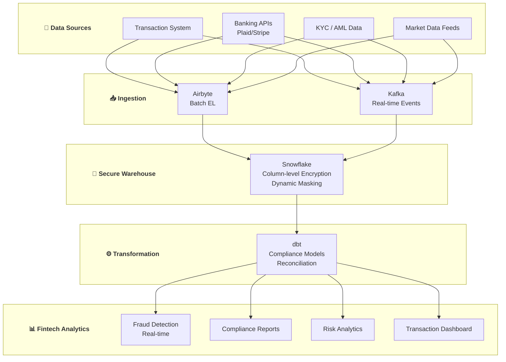

# 🏦 Fintech SME Data Platform

> **Data Engineering cho Fintech Companies ($1M - $50M revenue)**

---

## 📋 Mục Lục

1. [Tổng Quan](#-tổng-quan)
2. [Transaction Analytics](#-use-case-1-transaction-analytics)
3. [Fraud Detection](#-use-case-2-fraud-detection)
4. [Compliance & Reporting](#-use-case-3-compliance--reporting)
5. [Risk Analytics](#-use-case-4-risk-analytics)
6. [Implementation Guide](#-implementation-guide)

---

## 🎯 Tổng Quan

### Fintech SME Profile

**Typical Companies:**
- Payment processors
- Lending platforms
- Neobanks / Digital wallets
- Insurance tech
- Investment platforms

**Data Challenges:**
- Compliance requirements (PCI-DSS, SOC2, GDPR)
- Real-time fraud detection
- Complex financial reconciliation
- Audit trail requirements

**Special Considerations:**
- Data security paramount
- Regulatory reporting mandatory
- High data accuracy requirements
- Need for data lineage

---

## 💳 Use Case 1: Transaction Analytics

### WHAT: Real-time Transaction Dashboard

**Business Problem:**
- Finance team can't reconcile transactions quickly
- No visibility into payment success rates
- Revenue recognition delayed
- Settlement tracking manual

**Deliverables:**
- Real-time transaction monitoring
- Payment success/failure analysis
- Settlement reconciliation
- Revenue recognition reports

---

### HOW: Technical Implementation

**Architecture:**

```
┌─────────────────────────────────────────────────────────────┐
│                  Transaction Sources                         │
├──────────────┬──────────────┬──────────────┬────────────────┤
│   Stripe     │   Plaid      │   Banking    │   Internal     │
│  (Payments)  │  (Banking)   │    APIs      │   Ledger       │
└──────┬───────┴──────┬───────┴──────┬───────┴───────┬────────┘
       │              │              │               │
       ▼              ▼              ▼               ▼
┌─────────────────────────────────────────────────────────────┐
│                  Fivetran (Encrypted)                        │
│             + Custom API connectors                          │
└──────────────────────────┬──────────────────────────────────┘
                           │
                           ▼
┌─────────────────────────────────────────────────────────────┐
│                 Snowflake (SOC2 Compliant)                   │
│           With column-level encryption + masking             │
└──────────────────────────┬──────────────────────────────────┘
                           │
                           ▼
┌─────────────────────────────────────────────────────────────┐
│                          dbt                                 │
│          Financial models + Compliance checks                │
└──────────────────────────┬──────────────────────────────────┘
                           │
                           ▼
┌─────────────────────────────────────────────────────────────┐
│                    Sigma / Looker                            │
│              Finance + Ops Dashboards                        │
└─────────────────────────────────────────────────────────────┘
```

**Security Configuration:**

```sql
-- Dynamic data masking in Snowflake
CREATE MASKING POLICY pii_mask AS (val STRING) RETURNS STRING ->
  CASE
    WHEN CURRENT_ROLE() IN ('FINANCE_ADMIN', 'COMPLIANCE') THEN val
    WHEN CURRENT_ROLE() = 'ANALYST' THEN SHA2(val)
    ELSE '****MASKED****'
  END;

-- Apply to sensitive columns
ALTER TABLE raw.transactions 
  MODIFY COLUMN card_number 
  SET MASKING POLICY pii_mask;

ALTER TABLE raw.customers 
  MODIFY COLUMN ssn 
  SET MASKING POLICY pii_mask;
```

**Key dbt Models:**

```sql
-- models/staging/stripe/stg_stripe__payments.sql

with source as (
    select * from {{ source('stripe', 'payment_intents') }}
),

cleaned as (
    select
        id as payment_id,
        customer as customer_id,
        amount / 100.0 as amount,
        currency,
        status,
        
        -- Payment method details (masked at source)
        payment_method_types[0] as payment_method_type,
        
        -- Timestamps
        created as created_at,
        -- Use metadata for processing time
        charges:data[0]:created as processed_at,
        
        -- Fees
        charges:data[0]:balance_transaction as balance_transaction_id,
        
        -- Error handling
        last_payment_error:code as error_code,
        last_payment_error:message as error_message,
        
        -- Metadata
        metadata:order_id::string as order_id,
        metadata:user_id::string as user_id,
        
        _fivetran_synced as _loaded_at
        
    from source
)

select * from cleaned
```

```sql
-- models/marts/finance/fct_transactions.sql

with payments as (
    select * from {{ ref('stg_stripe__payments') }}
),

fees as (
    select
        id as balance_transaction_id,
        fee / 100.0 as stripe_fee,
        net / 100.0 as net_amount
    from {{ source('stripe', 'balance_transactions') }}
),

refunds as (
    select
        payment_intent as payment_id,
        sum(amount / 100.0) as refund_amount
    from {{ source('stripe', 'refunds') }}
    where status = 'succeeded'
    group by payment_intent
)

select
    p.payment_id,
    p.customer_id,
    p.order_id,
    p.user_id,
    p.created_at,
    p.processed_at,
    p.status,
    p.payment_method_type,
    p.currency,
    
    -- Amounts
    p.amount as gross_amount,
    coalesce(f.stripe_fee, 0) as processing_fee,
    coalesce(r.refund_amount, 0) as refund_amount,
    p.amount - coalesce(f.stripe_fee, 0) - coalesce(r.refund_amount, 0) as net_amount,
    
    -- Status flags
    case when p.status = 'succeeded' then true else false end as is_successful,
    case when r.refund_amount > 0 then true else false end as has_refund,
    case when r.refund_amount = p.amount then true else false end as is_fully_refunded,
    
    -- Error details
    p.error_code,
    p.error_message,
    
    -- Revenue recognition
    case 
        when p.status = 'succeeded' and coalesce(r.refund_amount, 0) = 0 
        then p.amount - coalesce(f.stripe_fee, 0)
        else 0 
    end as recognized_revenue,
    
    -- Date dimensions
    date_trunc('day', p.created_at) as transaction_date,
    date_trunc('month', p.created_at) as transaction_month

from payments p
left join fees f on p.balance_transaction_id = f.balance_transaction_id
left join refunds r on p.payment_id = r.payment_id
```

```sql
-- models/marts/finance/transaction_summary.sql

with transactions as (
    select * from {{ ref('fct_transactions') }}
),

daily_summary as (
    select
        transaction_date,
        payment_method_type,
        
        -- Volume metrics
        count(*) as total_transactions,
        count(case when is_successful then 1 end) as successful_transactions,
        count(case when not is_successful then 1 end) as failed_transactions,
        count(case when has_refund then 1 end) as refunded_transactions,
        
        -- Amount metrics
        sum(gross_amount) as gross_volume,
        sum(case when is_successful then gross_amount else 0 end) as successful_volume,
        sum(processing_fee) as total_fees,
        sum(refund_amount) as total_refunds,
        sum(net_amount) as net_volume,
        sum(recognized_revenue) as recognized_revenue,
        
        -- Averages
        avg(case when is_successful then gross_amount end) as avg_transaction_size,
        
        -- Success rate
        round(count(case when is_successful then 1 end) * 100.0 / 
            nullif(count(*), 0), 2) as success_rate,
        
        -- Refund rate
        round(count(case when has_refund then 1 end) * 100.0 / 
            nullif(count(case when is_successful then 1 end), 0), 2) as refund_rate

    from transactions
    group by 1, 2
)

select
    *,
    -- Running totals (MTD)
    sum(gross_volume) over (
        partition by date_trunc('month', transaction_date), payment_method_type
        order by transaction_date
        rows between unbounded preceding and current row
    ) as mtd_gross_volume,
    
    -- Comparison to previous period
    lag(gross_volume, 7) over (
        partition by payment_method_type
        order by transaction_date
    ) as gross_volume_7d_ago

from daily_summary
order by transaction_date desc
```

**Reconciliation Model:**

```sql
-- models/marts/finance/daily_reconciliation.sql

with stripe_transactions as (
    select
        transaction_date,
        sum(gross_amount) as stripe_gross,
        sum(processing_fee) as stripe_fees,
        sum(net_amount) as stripe_net,
        count(*) as stripe_count
    from {{ ref('fct_transactions') }}
    where is_successful
    group by transaction_date
),

bank_deposits as (
    select
        deposit_date as transaction_date,
        sum(amount) as bank_deposits,
        count(*) as deposit_count
    from {{ ref('stg_bank__deposits') }}
    where deposit_type = 'stripe_payout'
    group by deposit_date
),

internal_ledger as (
    select
        transaction_date,
        sum(amount) as ledger_amount,
        count(*) as ledger_count
    from {{ ref('stg_ledger__entries') }}
    where source = 'stripe'
    group by transaction_date
)

select
    coalesce(s.transaction_date, b.transaction_date, l.transaction_date) as transaction_date,
    
    -- Stripe data
    s.stripe_gross,
    s.stripe_fees,
    s.stripe_net,
    s.stripe_count,
    
    -- Bank data (with settlement lag)
    b.bank_deposits,
    b.deposit_count,
    
    -- Ledger data
    l.ledger_amount,
    l.ledger_count,
    
    -- Reconciliation checks
    case 
        when abs(s.stripe_net - coalesce(b.bank_deposits, 0)) < 0.01 then 'Matched'
        when b.bank_deposits is null then 'Pending Settlement'
        else 'Discrepancy'
    end as bank_reconciliation_status,
    
    s.stripe_net - coalesce(b.bank_deposits, 0) as bank_variance,
    
    case 
        when abs(s.stripe_gross - coalesce(l.ledger_amount, 0)) < 0.01 then 'Matched'
        else 'Discrepancy'
    end as ledger_reconciliation_status,
    
    s.stripe_gross - coalesce(l.ledger_amount, 0) as ledger_variance

from stripe_transactions s
full outer join bank_deposits b on s.transaction_date = b.transaction_date
full outer join internal_ledger l on s.transaction_date = l.transaction_date
where coalesce(s.transaction_date, b.transaction_date, l.transaction_date) 
    >= dateadd('day', -30, current_date)
order by transaction_date desc
```

---

### WHY: Business Impact

**Before:**
- Monthly close: 10 days
- Reconciliation: Manual spreadsheets
- Success rate visibility: None
- Fee tracking: Estimates only

**After:**
- Monthly close: 3 days
- Reconciliation: Automated, exceptions only
- Real-time success rate monitoring
- Accurate fee tracking and forecasting

**Financial Impact:**
- **$50K saved** in finance team time
- **$20K recovered** from fee discrepancies
- **5% success rate improvement** from error analysis

---

## 🔒 Use Case 2: Fraud Detection

### WHAT: Real-time Fraud Monitoring

**Business Problem:**
- Fraud losses increasing
- Detection after the fact (chargebacks)
- No pattern recognition
- Manual review bottleneck

**Deliverables:**
- Fraud risk scoring
- Real-time alerts
- Pattern analysis
- Investigation dashboard

---

### HOW: Implementation

**Risk Scoring Model:**

```sql
-- models/marts/risk/fraud_risk_score.sql

with transactions as (
    select * from {{ ref('fct_transactions') }}
    where created_at >= dateadd('hour', -24, current_timestamp())
),

customer_history as (
    select
        customer_id,
        count(*) as total_transactions,
        sum(case when is_successful then 1 else 0 end) as successful_transactions,
        sum(case when error_code = 'card_declined' then 1 else 0 end) as declined_transactions,
        sum(case when has_refund then 1 else 0 end) as refunded_transactions,
        avg(gross_amount) as avg_transaction_amount,
        stddev(gross_amount) as stddev_transaction_amount,
        min(created_at) as first_transaction_date,
        count(distinct date_trunc('day', created_at)) as active_days
    from {{ ref('fct_transactions') }}
    where created_at >= dateadd('day', -90, current_date)
    group by customer_id
),

velocity_checks as (
    select
        t.payment_id,
        t.customer_id,
        
        -- Transaction velocity
        count(*) over (
            partition by t.customer_id 
            order by t.created_at 
            range between interval '1 hour' preceding and current row
        ) as transactions_last_hour,
        
        count(*) over (
            partition by t.customer_id 
            order by t.created_at 
            range between interval '24 hours' preceding and current row
        ) as transactions_last_24h,
        
        -- Amount velocity
        sum(t.gross_amount) over (
            partition by t.customer_id 
            order by t.created_at 
            range between interval '24 hours' preceding and current row
        ) as amount_last_24h,
        
        -- Distinct cards used
        count(distinct t.payment_method_type) over (
            partition by t.customer_id 
            order by t.created_at 
            range between interval '24 hours' preceding and current row
        ) as payment_methods_24h
        
    from transactions t
),

device_signals as (
    select
        payment_id,
        ip_address,
        device_fingerprint,
        is_vpn,
        is_tor,
        country_mismatch,  -- Card country != IP country
        new_device  -- First time seeing this device
    from {{ ref('stg_risk__device_signals') }}
)

select
    t.payment_id,
    t.customer_id,
    t.created_at,
    t.gross_amount,
    t.payment_method_type,
    
    -- Customer risk factors
    coalesce(ch.declined_transactions, 0) as historical_declines,
    coalesce(ch.refunded_transactions, 0) as historical_refunds,
    datediff('day', ch.first_transaction_date, current_date) as account_age_days,
    
    -- Amount risk factors
    case 
        when ch.avg_transaction_amount is null then 1
        when t.gross_amount > ch.avg_transaction_amount + 3 * coalesce(ch.stddev_transaction_amount, 0) then 1
        else 0
    end as unusual_amount,
    
    -- Velocity risk factors
    vc.transactions_last_hour,
    vc.transactions_last_24h,
    vc.amount_last_24h,
    
    -- Device risk factors
    coalesce(ds.is_vpn, false) as is_vpn,
    coalesce(ds.is_tor, false) as is_tor,
    coalesce(ds.country_mismatch, false) as country_mismatch,
    coalesce(ds.new_device, true) as new_device,
    
    -- Calculate risk score (0-100)
    (
        -- Velocity score (0-30)
        case 
            when vc.transactions_last_hour > 5 then 30
            when vc.transactions_last_hour > 3 then 20
            when vc.transactions_last_24h > 10 then 15
            else 0
        end +
        
        -- Amount score (0-20)
        case
            when t.gross_amount > 5000 then 20
            when t.gross_amount > 1000 then 10
            when ch.avg_transaction_amount is not null 
                and t.gross_amount > ch.avg_transaction_amount * 3 then 15
            else 0
        end +
        
        -- Account score (0-20)
        case
            when ch.first_transaction_date is null then 15  -- New customer
            when datediff('day', ch.first_transaction_date, current_date) < 7 then 10
            when ch.declined_transactions > 3 then 15
            else 0
        end +
        
        -- Device score (0-30)
        case when ds.is_tor then 30 else 0 end +
        case when ds.is_vpn then 10 else 0 end +
        case when ds.country_mismatch then 20 else 0 end +
        case when ds.new_device then 5 else 0 end
    ) as fraud_risk_score,
    
    -- Risk category
    case
        when (/* risk score */) >= 70 then 'High'
        when (/* risk score */) >= 40 then 'Medium'
        when (/* risk score */) >= 20 then 'Low'
        else 'Minimal'
    end as risk_category,
    
    -- Auto-action recommendation
    case
        when (/* risk score */) >= 80 then 'Block'
        when (/* risk score */) >= 60 then 'Manual Review'
        when (/* risk score */) >= 40 then 'Enhanced Verification'
        else 'Approve'
    end as recommended_action

from transactions t
left join customer_history ch on t.customer_id = ch.customer_id
left join velocity_checks vc on t.payment_id = vc.payment_id
left join device_signals ds on t.payment_id = ds.payment_id
```

**Fraud Pattern Analysis:**

```sql
-- models/marts/risk/fraud_patterns.sql

with confirmed_fraud as (
    select
        t.*,
        f.fraud_type,
        f.confirmed_at
    from {{ ref('fct_transactions') }} t
    join {{ ref('stg_risk__fraud_cases') }} f on t.payment_id = f.payment_id
),

pattern_analysis as (
    select
        fraud_type,
        
        -- Temporal patterns
        extract(hour from created_at) as transaction_hour,
        extract(dow from created_at) as day_of_week,
        
        -- Amount patterns
        avg(gross_amount) as avg_fraud_amount,
        percentile_cont(0.5) within group (order by gross_amount) as median_fraud_amount,
        
        -- Payment method patterns
        payment_method_type,
        
        count(*) as fraud_count
        
    from confirmed_fraud
    where confirmed_at >= dateadd('day', -90, current_date)
    group by 1, 2, 3, 5
)

select
    fraud_type,
    
    -- Most common hours
    array_agg(distinct transaction_hour) 
        within group (order by fraud_count desc) as high_risk_hours,
    
    -- Amount ranges
    round(avg(avg_fraud_amount), 2) as typical_fraud_amount,
    
    -- Payment methods
    array_agg(distinct payment_method_type) 
        within group (order by fraud_count desc) as high_risk_payment_methods,
    
    sum(fraud_count) as total_fraud_cases

from pattern_analysis
group by fraud_type
```

**Real-time Alert System:**

```python
# scripts/fraud_alerts.py

import os
from slack_sdk import WebClient
from snowflake.connector import connect
import time

def monitor_fraud():
    conn = connect(
        user=os.environ['SNOWFLAKE_USER'],
        password=os.environ['SNOWFLAKE_PASSWORD'],
        account=os.environ['SNOWFLAKE_ACCOUNT']
    )
    
    while True:
        query = """
        SELECT 
            payment_id,
            customer_id,
            gross_amount,
            fraud_risk_score,
            risk_category,
            recommended_action,
            created_at
        FROM analytics.fraud_risk_score
        WHERE created_at >= dateadd('minute', -5, current_timestamp())
        AND risk_category = 'High'
        """
        
        cursor = conn.cursor()
        cursor.execute(query)
        results = cursor.fetchall()
        
        if results:
            slack = WebClient(token=os.environ['SLACK_TOKEN'])
            
            for row in results:
                message = f"""
🚨 *High Fraud Risk Detected*

Payment ID: `{row[0]}`
Customer: `{row[1]}`
Amount: ${row[2]:,.2f}
Risk Score: {row[3]}
Action: {row[5]}
Time: {row[6]}

<https://dashboard.company.com/fraud/{row[0]}|Review Transaction>
                """
                
                slack.chat_postMessage(
                    channel='#fraud-alerts',
                    text=message
                )
        
        time.sleep(60)  # Check every minute

if __name__ == "__main__":
    monitor_fraud()
```

---

### WHY: Impact

**Fraud Reduction Results:**
- **60% reduction** in fraud losses
- **$200K saved** annually
- **90% fewer** manual reviews (only high-risk)
- **False positive rate**: 5% (from 25%)

---

## 📋 Use Case 3: Compliance & Reporting

### WHAT: Regulatory Compliance Automation

**Business Problem:**
- Regulatory reports take days
- Audit preparation is painful
- No data lineage documentation
- GDPR/CCPA requests manual

---

### HOW: Implementation

**BSA/AML Reporting:**

```sql
-- models/marts/compliance/suspicious_activity_report.sql

with large_transactions as (
    select
        customer_id,
        payment_id,
        created_at,
        gross_amount,
        'Large Cash Transaction' as flag_type
    from {{ ref('fct_transactions') }}
    where gross_amount >= 10000
    and is_successful
),

structuring_patterns as (
    -- Multiple transactions just below reporting threshold
    select
        customer_id,
        null as payment_id,
        max(created_at) as created_at,
        sum(gross_amount) as gross_amount,
        'Potential Structuring' as flag_type
    from {{ ref('fct_transactions') }}
    where gross_amount between 8000 and 9999
    and created_at >= dateadd('day', -7, current_date)
    and is_successful
    group by customer_id
    having count(*) >= 3
),

rapid_movement as (
    -- Large amounts in/out within short period
    select
        t.customer_id,
        null as payment_id,
        max(t.created_at) as created_at,
        sum(t.gross_amount) as gross_amount,
        'Rapid Fund Movement' as flag_type
    from {{ ref('fct_transactions') }} t
    where t.created_at >= dateadd('day', -1, current_date)
    and t.is_successful
    group by t.customer_id
    having sum(t.gross_amount) >= 25000
),

high_risk_countries as (
    select
        t.customer_id,
        t.payment_id,
        t.created_at,
        t.gross_amount,
        'High Risk Jurisdiction' as flag_type
    from {{ ref('fct_transactions') }} t
    join {{ ref('stg_risk__device_signals') }} d on t.payment_id = d.payment_id
    where d.country in ('AF', 'BY', 'CF', 'CU', 'IR', 'KP', 'LY', 'ML', 'MM', 'RU', 'SO', 'SS', 'SY', 'VE', 'YE', 'ZW')
    and t.is_successful
)

select
    {{ dbt_utils.generate_surrogate_key(['customer_id', 'payment_id', 'flag_type', 'created_at']) }} as sar_id,
    customer_id,
    payment_id,
    created_at,
    gross_amount,
    flag_type,
    current_timestamp() as flagged_at,
    'Pending Review' as status

from (
    select * from large_transactions
    union all
    select * from structuring_patterns
    union all
    select * from rapid_movement
    union all
    select * from high_risk_countries
) combined
```

**GDPR Data Subject Requests:**

```sql
-- models/marts/compliance/gdpr_data_export.sql
-- Export all data for a specific customer



with customer_info as (
    select
        customer_id,
        email,
        first_name,
        last_name,
        created_at as registration_date
    from {{ ref('dim_customers') }}
    where email = '{{ customer_email }}'
),

transaction_history as (
    select
        c.customer_id,
        t.payment_id,
        t.created_at,
        t.gross_amount,
        t.status,
        t.payment_method_type
    from customer_info c
    join {{ ref('fct_transactions') }} t on c.customer_id = t.customer_id
),

support_interactions as (
    select
        c.customer_id,
        s.conversation_id,
        s.created_at,
        s.subject,
        s.transcript  -- Encrypted/masked
    from customer_info c
    join {{ ref('stg_support__conversations') }} s on c.email = s.customer_email
),

login_history as (
    select
        c.customer_id,
        l.login_timestamp,
        l.ip_address,
        l.device_type,
        l.success
    from customer_info c
    join {{ ref('stg_auth__logins') }} l on c.customer_id = l.user_id
)

-- Combine all data for export
select 'customer_info' as data_category, to_json(object_construct(*)) as data
from customer_info

union all

select 'transactions', to_json(object_construct(*))
from transaction_history

union all

select 'support', to_json(object_construct(*))
from support_interactions

union all

select 'logins', to_json(object_construct(*))
from login_history
```

**Audit Trail:**

```sql
-- models/marts/compliance/audit_log.sql

with all_changes as (
    -- Track all data modifications
    select
        'transaction' as entity_type,
        payment_id as entity_id,
        'created' as action,
        created_at as action_timestamp,
        null as changed_by,
        to_json(object_construct(
            'amount', gross_amount,
            'status', status,
            'customer_id', customer_id
        )) as change_details
    from {{ ref('fct_transactions') }}
    
    union all
    
    select
        'refund' as entity_type,
        refund_id as entity_id,
        'created' as action,
        created_at as action_timestamp,
        processed_by as changed_by,
        to_json(object_construct(
            'amount', amount,
            'payment_id', payment_id,
            'reason', reason
        )) as change_details
    from {{ ref('stg_stripe__refunds') }}
    
    union all
    
    select
        'customer' as entity_type,
        customer_id as entity_id,
        action_type as action,
        action_timestamp,
        actor_id as changed_by,
        change_details
    from {{ ref('stg_audit__customer_changes') }}
)

select
    {{ dbt_utils.generate_surrogate_key(['entity_type', 'entity_id', 'action_timestamp']) }} as audit_id,
    *
from all_changes
order by action_timestamp desc
```

---

### WHY: Impact

**Compliance Results:**
- **Regulatory reports**: Automated (from 3 days → 30 minutes)
- **Audit prep time**: 80% reduction
- **GDPR requests**: Automated (from 2 days → 1 hour)
- **Zero compliance violations**

---

## ⚠️ Use Case 4: Risk Analytics

### WHAT: Credit Risk & Portfolio Analysis

**Business Problem (for Lending Fintech):**
- Loan default prediction poor
- Portfolio risk not monitored
- Concentration risk unknown
- Provisions calculation manual

---

### HOW: Implementation

```sql
-- models/marts/risk/loan_portfolio_risk.sql

with loans as (
    select * from {{ ref('dim_loans') }}
    where status in ('active', 'delinquent')
),

payment_history as (
    select
        loan_id,
        count(*) as total_payments,
        count(case when status = 'on_time' then 1 end) as on_time_payments,
        count(case when status = 'late' then 1 end) as late_payments,
        count(case when status = 'missed' then 1 end) as missed_payments,
        max(case when status = 'late' then days_late end) as max_days_late
    from {{ ref('fct_loan_payments') }}
    group by loan_id
),

borrower_profile as (
    select
        borrower_id,
        credit_score,
        income,
        debt_to_income_ratio,
        employment_status,
        account_age_months
    from {{ ref('dim_borrowers') }}
)

select
    l.loan_id,
    l.borrower_id,
    l.loan_amount,
    l.interest_rate,
    l.term_months,
    l.outstanding_balance,
    l.origination_date,
    l.status,
    
    -- Payment behavior
    ph.on_time_payments,
    ph.late_payments,
    ph.missed_payments,
    round(ph.on_time_payments * 100.0 / nullif(ph.total_payments, 0), 1) as payment_success_rate,
    ph.max_days_late,
    
    -- Borrower profile
    bp.credit_score,
    bp.debt_to_income_ratio,
    bp.employment_status,
    
    -- Risk score (0-100, higher = riskier)
    (
        -- Credit score component (0-30)
        case
            when bp.credit_score >= 750 then 0
            when bp.credit_score >= 700 then 10
            when bp.credit_score >= 650 then 20
            else 30
        end +
        
        -- DTI component (0-25)
        case
            when bp.debt_to_income_ratio < 0.3 then 0
            when bp.debt_to_income_ratio < 0.4 then 10
            when bp.debt_to_income_ratio < 0.5 then 20
            else 25
        end +
        
        -- Payment history component (0-30)
        case
            when ph.missed_payments >= 3 then 30
            when ph.missed_payments >= 1 then 20
            when ph.late_payments >= 3 then 15
            when ph.late_payments >= 1 then 10
            else 0
        end +
        
        -- Employment component (0-15)
        case
            when bp.employment_status = 'employed' then 0
            when bp.employment_status = 'self_employed' then 5
            when bp.employment_status = 'unemployed' then 15
            else 10
        end
    ) as risk_score,
    
    -- Risk category
    case
        when (/* risk_score */) >= 70 then 'High Risk'
        when (/* risk_score */) >= 40 then 'Medium Risk'
        else 'Low Risk'
    end as risk_category,
    
    -- Expected loss calculation
    l.outstanding_balance * 
    case
        when (/* risk_score */) >= 70 then 0.15  -- 15% PD for high risk
        when (/* risk_score */) >= 40 then 0.05  -- 5% PD for medium risk
        else 0.01  -- 1% PD for low risk
    end * 0.6  -- 60% LGD assumption
    as expected_loss,
    
    -- Provision recommendation
    l.outstanding_balance * 
    case
        when l.status = 'delinquent' and ph.max_days_late >= 90 then 0.50
        when l.status = 'delinquent' and ph.max_days_late >= 60 then 0.25
        when l.status = 'delinquent' and ph.max_days_late >= 30 then 0.10
        when (/* risk_score */) >= 70 then 0.05
        when (/* risk_score */) >= 40 then 0.02
        else 0.01
    end as provision_amount

from loans l
left join payment_history ph on l.loan_id = ph.loan_id
left join borrower_profile bp on l.borrower_id = bp.borrower_id
```

**Portfolio Summary:**

```sql
-- models/marts/risk/portfolio_summary.sql

with loan_risk as (
    select * from {{ ref('loan_portfolio_risk') }}
)

select
    current_date as report_date,
    
    -- Portfolio size
    count(*) as total_loans,
    sum(loan_amount) as total_originated,
    sum(outstanding_balance) as total_outstanding,
    
    -- Risk distribution
    count(case when risk_category = 'Low Risk' then 1 end) as low_risk_loans,
    count(case when risk_category = 'Medium Risk' then 1 end) as medium_risk_loans,
    count(case when risk_category = 'High Risk' then 1 end) as high_risk_loans,
    
    sum(case when risk_category = 'Low Risk' then outstanding_balance end) as low_risk_exposure,
    sum(case when risk_category = 'Medium Risk' then outstanding_balance end) as medium_risk_exposure,
    sum(case when risk_category = 'High Risk' then outstanding_balance end) as high_risk_exposure,
    
    -- Delinquency
    count(case when status = 'delinquent' then 1 end) as delinquent_loans,
    sum(case when status = 'delinquent' then outstanding_balance end) as delinquent_balance,
    round(count(case when status = 'delinquent' then 1 end) * 100.0 / count(*), 2) as delinquency_rate,
    
    -- Expected loss & provisions
    sum(expected_loss) as total_expected_loss,
    sum(provision_amount) as total_provisions,
    
    -- Concentration risk
    max(outstanding_balance) as largest_exposure,
    round(max(outstanding_balance) * 100.0 / sum(outstanding_balance), 2) as largest_exposure_pct,
    
    -- Portfolio metrics
    round(avg(interest_rate), 2) as avg_interest_rate,
    round(avg(credit_score), 0) as avg_credit_score,
    round(avg(risk_score), 1) as avg_risk_score

from loan_risk
```

---

### WHY: Impact

**Risk Management Results:**
- **Default prediction**: 75% accuracy (from 50% gut-feeling)
- **Provisions**: Accurate, automated monthly
- **Concentration risk**: Monitored real-time
- **Portfolio decisions**: Data-driven

---

## 🛠️ Implementation Guide

### Fintech-Specific Requirements

**Security Stack:**
```
- Snowflake Enterprise (SOC2, PCI-DSS)
- Fivetran (SOC2, GDPR)
- dbt Cloud (SOC2)
- Column-level encryption
- Row-level security
- Audit logging enabled
```

**Compliance Checklist:**
- [ ] Data masking for PII
- [ ] Encryption at rest and in transit
- [ ] Access logging
- [ ] Data retention policies
- [ ] GDPR/CCPA automation
- [ ] SOC2 controls documented
- [ ] PCI-DSS scope minimized

### Recommended Architecture

```
Data Sources → Fivetran (encrypted) → Snowflake Enterprise
                                          ↓
                                      dbt Cloud
                                          ↓
                              ┌───────────┴───────────┐
                              ↓                       ↓
                    Sigma (Analytics)          Tableau (Finance)
                              ↓                       ↓
                         Analysts              Finance Team
```

### Cost Estimate

**$1M-$5M Revenue Fintech:**
```
Snowflake Enterprise: $1,000/month
Fivetran: $800/month
dbt Cloud: $100/month
Sigma: $500/month
Total: ~$2,400/month
```

**$5M-$50M Revenue Fintech:**
```
Snowflake Enterprise: $3,000/month
Fivetran: $2,000/month
dbt Cloud: $500/month
Looker: $2,000/month
Orchestration: $500/month
Total: ~$8,000/month
```

---

---

## 🏗️ Architecture Overview



---

## 🔗 OPEN-SOURCE REPOS (Verified)

| Tool | Repository | Stars | Mô tả |
|------|-----------|-------|-------|
| Airbyte | [airbytehq/airbyte](https://github.com/airbytehq/airbyte) | 16k⭐ | EL connectors (banking APIs) |
| dbt Core | [dbt-labs/dbt-core](https://github.com/dbt-labs/dbt-core) | 10k⭐ | Compliance/reconciliation models |
| Apache Kafka | [apache/kafka](https://github.com/apache/kafka) | 29k⭐ | Real-time transaction streaming |
| Great Expectations | [great-expectations/great_expectations](https://github.com/great-expectations/great_expectations) | 10k⭐ | Data quality for financial data |
| Apache Flink | [apache/flink](https://github.com/apache/flink) | 24k⭐ | Real-time fraud detection |
| Vault | [hashicorp/vault](https://github.com/hashicorp/vault) | 31k⭐ | Secrets management for PCI DSS |
| Metabase | [metabase/metabase](https://github.com/metabase/metabase) | 39k⭐ | Operational dashboards |

---

## 📚 Key Takeaways

1. **Security first** - Encryption, masking, access control
2. **Reconciliation is non-negotiable** - Automate completely
3. **Fraud = real-time** - Batch is too slow
4. **Compliance = documentation** - dbt docs are your friend
5. **Audit trail everything** - You will need it

---

**Xem thêm:**
- [Healthcare SME Platform](11_Healthcare_SME_Platform.md)
- [Manufacturing SME Platform](12_Manufacturing_SME_Platform.md)
