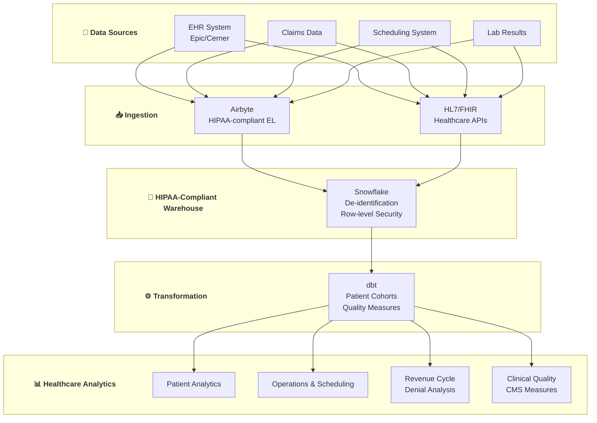

# 🏥 Healthcare SME Data Platform

> **Data Engineering cho Healthcare Companies (Clinics, Telehealth, MedTech)**

---

## 📋 Mục Lục

1. [Tổng Quan](#-tổng-quan)
2. [Patient Analytics](#-use-case-1-patient-analytics)
3. [Operations & Scheduling](#-use-case-2-operations--scheduling)
4. [Revenue Cycle Management](#-use-case-3-revenue-cycle-management)
5. [Clinical Quality Metrics](#-use-case-4-clinical-quality-metrics)
6. [Implementation Guide](#-implementation-guide)

---

## 🎯 Tổng Quan

### Healthcare SME Profile

**Typical Companies:**
- Multi-location clinics (5-50 locations)
- Telehealth platforms
- Dental/Vision/Physical therapy practices
- Home healthcare agencies
- Medical device companies

**Data Challenges:**
- HIPAA compliance mandatory
- Multiple EHR/EMR systems
- Insurance/billing complexity
- PHI (Protected Health Information) handling

**Special Requirements:**
- BAA (Business Associate Agreement) với vendors
- Data de-identification
- Audit logging
- Access control

---

## 👥 Use Case 1: Patient Analytics

### WHAT: Patient Journey & Retention Analysis

**Business Problem:**
- Don't know patient lifetime value
- No-show rates impacting revenue
- Patient churn not measured
- Referral patterns unknown

**Deliverables:**
- Patient engagement dashboard
- No-show prediction
- Retention analysis
- Referral tracking

---

### HOW: Technical Implementation

**HIPAA-Compliant Architecture:**

```
┌─────────────────────────────────────────────────────────────┐
│                    Healthcare Sources                        │
├──────────────┬──────────────┬──────────────┬────────────────┤
│     EHR      │   Practice   │   Billing    │   CRM          │
│  (Epic/Cerner)│  Management │   System     │  (Salesforce)  │
└──────┬───────┴──────┬───────┴──────┬───────┴───────┬────────┘
       │              │              │               │
       │              │              │               │
       ▼              ▼              ▼               ▼
┌─────────────────────────────────────────────────────────────┐
│               HIPAA-Compliant Integration                    │
│          Fivetran (BAA) / Healthcare APIs                    │
└──────────────────────────┬──────────────────────────────────┘
                           │
                           ▼
┌─────────────────────────────────────────────────────────────┐
│            Snowflake Healthcare & Life Sciences              │
│                    (BAA, HIPAA-ready)                        │
│                                                              │
│   ┌─────────────────────────────────────────────────────┐   │
│   │              De-identification Layer                 │   │
│   │     PHI → Tokenized/Hashed identifiers              │   │
│   └─────────────────────────────────────────────────────┘   │
└──────────────────────────┬──────────────────────────────────┘
                           │
                           ▼
┌─────────────────────────────────────────────────────────────┐
│                      dbt + Analytics                         │
│              (No PHI in output models)                       │
└──────────────────────────┬──────────────────────────────────┘
                           │
                           ▼
┌─────────────────────────────────────────────────────────────┐
│                    Sigma / Tableau                           │
│               Aggregate reports only                         │
└─────────────────────────────────────────────────────────────┘
```

**De-identification Strategy:**

```sql
-- macros/deidentify.sql


    SHA2({{ column_name }} || '{{ var("phi_salt") }}')



    -- Shift dates by consistent random offset per patient
    dateadd('day', 
        mod(abs(hash(patient_id)), 365) - 182,  -- Random shift -182 to +182 days
        {{ date_column }}
    )



    case
        when datediff('year', {{ birthdate_column }}, current_date) < 18 then '0-17'
        when datediff('year', {{ birthdate_column }}, current_date) < 30 then '18-29'
        when datediff('year', {{ birthdate_column }}, current_date) < 45 then '30-44'
        when datediff('year', {{ birthdate_column }}, current_date) < 65 then '45-64'
        else '65+'
    end

```

**Key dbt Models:**

```sql
-- models/staging/ehr/stg_ehr__patients.sql
-- Contains PHI - restricted access

{{ config(
    materialized='table',
    tags=['phi', 'restricted']
) }}

with source as (
    select * from {{ source('ehr', 'patients') }}
),

cleaned as (
    select
        -- De-identified key (for joining)
        {{ hash_phi('patient_id') }} as patient_key,
        
        -- Keep internal ID for operations (restricted)
        patient_id,
        
        -- Demographics (de-identified)
        {{ age_bucket('date_of_birth') }} as age_group,
        gender,
        
        -- Location (generalized)
        substring(zip_code, 1, 3) || 'XX' as zip_prefix,
        state,
        
        -- Clinical (non-PHI)
        primary_insurance,
        pcp_provider_id,
        
        -- Dates (potentially shifted for analytics)
        registration_date,
        last_visit_date,
        
        -- Status
        patient_status,
        
        _loaded_at
        
    from source
)

select * from cleaned
```

```sql
-- models/marts/patient/patient_engagement.sql
-- De-identified patient analytics

with patients as (
    select * from {{ ref('stg_ehr__patients') }}
),

appointments as (
    select
        {{ hash_phi('patient_id') }} as patient_key,
        appointment_date,
        appointment_type,
        provider_id,
        location_id,
        status,  -- scheduled, completed, no_show, cancelled
        check_in_time,
        check_out_time
    from {{ ref('stg_pm__appointments') }}
),

patient_visits as (
    select
        patient_key,
        count(*) as total_appointments,
        count(case when status = 'completed' then 1 end) as completed_visits,
        count(case when status = 'no_show' then 1 end) as no_shows,
        count(case when status = 'cancelled' then 1 end) as cancellations,
        min(appointment_date) as first_visit,
        max(appointment_date) as last_visit,
        datediff('day', min(appointment_date), max(appointment_date)) as patient_tenure_days,
        count(distinct location_id) as locations_visited,
        count(distinct provider_id) as providers_seen
    from appointments
    group by patient_key
)

select
    p.patient_key,
    p.age_group,
    p.gender,
    p.zip_prefix,
    p.primary_insurance,
    p.patient_status,
    
    -- Visit metrics
    coalesce(pv.total_appointments, 0) as total_appointments,
    coalesce(pv.completed_visits, 0) as completed_visits,
    coalesce(pv.no_shows, 0) as no_shows,
    coalesce(pv.cancellations, 0) as cancellations,
    
    -- Rates
    round(coalesce(pv.no_shows, 0) * 100.0 / 
        nullif(pv.total_appointments, 0), 1) as no_show_rate,
    round(coalesce(pv.cancellations, 0) * 100.0 / 
        nullif(pv.total_appointments, 0), 1) as cancellation_rate,
    
    -- Engagement
    pv.patient_tenure_days,
    pv.locations_visited,
    pv.providers_seen,
    pv.first_visit,
    pv.last_visit,
    datediff('day', pv.last_visit, current_date) as days_since_last_visit,
    
    -- Engagement score (0-100)
    (
        -- Recency (0-30)
        case
            when datediff('day', pv.last_visit, current_date) <= 30 then 30
            when datediff('day', pv.last_visit, current_date) <= 90 then 20
            when datediff('day', pv.last_visit, current_date) <= 180 then 10
            else 0
        end +
        
        -- Frequency (0-30)
        least(30, coalesce(pv.completed_visits, 0) * 3) +
        
        -- Loyalty (0-20)
        case
            when pv.patient_tenure_days >= 365 then 20
            when pv.patient_tenure_days >= 180 then 15
            when pv.patient_tenure_days >= 90 then 10
            else 5
        end +
        
        -- Reliability (0-20)
        case
            when coalesce(pv.no_shows, 0) = 0 then 20
            when pv.no_shows * 1.0 / nullif(pv.total_appointments, 0) <= 0.1 then 15
            when pv.no_shows * 1.0 / nullif(pv.total_appointments, 0) <= 0.2 then 10
            else 0
        end
    ) as engagement_score,
    
    -- Segment
    case
        when p.patient_status = 'inactive' then 'Churned'
        when datediff('day', pv.last_visit, current_date) > 365 then 'Dormant'
        when datediff('day', pv.last_visit, current_date) > 180 then 'At Risk'
        when pv.completed_visits >= 5 then 'Loyal'
        when pv.completed_visits >= 2 then 'Returning'
        else 'New'
    end as patient_segment

from patients p
left join patient_visits pv using (patient_key)
```

**No-Show Prediction:**

```sql
-- models/marts/patient/noshow_risk.sql

with upcoming_appointments as (
    select
        {{ hash_phi('patient_id') }} as patient_key,
        appointment_id,
        appointment_date,
        appointment_time,
        appointment_type,
        provider_id,
        location_id
    from {{ ref('stg_pm__appointments') }}
    where appointment_date between current_date and dateadd('day', 14, current_date)
    and status = 'scheduled'
),

patient_history as (
    select
        patient_key,
        no_show_rate,
        cancellation_rate,
        completed_visits,
        days_since_last_visit
    from {{ ref('patient_engagement') }}
),

appointment_patterns as (
    select
        {{ hash_phi('patient_id') }} as patient_key,
        extract(dow from appointment_date) as day_of_week,
        extract(hour from appointment_time) as hour_of_day,
        count(*) as appointments,
        sum(case when status = 'no_show' then 1 else 0 end) as no_shows
    from {{ ref('stg_pm__appointments') }}
    where appointment_date >= dateadd('year', -1, current_date)
    group by 1, 2, 3
),

provider_noshow_rates as (
    select
        provider_id,
        count(*) as appointments,
        sum(case when status = 'no_show' then 1 else 0 end) as no_shows,
        round(sum(case when status = 'no_show' then 1 else 0 end) * 100.0 / count(*), 1) as provider_noshow_rate
    from {{ ref('stg_pm__appointments') }}
    where appointment_date >= dateadd('month', -6, current_date)
    group by provider_id
)

select
    ua.appointment_id,
    ua.patient_key,
    ua.appointment_date,
    ua.appointment_time,
    ua.appointment_type,
    
    -- Patient risk factors
    coalesce(ph.no_show_rate, 0) as historical_noshow_rate,
    coalesce(ph.completed_visits, 0) as completed_visits,
    coalesce(ph.days_since_last_visit, 999) as days_since_last_visit,
    
    -- Time-based risk factors
    extract(dow from ua.appointment_date) as day_of_week,
    extract(hour from ua.appointment_time) as hour_of_day,
    datediff('day', current_date, ua.appointment_date) as days_until_appointment,
    
    -- Provider risk factor
    coalesce(pnr.provider_noshow_rate, 0) as provider_noshow_rate,
    
    -- Calculate no-show risk score (0-100)
    (
        -- Historical patient behavior (0-40)
        least(40, coalesce(ph.no_show_rate, 15) * 4) +
        
        -- New patient risk (0-15)
        case when coalesce(ph.completed_visits, 0) = 0 then 15 else 0 end +
        
        -- Day/time risk (0-20)
        case 
            when extract(dow from ua.appointment_date) = 1 then 10  -- Monday
            when extract(dow from ua.appointment_date) = 5 then 8   -- Friday
            else 0
        end +
        case
            when extract(hour from ua.appointment_time) < 9 then 10  -- Early morning
            when extract(hour from ua.appointment_time) >= 16 then 5  -- Late afternoon
            else 0
        end +
        
        -- Lead time risk (0-15)
        case
            when datediff('day', current_date, ua.appointment_date) >= 14 then 15
            when datediff('day', current_date, ua.appointment_date) >= 7 then 10
            when datediff('day', current_date, ua.appointment_date) >= 3 then 5
            else 0
        end +
        
        -- Engagement risk (0-10)
        case
            when coalesce(ph.days_since_last_visit, 999) > 365 then 10
            when coalesce(ph.days_since_last_visit, 999) > 180 then 5
            else 0
        end
    ) as noshow_risk_score,
    
    -- Risk category
    case
        when (/* risk score */) >= 60 then 'High Risk'
        when (/* risk score */) >= 35 then 'Medium Risk'
        else 'Low Risk'
    end as risk_category,
    
    -- Recommended intervention
    case
        when (/* risk score */) >= 60 then 'Call confirmation + backup booking'
        when (/* risk score */) >= 35 then 'Text reminder + confirmation request'
        else 'Standard reminder'
    end as recommended_action

from upcoming_appointments ua
left join patient_history ph using (patient_key)
left join provider_noshow_rates pnr on ua.provider_id = pnr.provider_id
```

---

### WHY: Business Impact

**Patient Analytics Results:**
- **No-show reduction**: 35% (from 18% → 12%)
- **Revenue recovered**: $150K/year (from reduced no-shows)
- **Patient retention**: +20% improvement
- **Targeted re-engagement**: 45% response rate for dormant patients

---

## 📅 Use Case 2: Operations & Scheduling

### WHAT: Clinic Efficiency Analytics

**Business Problem:**
- Providers under/over-booked
- Wait times unknown
- Capacity not optimized
- Multi-location comparison difficult

---

### HOW: Implementation

```sql
-- models/marts/operations/provider_productivity.sql

with appointments as (
    select * from {{ ref('stg_pm__appointments') }}
    where appointment_date >= dateadd('month', -6, current_date)
),

provider_metrics as (
    select
        provider_id,
        date_trunc('week', appointment_date) as week,
        location_id,
        
        -- Volume
        count(*) as scheduled_appointments,
        count(case when status = 'completed' then 1 end) as completed_appointments,
        count(case when status = 'no_show' then 1 end) as no_shows,
        
        -- Time metrics
        avg(datediff('minute', check_in_time, check_out_time)) as avg_visit_duration_mins,
        avg(datediff('minute', appointment_time, check_in_time)) as avg_wait_time_mins,
        
        -- Revenue (if available)
        sum(case when status = 'completed' then billed_amount else 0 end) as billed_amount,
        sum(case when status = 'completed' then collected_amount else 0 end) as collected_amount

    from appointments
    group by 1, 2, 3
),

provider_capacity as (
    select
        provider_id,
        location_id,
        day_of_week,
        available_slots
    from {{ ref('dim_provider_schedules') }}
)

select
    pm.provider_id,
    p.provider_name,
    p.specialty,
    pm.week,
    pm.location_id,
    
    -- Productivity metrics
    pm.scheduled_appointments,
    pm.completed_appointments,
    pm.no_shows,
    round(pm.completed_appointments * 100.0 / nullif(pm.scheduled_appointments, 0), 1) as completion_rate,
    
    -- Utilization (vs capacity)
    sum(pc.available_slots) as weekly_capacity,
    round(pm.scheduled_appointments * 100.0 / nullif(sum(pc.available_slots), 0), 1) as utilization_rate,
    
    -- Patient experience
    round(pm.avg_wait_time_mins, 1) as avg_wait_time_mins,
    round(pm.avg_visit_duration_mins, 1) as avg_visit_duration_mins,
    
    -- Revenue metrics
    pm.billed_amount,
    pm.collected_amount,
    round(pm.billed_amount / nullif(pm.completed_appointments, 0), 2) as revenue_per_visit,
    
    -- Efficiency score
    (
        -- Utilization component (0-30)
        least(30, pm.scheduled_appointments * 100.0 / nullif(sum(pc.available_slots), 0) * 0.3) +
        
        -- Completion rate (0-30)
        pm.completed_appointments * 100.0 / nullif(pm.scheduled_appointments, 0) * 0.3 +
        
        -- Wait time (0-20, lower is better)
        case
            when pm.avg_wait_time_mins <= 10 then 20
            when pm.avg_wait_time_mins <= 20 then 15
            when pm.avg_wait_time_mins <= 30 then 10
            else 5
        end +
        
        -- Collection rate (0-20)
        pm.collected_amount * 100.0 / nullif(pm.billed_amount, 0) * 0.2
    ) as efficiency_score

from provider_metrics pm
join {{ ref('dim_providers') }} p on pm.provider_id = p.provider_id
left join provider_capacity pc 
    on pm.provider_id = pc.provider_id 
    and pm.location_id = pc.location_id
group by 1, 2, 3, 4, 5, 6, 7, 8, 9, 10, 11, 12
```

**Location Performance:**

```sql
-- models/marts/operations/location_performance.sql

with daily_metrics as (
    select
        location_id,
        appointment_date,
        
        count(*) as total_appointments,
        count(case when status = 'completed' then 1 end) as completed,
        count(case when status = 'no_show' then 1 end) as no_shows,
        count(case when status = 'cancelled' then 1 end) as cancelled,
        
        sum(billed_amount) as billed,
        sum(collected_amount) as collected,
        
        avg(datediff('minute', check_in_time, check_out_time)) as avg_visit_duration,
        avg(datediff('minute', appointment_time, check_in_time)) as avg_wait_time

    from {{ ref('stg_pm__appointments') }}
    where appointment_date >= dateadd('month', -3, current_date)
    group by 1, 2
)

select
    l.location_id,
    l.location_name,
    l.city,
    l.state,
    l.square_footage,
    l.exam_rooms,
    
    -- Volume summary
    sum(dm.total_appointments) as total_appointments,
    sum(dm.completed) as completed_appointments,
    round(avg(dm.total_appointments), 1) as avg_daily_appointments,
    
    -- Performance
    round(sum(dm.completed) * 100.0 / sum(dm.total_appointments), 1) as completion_rate,
    round(sum(dm.no_shows) * 100.0 / sum(dm.total_appointments), 1) as noshow_rate,
    
    -- Revenue
    sum(dm.billed) as total_billed,
    sum(dm.collected) as total_collected,
    round(sum(dm.collected) / sum(dm.billed) * 100, 1) as collection_rate,
    round(sum(dm.collected) / l.square_footage, 2) as revenue_per_sqft,
    
    -- Patient experience
    round(avg(dm.avg_wait_time), 1) as avg_wait_time_mins,
    
    -- Efficiency
    round(sum(dm.completed) * 1.0 / l.exam_rooms / count(distinct dm.appointment_date), 1) as patients_per_room_per_day

from {{ ref('dim_locations') }} l
join daily_metrics dm on l.location_id = dm.location_id
group by 1, 2, 3, 4, 5, 6
```

---

### WHY: Impact

**Operations Results:**
- **Provider utilization**: +15% improvement
- **Wait times**: Reduced 40% (from 25 min → 15 min)
- **Revenue per location**: +12% with capacity optimization
- **Staff scheduling**: Data-driven, saves 10 hours/week

---

## 💰 Use Case 3: Revenue Cycle Management

### WHAT: Billing & Collections Analytics

**Business Problem:**
- Claims denial rate high
- A/R days too long
- Write-offs not analyzed
- Payer performance unknown

---

### HOW: Implementation

```sql
-- models/marts/finance/claims_analysis.sql

with claims as (
    select * from {{ ref('stg_billing__claims') }}
),

claim_lifecycle as (
    select
        claim_id,
        patient_key,
        provider_id,
        location_id,
        payer_id,
        service_date,
        submission_date,
        
        -- Amounts
        billed_amount,
        allowed_amount,
        paid_amount,
        patient_responsibility,
        write_off_amount,
        
        -- Status
        claim_status,
        denial_code,
        denial_reason,
        
        -- Timing
        datediff('day', service_date, submission_date) as days_to_submit,
        datediff('day', submission_date, 
            coalesce(paid_date, current_date)) as days_to_payment,
        
        -- Flags
        case when denial_code is not null then 1 else 0 end as was_denied,
        case when paid_amount > 0 then 1 else 0 end as was_paid,
        case when write_off_amount > 0 then 1 else 0 end as had_writeoff

    from claims
)

select
    cl.claim_id,
    cl.patient_key,
    cl.provider_id,
    p.payer_name,
    cl.service_date,
    
    -- Financial metrics
    cl.billed_amount,
    cl.allowed_amount,
    cl.paid_amount,
    cl.write_off_amount,
    round((cl.billed_amount - cl.allowed_amount) * 100.0 / 
        nullif(cl.billed_amount, 0), 1) as contractual_adjustment_pct,
    round(cl.paid_amount * 100.0 / nullif(cl.billed_amount, 0), 1) as collection_rate,
    
    -- Timeline
    cl.days_to_submit,
    cl.days_to_payment,
    
    -- Status
    cl.claim_status,
    cl.was_denied,
    cl.denial_code,
    cl.denial_reason,
    
    -- Denial category
    case
        when cl.denial_code like 'CO%' then 'Contractual'
        when cl.denial_code like 'PR%' then 'Patient Responsibility'
        when cl.denial_code like 'OA%' then 'Other Adjustment'
        when cl.denial_code in ('1', '2', '3') then 'Eligibility'
        when cl.denial_code in ('4', '5', '6') then 'Authorization'
        when cl.denial_code in ('16', '17', '18') then 'Information Missing'
        else 'Other'
    end as denial_category

from claim_lifecycle cl
join {{ ref('dim_payers') }} p on cl.payer_id = p.payer_id
```

**Payer Performance:**

```sql
-- models/marts/finance/payer_performance.sql

with claims as (
    select * from {{ ref('claims_analysis') }}
    where service_date >= dateadd('month', -12, current_date)
)

select
    payer_name,
    
    -- Volume
    count(*) as total_claims,
    sum(billed_amount) as total_billed,
    
    -- Payment performance
    sum(paid_amount) as total_paid,
    round(sum(paid_amount) * 100.0 / sum(billed_amount), 1) as yield_rate,
    round(avg(days_to_payment), 0) as avg_days_to_payment,
    
    -- Denial analysis
    sum(was_denied) as denied_claims,
    round(sum(was_denied) * 100.0 / count(*), 1) as denial_rate,
    
    -- Write-offs
    sum(write_off_amount) as total_writeoffs,
    round(sum(write_off_amount) * 100.0 / sum(billed_amount), 1) as writeoff_rate,
    
    -- Top denial reasons
    mode(denial_reason) as most_common_denial_reason,
    
    -- Ranking
    rank() over (order by sum(paid_amount) desc) as revenue_rank,
    rank() over (order by sum(was_denied) * 100.0 / count(*)) as denial_rank  -- Lower is better

from claims
group by payer_name
order by total_paid desc
```

**A/R Aging:**

```sql
-- models/marts/finance/ar_aging.sql

with open_claims as (
    select
        claim_id,
        patient_key,
        payer_name,
        service_date,
        submission_date,
        billed_amount,
        paid_amount,
        billed_amount - coalesce(paid_amount, 0) as outstanding_balance,
        datediff('day', submission_date, current_date) as days_outstanding
    from {{ ref('claims_analysis') }}
    where claim_status not in ('Paid', 'Closed', 'Written Off')
)

select
    claim_id,
    patient_key,
    payer_name,
    service_date,
    outstanding_balance,
    days_outstanding,
    
    -- Aging bucket
    case
        when days_outstanding <= 30 then '0-30 days'
        when days_outstanding <= 60 then '31-60 days'
        when days_outstanding <= 90 then '61-90 days'
        when days_outstanding <= 120 then '91-120 days'
        else '120+ days'
    end as aging_bucket,
    
    -- Collection probability
    case
        when days_outstanding <= 30 then 0.95
        when days_outstanding <= 60 then 0.85
        when days_outstanding <= 90 then 0.70
        when days_outstanding <= 120 then 0.50
        else 0.25
    end as collection_probability,
    
    -- Expected collection
    outstanding_balance * 
    case
        when days_outstanding <= 30 then 0.95
        when days_outstanding <= 60 then 0.85
        when days_outstanding <= 90 then 0.70
        when days_outstanding <= 120 then 0.50
        else 0.25
    end as expected_collection

from open_claims
```

---

### WHY: Impact

**Revenue Cycle Results:**
- **Denial rate**: Reduced from 12% → 7%
- **A/R days**: Reduced from 45 → 32
- **Collection rate**: Improved from 85% → 92%
- **Revenue recovered**: $300K/year from denial management

---

## 📊 Use Case 4: Clinical Quality Metrics

### WHAT: Quality Reporting Dashboard

**Business Problem:**
- MIPS/MACRA reporting manual
- Quality gaps not identified
- Care coordination difficult
- Outcomes not tracked

---

### HOW: Implementation

```sql
-- models/marts/clinical/quality_measures.sql
-- Example: Diabetes quality measures

with diabetic_patients as (
    select distinct
        patient_key,
        diagnosis_date
    from {{ ref('stg_ehr__diagnoses') }}
    where icd10_code like 'E11%'  -- Type 2 Diabetes
    or icd10_code like 'E10%'     -- Type 1 Diabetes
),

patient_labs as (
    select
        patient_key,
        lab_name,
        result_value,
        result_date,
        row_number() over (
            partition by patient_key, lab_name 
            order by result_date desc
        ) as rn
    from {{ ref('stg_ehr__lab_results') }}
    where lab_name in ('HbA1c', 'LDL', 'eGFR', 'Urine Albumin')
),

patient_exams as (
    select
        patient_key,
        exam_type,
        exam_date,
        result
    from {{ ref('stg_ehr__exams') }}
    where exam_type in ('Foot Exam', 'Eye Exam', 'Blood Pressure')
)

select
    dp.patient_key,
    
    -- Diabetes Control (HbA1c < 8%)
    case 
        when pl_a1c.result_value < 8 then 'Met'
        when pl_a1c.result_value is null then 'No Data'
        else 'Not Met'
    end as dm_control_status,
    pl_a1c.result_value as latest_a1c,
    pl_a1c.result_date as a1c_date,
    
    -- Lipid Management (LDL < 100)
    case 
        when pl_ldl.result_value < 100 then 'Met'
        when pl_ldl.result_value is null then 'No Data'
        else 'Not Met'
    end as lipid_control_status,
    
    -- Kidney Function (annual eGFR)
    case
        when pl_egfr.result_date >= dateadd('year', -1, current_date) then 'Met'
        else 'Not Met'
    end as kidney_screening_status,
    
    -- Foot Exam (annual)
    case
        when pe_foot.exam_date >= dateadd('year', -1, current_date) then 'Met'
        else 'Not Met'
    end as foot_exam_status,
    
    -- Eye Exam (annual)
    case
        when pe_eye.exam_date >= dateadd('year', -1, current_date) then 'Met'
        else 'Not Met'
    end as eye_exam_status,
    
    -- Overall quality score (% of measures met)
    (
        case when pl_a1c.result_value < 8 then 1 else 0 end +
        case when pl_ldl.result_value < 100 then 1 else 0 end +
        case when pl_egfr.result_date >= dateadd('year', -1, current_date) then 1 else 0 end +
        case when pe_foot.exam_date >= dateadd('year', -1, current_date) then 1 else 0 end +
        case when pe_eye.exam_date >= dateadd('year', -1, current_date) then 1 else 0 end
    ) * 100.0 / 5 as quality_score

from diabetic_patients dp
left join patient_labs pl_a1c 
    on dp.patient_key = pl_a1c.patient_key 
    and pl_a1c.lab_name = 'HbA1c' 
    and pl_a1c.rn = 1
left join patient_labs pl_ldl 
    on dp.patient_key = pl_ldl.patient_key 
    and pl_ldl.lab_name = 'LDL' 
    and pl_ldl.rn = 1
left join patient_labs pl_egfr 
    on dp.patient_key = pl_egfr.patient_key 
    and pl_egfr.lab_name = 'eGFR' 
    and pl_egfr.rn = 1
left join patient_exams pe_foot 
    on dp.patient_key = pe_foot.patient_key 
    and pe_foot.exam_type = 'Foot Exam'
left join patient_exams pe_eye 
    on dp.patient_key = pe_eye.patient_key 
    and pe_eye.exam_type = 'Eye Exam'
```

**Quality Summary Dashboard:**

```sql
-- models/marts/clinical/quality_summary.sql

with quality_measures as (
    select * from {{ ref('quality_measures') }}
)

select
    'Diabetes Management' as measure_category,
    
    -- DM Control (HbA1c < 8%)
    count(case when dm_control_status = 'Met' then 1 end) as dm_control_met,
    count(case when dm_control_status = 'Not Met' then 1 end) as dm_control_not_met,
    round(count(case when dm_control_status = 'Met' then 1 end) * 100.0 / 
        count(*), 1) as dm_control_rate,
    
    -- Eye Exam
    count(case when eye_exam_status = 'Met' then 1 end) as eye_exam_met,
    round(count(case when eye_exam_status = 'Met' then 1 end) * 100.0 / 
        count(*), 1) as eye_exam_rate,
    
    -- Foot Exam  
    count(case when foot_exam_status = 'Met' then 1 end) as foot_exam_met,
    round(count(case when foot_exam_status = 'Met' then 1 end) * 100.0 / 
        count(*), 1) as foot_exam_rate,
    
    -- Overall
    round(avg(quality_score), 1) as avg_quality_score,
    count(case when quality_score = 100 then 1 end) as fully_compliant_patients

from quality_measures
```

---

### WHY: Impact

**Clinical Quality Results:**
- **MIPS score**: Increased from 70 → 92
- **Quality bonuses**: $150K/year in incentive payments
- **Care gaps closed**: 2,500 patients contacted proactively
- **Reporting time**: From 40 hours → 2 hours per quarter

---

## 🛠️ Implementation Guide

### HIPAA Compliance Checklist

**Technical Safeguards:**
- [ ] Data encryption at rest (Snowflake default)
- [ ] Data encryption in transit (TLS 1.2+)
- [ ] Access logging enabled
- [ ] Multi-factor authentication
- [ ] Role-based access control
- [ ] Automatic session timeout
- [ ] Data masking for PHI

**Administrative Safeguards:**
- [ ] BAA signed with all vendors
- [ ] Privacy policy documented
- [ ] Security training completed
- [ ] Incident response plan
- [ ] Risk assessment performed

**dbt Security Practices:**

```yaml
# dbt_project.yml

vars:
  phi_salt: "{{ env_var('PHI_SALT') }}"  # Environment variable

models:
  healthcare_analytics:
    staging:
      +tags: ['phi', 'restricted']
      +grants:
        select: ['role_clinical_analysts']
    
    marts:
      patient:
        +tags: ['deidentified']
        +grants:
          select: ['role_all_analysts']
```

### Recommended Stack

**HIPAA-Compliant Stack:**
```
- Snowflake Healthcare & Life Sciences (BAA)
- Fivetran Healthcare (BAA)
- dbt Cloud (SOC2)
- Sigma / Looker (BAA available)
```

### Cost Estimate

**Small Practice (5-10 providers):**
```
Snowflake: $500/month
Fivetran: $500/month
dbt Cloud: $0 (developer tier)
Sigma: $400/month
Total: ~$1,400/month
```

**Medium Group (20-50 providers):**
```
Snowflake: $1,500/month
Fivetran: $1,200/month
dbt Cloud: $100/month
Looker: $1,500/month
Total: ~$4,300/month
```

---

---

## 🏗️ Architecture Overview



---

## 🔗 OPEN-SOURCE REPOS (Verified)

| Tool | Repository | Stars | Mô tả |
|------|-----------|-------|-------|
| Airbyte | [airbytehq/airbyte](https://github.com/airbytehq/airbyte) | 16k⭐ | EL connectors (EHR integration) |
| dbt Core | [dbt-labs/dbt-core](https://github.com/dbt-labs/dbt-core) | 10k⭐ | Healthcare quality models |
| Great Expectations | [great-expectations/great_expectations](https://github.com/great-expectations/great_expectations) | 10k⭐ | PHI data quality validation |
| HAPI FHIR | [hapifhir/hapi-fhir](https://github.com/hapifhir/hapi-fhir) | 2k⭐ | FHIR server implementation |
| Metabase | [metabase/metabase](https://github.com/metabase/metabase) | 39k⭐ | Clinical dashboards |
| Prefect | [PrefectHQ/prefect](https://github.com/PrefectHQ/prefect) | 17k⭐ | Workflow orchestration |
| Vault | [hashicorp/vault](https://github.com/hashicorp/vault) | 31k⭐ | Secrets + PHI key management |

---

## 📚 Key Takeaways

1. **HIPAA first** - De-identify, mask, encrypt
2. **No-shows = money** - Predict and prevent
3. **Revenue cycle is complex** - Start with denial analysis
4. **Quality = reimbursement** - Track measures proactively
5. **Provider utilization** - Drive revenue per visit

---

**Xem thêm:**
- [Manufacturing SME Platform](12_Manufacturing_SME_Platform.md)
