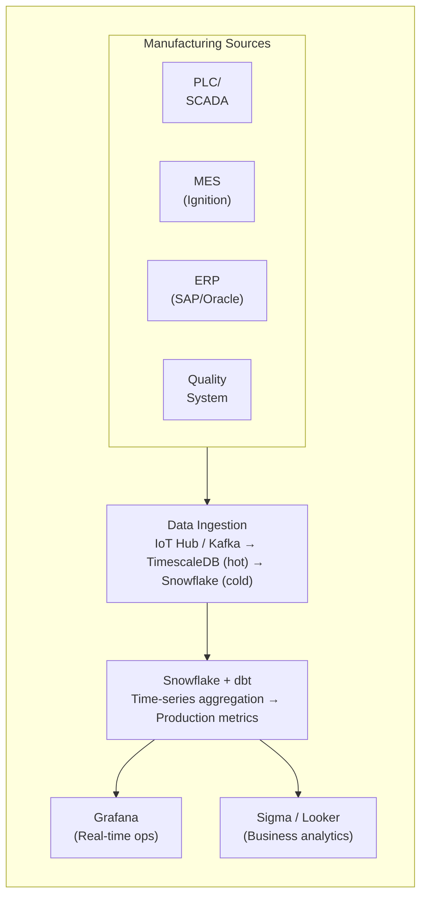
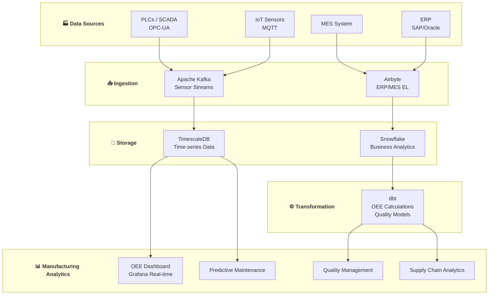

# 🏭 Manufacturing SME Data Platform

> **Data Engineering cho Manufacturing Companies ($5M - $100M revenue)**

---

## 📋 Mục Lục

1. [Tổng Quan](#-tổng-quan)
2. [Production Analytics](#-use-case-1-production-analytics)
3. [Quality Management](#-use-case-2-quality-management)
4. [Supply Chain Analytics](#-use-case-3-supply-chain-analytics)
5. [Equipment Maintenance](#-use-case-4-equipment-maintenance)
6. [Implementation Guide](#-implementation-guide)

---

## 🎯 Tổng Quan

### Manufacturing SME Profile

**Typical Companies:**
- Discrete manufacturing
- Process manufacturing
- Job shops
- Food & beverage production
- Consumer goods manufacturing

**Data Challenges:**
- Legacy systems (MES, ERP, SCADA)
- Sensor data volume
- Real-time requirements
- Multiple production sites

**Unique Aspects:**
- OT (Operational Technology) vs IT divide
- Time-series data from sensors
- Complex BOM (Bill of Materials)
- Regulatory compliance (FDA, ISO)

---

## 🔧 Use Case 1: Production Analytics

### WHAT: Real-time Production Dashboard

**Business Problem:**
- No visibility into shop floor efficiency
- OEE (Overall Equipment Effectiveness) unknown
- Production targets missed without warning
- Downtime not tracked systematically

**Deliverables:**
- Real-time production monitoring
- OEE dashboard
- Shift performance comparison
- Downtime analysis

---

### HOW: Technical Implementation

**Architecture:**



**Key dbt Models:**

```sql
-- models/staging/mes/stg_mes__production_runs.sql

with source as (
    select * from {{ source('mes', 'production_runs') }}
),

cleaned as (
    select
        run_id,
        work_order_id,
        machine_id,
        product_id,
        
        -- Timing
        run_start_time,
        run_end_time,
        datediff('minute', run_start_time, run_end_time) as run_duration_mins,
        
        -- Production
        target_quantity,
        actual_quantity,
        good_quantity,
        scrap_quantity,
        rework_quantity,
        
        -- Speed
        ideal_cycle_time_seconds,
        actual_cycle_time_seconds,
        
        -- Operator
        operator_id,
        shift,
        
        -- Status
        run_status,
        
        _loaded_at
        
    from source
)

select * from cleaned
```

```sql
-- models/staging/mes/stg_mes__downtime_events.sql

with source as (
    select * from {{ source('mes', 'downtime_events') }}
),

cleaned as (
    select
        event_id,
        machine_id,
        
        -- Timing
        start_time,
        end_time,
        datediff('minute', start_time, end_time) as duration_mins,
        
        -- Classification
        downtime_category,  -- Planned, Unplanned
        downtime_reason,    -- Setup, Breakdown, Material shortage, etc.
        downtime_code,
        
        -- Resolution
        technician_id,
        resolution_notes,
        
        _loaded_at
        
    from source
)

select * from cleaned
```

```sql
-- models/marts/production/oee_analysis.sql
-- OEE = Availability × Performance × Quality

with production_runs as (
    select * from {{ ref('stg_mes__production_runs') }}
    where run_start_time >= dateadd('day', -30, current_date)
),

downtime as (
    select * from {{ ref('stg_mes__downtime_events') }}
    where start_time >= dateadd('day', -30, current_date)
),

machine_schedule as (
    select * from {{ ref('dim_machine_schedule') }}
),

-- Calculate by machine and shift
oee_components as (
    select
        pr.machine_id,
        date_trunc('day', pr.run_start_time) as production_date,
        pr.shift,
        
        -- Scheduled time (minutes)
        sum(ms.scheduled_minutes) as scheduled_time,
        
        -- Actual run time (Availability)
        sum(pr.run_duration_mins) as run_time,
        coalesce(sum(dt.duration_mins), 0) as downtime_mins,
        
        -- Production counts (Performance & Quality)
        sum(pr.target_quantity) as target_quantity,
        sum(pr.actual_quantity) as actual_quantity,
        sum(pr.good_quantity) as good_quantity,
        sum(pr.scrap_quantity) as scrap_quantity,
        
        -- Cycle time analysis
        avg(pr.ideal_cycle_time_seconds) as ideal_cycle_time,
        avg(pr.actual_cycle_time_seconds) as actual_cycle_time

    from production_runs pr
    left join machine_schedule ms 
        on pr.machine_id = ms.machine_id 
        and date_trunc('day', pr.run_start_time) = ms.schedule_date
        and pr.shift = ms.shift
    left join downtime dt 
        on pr.machine_id = dt.machine_id
        and dt.start_time between pr.run_start_time and pr.run_end_time
    group by 1, 2, 3
)

select
    machine_id,
    m.machine_name,
    m.production_line,
    production_date,
    shift,
    
    -- Raw metrics
    scheduled_time,
    run_time,
    downtime_mins,
    target_quantity,
    actual_quantity,
    good_quantity,
    scrap_quantity,
    
    -- Availability = (Scheduled Time - Downtime) / Scheduled Time
    round(
        (scheduled_time - downtime_mins) * 100.0 / nullif(scheduled_time, 0)
    , 1) as availability_pct,
    
    -- Performance = (Actual Cycle Time × Actual Quantity) / Run Time
    round(
        (ideal_cycle_time * actual_quantity / 60.0) * 100.0 / nullif(run_time, 0)
    , 1) as performance_pct,
    
    -- Quality = Good Quantity / Total Quantity
    round(
        good_quantity * 100.0 / nullif(actual_quantity, 0)
    , 1) as quality_pct,
    
    -- OEE = Availability × Performance × Quality
    round(
        ((scheduled_time - downtime_mins) * 1.0 / nullif(scheduled_time, 0)) *
        ((ideal_cycle_time * actual_quantity / 60.0) / nullif(run_time, 0)) *
        (good_quantity * 1.0 / nullif(actual_quantity, 0)) * 100
    , 1) as oee_pct,
    
    -- OEE Category
    case
        when (/* oee calculation */) >= 85 then 'World Class'
        when (/* oee calculation */) >= 70 then 'Good'
        when (/* oee calculation */) >= 60 then 'Average'
        else 'Needs Improvement'
    end as oee_category,
    
    -- Losses breakdown (Six Big Losses)
    downtime_mins as availability_loss_mins,
    round((run_time - (ideal_cycle_time * actual_quantity / 60.0)), 1) as speed_loss_mins,
    scrap_quantity as quality_loss_units

from oee_components oc
join {{ ref('dim_machines') }} m on oc.machine_id = m.machine_id
```

**Downtime Analysis:**

```sql
-- models/marts/production/downtime_pareto.sql

with downtime_events as (
    select * from {{ ref('stg_mes__downtime_events') }}
    where start_time >= dateadd('month', -3, current_date)
)

select
    downtime_category,
    downtime_reason,
    
    count(*) as occurrence_count,
    sum(duration_mins) as total_downtime_mins,
    round(sum(duration_mins) / 60.0, 1) as total_downtime_hours,
    
    avg(duration_mins) as avg_duration_mins,
    max(duration_mins) as max_duration_mins,
    
    -- Percentage of total downtime
    round(
        sum(duration_mins) * 100.0 / 
        sum(sum(duration_mins)) over ()
    , 1) as pct_of_total_downtime,
    
    -- Cumulative percentage (for Pareto)
    round(
        sum(sum(duration_mins)) over (
            order by sum(duration_mins) desc
            rows between unbounded preceding and current row
        ) * 100.0 / 
        sum(sum(duration_mins)) over ()
    , 1) as cumulative_pct,
    
    -- Cost impact (estimated $X per minute of downtime)
    sum(duration_mins) * 50 as estimated_cost_impact  -- $50/min example

from downtime_events
group by downtime_category, downtime_reason
order by total_downtime_mins desc
```

**Shift Performance Comparison:**

```sql
-- models/marts/production/shift_comparison.sql

with shift_metrics as (
    select
        production_date,
        shift,
        
        count(distinct machine_id) as machines_used,
        sum(actual_quantity) as total_production,
        sum(good_quantity) as good_production,
        sum(scrap_quantity) as scrap_production,
        
        avg(oee_pct) as avg_oee,
        avg(availability_pct) as avg_availability,
        avg(performance_pct) as avg_performance,
        avg(quality_pct) as avg_quality
        
    from {{ ref('oee_analysis') }}
    where production_date >= dateadd('month', -1, current_date)
    group by production_date, shift
)

select
    shift,
    
    count(distinct production_date) as days_worked,
    avg(machines_used) as avg_machines,
    
    sum(total_production) as total_production,
    sum(good_production) as good_production,
    round(sum(good_production) * 100.0 / sum(total_production), 1) as yield_rate,
    
    round(avg(avg_oee), 1) as avg_oee,
    round(avg(avg_availability), 1) as avg_availability,
    round(avg(avg_performance), 1) as avg_performance,
    round(avg(avg_quality), 1) as avg_quality,
    
    -- Productivity per hour (assuming 8-hour shift)
    round(sum(total_production) / (count(distinct production_date) * 8.0), 0) as units_per_hour,
    
    -- Rank shifts
    rank() over (order by avg(avg_oee) desc) as oee_rank

from shift_metrics
group by shift
order by avg_oee desc
```

---

### WHY: Business Impact

**Production Analytics Results:**
- **OEE visibility**: From unknown → real-time tracking
- **OEE improvement**: From 55% → 72% in 6 months
- **Downtime reduction**: 25% through root cause analysis
- **Production capacity**: +15% without new equipment

**ROI Calculation:**

```
OEE Improvement: 55% → 72% = 17 percentage points
Annual Production Value: $10M
Capacity Gained: 17% × $10M = $1.7M additional capacity
Investment: ~$50K (data platform)
First-year ROI: 3,300%
```

---

## 📊 Use Case 2: Quality Management

### WHAT: Quality Analytics & SPC

**Business Problem:**
- Quality issues caught too late
- No Statistical Process Control (SPC)
- Scrap/rework costs high
- Customer complaints not linked to production

**Deliverables:**
- SPC charts with control limits
- Quality trends dashboard
- Cost of quality analysis
- Defect Pareto analysis

---

### HOW: Implementation

```sql
-- models/marts/quality/spc_analysis.sql
-- Statistical Process Control for key measurements

with measurements as (
    select
        m.measurement_id,
        m.part_id,
        m.product_id,
        m.machine_id,
        m.measurement_name,
        m.measurement_value,
        m.measurement_time,
        m.operator_id,
        m.lot_number,
        
        -- Specification limits
        s.lsl,  -- Lower Spec Limit
        s.usl,  -- Upper Spec Limit
        s.target_value
        
    from {{ ref('stg_quality__measurements') }} m
    join {{ ref('dim_specifications') }} s 
        on m.product_id = s.product_id 
        and m.measurement_name = s.measurement_name
    where m.measurement_time >= dateadd('day', -30, current_date)
),

-- Calculate control limits (using last 30 subgroups)
control_limits as (
    select
        product_id,
        measurement_name,
        
        avg(measurement_value) as x_bar,
        stddev(measurement_value) as sigma,
        
        -- Control limits (±3 sigma)
        avg(measurement_value) - 3 * stddev(measurement_value) as lcl,
        avg(measurement_value) + 3 * stddev(measurement_value) as ucl,
        
        -- Warning limits (±2 sigma)
        avg(measurement_value) - 2 * stddev(measurement_value) as lwl,
        avg(measurement_value) + 2 * stddev(measurement_value) as uwl
        
    from measurements
    group by product_id, measurement_name
)

select
    m.measurement_id,
    m.part_id,
    m.product_id,
    m.machine_id,
    m.measurement_name,
    m.measurement_value,
    m.measurement_time,
    m.lot_number,
    
    -- Specification info
    m.lsl,
    m.usl,
    m.target_value,
    
    -- Control limits
    cl.x_bar,
    cl.lcl,
    cl.ucl,
    cl.lwl,
    cl.uwl,
    
    -- Calculate Cp and Cpk
    (m.usl - m.lsl) / (6 * cl.sigma) as cp,
    least(
        (m.usl - cl.x_bar) / (3 * cl.sigma),
        (cl.x_bar - m.lsl) / (3 * cl.sigma)
    ) as cpk,
    
    -- Status flags
    case
        when m.measurement_value < m.lsl or m.measurement_value > m.usl then 'Out of Spec'
        when m.measurement_value < cl.lcl or m.measurement_value > cl.ucl then 'Out of Control'
        when m.measurement_value < cl.lwl or m.measurement_value > cl.uwl then 'Warning'
        else 'In Control'
    end as status,
    
    -- Deviation from target
    m.measurement_value - m.target_value as deviation_from_target,
    abs(m.measurement_value - m.target_value) / ((m.usl - m.lsl) / 2) * 100 as deviation_pct

from measurements m
join control_limits cl 
    on m.product_id = cl.product_id 
    and m.measurement_name = cl.measurement_name
```

**Defect Analysis:**

```sql
-- models/marts/quality/defect_analysis.sql

with defects as (
    select * from {{ ref('stg_quality__defects') }}
    where inspection_date >= dateadd('month', -3, current_date)
)

select
    defect_code,
    defect_description,
    defect_category,
    severity,
    
    -- Volume
    count(*) as defect_count,
    sum(affected_quantity) as total_affected_units,
    
    -- Cost
    sum(scrap_cost) as total_scrap_cost,
    sum(rework_cost) as total_rework_cost,
    sum(scrap_cost + rework_cost) as total_quality_cost,
    
    -- Rate
    sum(affected_quantity) * 1000000.0 / 
        (select sum(actual_quantity) from {{ ref('stg_mes__production_runs') }}
         where run_start_time >= dateadd('month', -3, current_date)) 
    as ppm,  -- Parts per million
    
    -- Pareto
    round(
        sum(sum(affected_quantity)) over (
            order by sum(affected_quantity) desc
            rows between unbounded preceding and current row
        ) * 100.0 / 
        sum(sum(affected_quantity)) over ()
    , 1) as cumulative_pct,
    
    -- Root cause tracking
    mode(root_cause) as most_common_root_cause,
    count(distinct machine_id) as machines_affected,
    count(distinct operator_id) as operators_involved

from defects
group by 1, 2, 3, 4
order by defect_count desc
```

**Cost of Quality:**

```sql
-- models/marts/quality/cost_of_quality.sql

with quality_costs as (
    select
        date_trunc('month', cost_date) as month,
        
        -- Prevention costs
        sum(case when cost_category = 'Prevention' then cost_amount else 0 end) as prevention_costs,
        
        -- Appraisal costs (inspection, testing)
        sum(case when cost_category = 'Appraisal' then cost_amount else 0 end) as appraisal_costs,
        
        -- Internal failure costs (scrap, rework)
        sum(case when cost_category = 'Internal Failure' then cost_amount else 0 end) as internal_failure_costs,
        
        -- External failure costs (returns, warranty, complaints)
        sum(case when cost_category = 'External Failure' then cost_amount else 0 end) as external_failure_costs
        
    from {{ ref('stg_finance__quality_costs') }}
    where cost_date >= dateadd('year', -1, current_date)
    group by 1
),

production_value as (
    select
        date_trunc('month', run_start_time) as month,
        sum(actual_quantity * unit_value) as production_value
    from {{ ref('stg_mes__production_runs') }} pr
    join {{ ref('dim_products') }} p on pr.product_id = p.product_id
    where run_start_time >= dateadd('year', -1, current_date)
    group by 1
)

select
    qc.month,
    
    -- Cost categories
    qc.prevention_costs,
    qc.appraisal_costs,
    qc.internal_failure_costs,
    qc.external_failure_costs,
    
    -- Totals
    qc.prevention_costs + qc.appraisal_costs as conformance_costs,
    qc.internal_failure_costs + qc.external_failure_costs as nonconformance_costs,
    qc.prevention_costs + qc.appraisal_costs + 
        qc.internal_failure_costs + qc.external_failure_costs as total_quality_costs,
    
    -- As percentage of production value
    pv.production_value,
    round((qc.prevention_costs + qc.appraisal_costs + 
        qc.internal_failure_costs + qc.external_failure_costs) * 100.0 /
        nullif(pv.production_value, 0), 2) as quality_cost_pct,
    
    -- Ratios
    round(qc.prevention_costs * 100.0 / 
        nullif(qc.prevention_costs + qc.appraisal_costs + 
        qc.internal_failure_costs + qc.external_failure_costs, 0), 1) as prevention_pct,
    round(qc.external_failure_costs * 100.0 / 
        nullif(qc.internal_failure_costs + qc.external_failure_costs, 0), 1) as external_failure_ratio

from quality_costs qc
join production_value pv on qc.month = pv.month
order by month
```

---

### WHY: Impact

**Quality Management Results:**
- **Scrap reduction**: 40% decrease
- **First-pass yield**: 92% → 97%
- **Customer complaints**: 60% reduction
- **Cost of quality**: 8% → 4% of production value

---

## 📦 Use Case 3: Supply Chain Analytics

### WHAT: Inventory & Supplier Analytics

**Business Problem:**
- Stockouts causing production stops
- Too much inventory tying up cash
- Supplier performance not tracked
- No demand forecasting

---

### HOW: Implementation

```sql
-- models/marts/supply_chain/inventory_health.sql

with current_inventory as (
    select
        item_id,
        item_name,
        item_category,
        location_id,
        quantity_on_hand,
        quantity_reserved,
        quantity_available,
        unit_cost,
        quantity_on_hand * unit_cost as inventory_value,
        reorder_point,
        safety_stock,
        lead_time_days
    from {{ ref('stg_erp__inventory') }}
),

consumption as (
    select
        item_id,
        sum(quantity_consumed) as consumed_30d,
        avg(quantity_consumed) as avg_daily_consumption,
        stddev(quantity_consumed) as consumption_stddev
    from {{ ref('stg_erp__inventory_transactions') }}
    where transaction_date >= dateadd('day', -30, current_date)
    and transaction_type = 'consumption'
    group by item_id
),

open_orders as (
    select
        item_id,
        sum(quantity_ordered) as quantity_on_order,
        min(expected_delivery_date) as next_delivery_date
    from {{ ref('stg_erp__purchase_orders') }}
    where status in ('open', 'confirmed')
    group by item_id
)

select
    ci.item_id,
    ci.item_name,
    ci.item_category,
    ci.quantity_on_hand,
    ci.quantity_available,
    ci.inventory_value,
    
    -- Consumption metrics
    coalesce(c.consumed_30d, 0) as consumed_30d,
    round(coalesce(c.avg_daily_consumption, 0), 2) as avg_daily_usage,
    
    -- Days of stock
    case 
        when coalesce(c.avg_daily_consumption, 0) = 0 then 999
        else round(ci.quantity_available / c.avg_daily_consumption, 0)
    end as days_of_stock,
    
    -- Reorder analysis
    ci.reorder_point,
    ci.safety_stock,
    ci.lead_time_days,
    case
        when ci.quantity_available <= 0 then 'Stockout'
        when ci.quantity_available <= ci.safety_stock then 'Critical'
        when ci.quantity_available <= ci.reorder_point then 'Reorder Now'
        when ci.quantity_available <= ci.reorder_point * 1.5 then 'Reorder Soon'
        else 'Adequate'
    end as stock_status,
    
    -- Incoming supply
    coalesce(oo.quantity_on_order, 0) as quantity_on_order,
    oo.next_delivery_date,
    
    -- Inventory health
    case
        when ci.quantity_available / nullif(c.avg_daily_consumption, 0) > 90 then 'Overstock'
        when ci.quantity_available / nullif(c.avg_daily_consumption, 0) < ci.lead_time_days then 'Understock'
        else 'Balanced'
    end as inventory_health,
    
    -- ABC Classification (by value)
    case
        when sum(ci.inventory_value) over (order by ci.inventory_value desc 
            rows between unbounded preceding and current row) / 
            sum(ci.inventory_value) over () <= 0.8 then 'A'
        when sum(ci.inventory_value) over (order by ci.inventory_value desc 
            rows between unbounded preceding and current row) / 
            sum(ci.inventory_value) over () <= 0.95 then 'B'
        else 'C'
    end as abc_class

from current_inventory ci
left join consumption c using (item_id)
left join open_orders oo using (item_id)
```

**Supplier Performance:**

```sql
-- models/marts/supply_chain/supplier_scorecard.sql

with purchase_orders as (
    select * from {{ ref('stg_erp__purchase_orders') }}
    where order_date >= dateadd('year', -1, current_date)
),

deliveries as (
    select
        po_id,
        supplier_id,
        
        -- On-time delivery
        case when actual_delivery_date <= expected_delivery_date 
            then 1 else 0 end as on_time,
        datediff('day', expected_delivery_date, actual_delivery_date) as days_late,
        
        -- Quantity accuracy
        quantity_ordered,
        quantity_received,
        case when quantity_received >= quantity_ordered 
            then 1 else 0 end as complete_delivery
        
    from {{ ref('stg_erp__deliveries') }}
),

quality_results as (
    select
        supplier_id,
        count(*) as inspections,
        sum(case when result = 'pass' then 1 else 0 end) as passed,
        sum(rejected_quantity) as rejected_units,
        sum(received_quantity) as received_units
    from {{ ref('stg_quality__receiving_inspections') }}
    where inspection_date >= dateadd('year', -1, current_date)
    group by supplier_id
)

select
    s.supplier_id,
    s.supplier_name,
    s.supplier_category,
    
    -- Volume metrics
    count(distinct po.po_id) as total_orders,
    sum(po.order_value) as total_spend,
    
    -- Delivery performance
    round(avg(d.on_time) * 100, 1) as on_time_delivery_pct,
    round(avg(d.days_late), 1) as avg_days_late,
    
    -- Quantity performance
    round(avg(d.complete_delivery) * 100, 1) as complete_delivery_pct,
    
    -- Quality performance
    coalesce(round(qr.passed * 100.0 / nullif(qr.inspections, 0), 1), 100) as quality_pass_rate,
    coalesce(round(qr.rejected_units * 1000000.0 / nullif(qr.received_units, 0), 0), 0) as reject_ppm,
    
    -- Price performance (vs standard cost)
    round(avg((po.unit_price - p.standard_cost) / nullif(p.standard_cost, 0)) * 100, 1) as price_variance_pct,
    
    -- Overall score (weighted)
    round(
        (avg(d.on_time) * 30) +  -- 30% delivery
        (avg(d.complete_delivery) * 20) +  -- 20% quantity
        (coalesce(qr.passed * 1.0 / nullif(qr.inspections, 0), 1) * 30) +  -- 30% quality
        (1 - least(1, abs(avg((po.unit_price - p.standard_cost) / nullif(p.standard_cost, 0))))) * 20  -- 20% price
    , 1) as supplier_score,
    
    -- Category
    case
        when (/* supplier_score */) >= 85 then 'Preferred'
        when (/* supplier_score */) >= 70 then 'Approved'
        when (/* supplier_score */) >= 55 then 'Conditional'
        else 'Disqualified'
    end as supplier_tier

from {{ ref('dim_suppliers') }} s
left join purchase_orders po on s.supplier_id = po.supplier_id
left join deliveries d on po.po_id = d.po_id
left join quality_results qr on s.supplier_id = qr.supplier_id
left join {{ ref('dim_products') }} p on po.item_id = p.item_id
group by 1, 2, 3, qr.passed, qr.inspections, qr.rejected_units, qr.received_units
```

---

### WHY: Impact

**Supply Chain Results:**
- **Stockouts**: Reduced 70%
- **Inventory turns**: Improved from 4x → 6x annually
- **Cash freed**: $500K from inventory optimization
- **Supplier issues**: 50% reduction with scorecard

---

## 🔧 Use Case 4: Equipment Maintenance

### WHAT: Predictive Maintenance

**Business Problem:**
- Unexpected breakdowns costly
- Maintenance either too early or too late
- No visibility into equipment health
- Spare parts management reactive

---

### HOW: Implementation

```sql
-- models/marts/maintenance/equipment_health.sql

with equipment as (
    select * from {{ ref('dim_equipment') }}
    where status = 'active'
),

sensor_data as (
    -- Aggregate sensor readings
    select
        equipment_id,
        date_trunc('hour', reading_time) as reading_hour,
        
        -- Temperature
        avg(case when sensor_type = 'temperature' then reading_value end) as avg_temp,
        max(case when sensor_type = 'temperature' then reading_value end) as max_temp,
        
        -- Vibration
        avg(case when sensor_type = 'vibration' then reading_value end) as avg_vibration,
        max(case when sensor_type = 'vibration' then reading_value end) as max_vibration,
        
        -- Current draw
        avg(case when sensor_type = 'current' then reading_value end) as avg_current,
        
        -- Pressure
        avg(case when sensor_type = 'pressure' then reading_value end) as avg_pressure
        
    from {{ ref('stg_iot__sensor_readings') }}
    where reading_time >= dateadd('day', -7, current_date)
    group by 1, 2
),

maintenance_history as (
    select
        equipment_id,
        max(maintenance_date) as last_maintenance_date,
        count(*) as maintenance_count_12m,
        sum(case when maintenance_type = 'breakdown' then 1 else 0 end) as breakdowns_12m,
        sum(maintenance_cost) as total_maintenance_cost_12m
    from {{ ref('stg_cmms__work_orders') }}
    where maintenance_date >= dateadd('year', -1, current_date)
    and status = 'completed'
    group by equipment_id
),

runtime_data as (
    select
        equipment_id,
        sum(runtime_hours) as total_runtime_hours,
        sum(runtime_hours) as runtime_since_maintenance
    from {{ ref('stg_mes__equipment_runtime') }}
    where runtime_date >= dateadd('year', -1, current_date)
    group by equipment_id
)

select
    e.equipment_id,
    e.equipment_name,
    e.equipment_type,
    e.location,
    e.install_date,
    datediff('year', e.install_date, current_date) as age_years,
    
    -- Sensor health (latest readings vs thresholds)
    sd.avg_temp,
    sd.max_temp,
    e.temp_warning_threshold,
    e.temp_critical_threshold,
    case
        when sd.max_temp > e.temp_critical_threshold then 'Critical'
        when sd.max_temp > e.temp_warning_threshold then 'Warning'
        else 'Normal'
    end as temp_status,
    
    sd.avg_vibration,
    sd.max_vibration,
    case
        when sd.max_vibration > e.vibration_critical_threshold then 'Critical'
        when sd.max_vibration > e.vibration_warning_threshold then 'Warning'
        else 'Normal'
    end as vibration_status,
    
    -- Maintenance metrics
    mh.last_maintenance_date,
    datediff('day', mh.last_maintenance_date, current_date) as days_since_maintenance,
    mh.breakdowns_12m,
    rd.total_runtime_hours,
    
    -- Time-based maintenance check
    e.maintenance_interval_days,
    case
        when datediff('day', mh.last_maintenance_date, current_date) > e.maintenance_interval_days
        then 'Overdue'
        when datediff('day', mh.last_maintenance_date, current_date) > e.maintenance_interval_days * 0.9
        then 'Due Soon'
        else 'OK'
    end as scheduled_maintenance_status,
    
    -- Runtime-based maintenance check
    e.maintenance_interval_hours,
    case
        when rd.runtime_since_maintenance > e.maintenance_interval_hours then 'Overdue'
        when rd.runtime_since_maintenance > e.maintenance_interval_hours * 0.9 then 'Due Soon'
        else 'OK'
    end as runtime_maintenance_status,
    
    -- Overall health score (0-100)
    (
        -- Sensor health (0-40)
        case when sd.max_temp <= e.temp_warning_threshold then 20 else 0 end +
        case when sd.max_vibration <= e.vibration_warning_threshold then 20 else 0 end +
        
        -- Maintenance health (0-30)
        case 
            when datediff('day', mh.last_maintenance_date, current_date) <= e.maintenance_interval_days * 0.5 then 30
            when datediff('day', mh.last_maintenance_date, current_date) <= e.maintenance_interval_days then 20
            else 0
        end +
        
        -- Reliability (0-30)
        case
            when mh.breakdowns_12m = 0 then 30
            when mh.breakdowns_12m = 1 then 20
            when mh.breakdowns_12m <= 3 then 10
            else 0
        end
    ) as health_score,
    
    -- Failure risk
    case
        when sd.max_temp > e.temp_critical_threshold or sd.max_vibration > e.vibration_critical_threshold
        then 'High'
        when sd.max_temp > e.temp_warning_threshold or sd.max_vibration > e.vibration_warning_threshold
            or datediff('day', mh.last_maintenance_date, current_date) > e.maintenance_interval_days
        then 'Medium'
        else 'Low'
    end as failure_risk,
    
    -- Recommended action
    case
        when sd.max_temp > e.temp_critical_threshold then 'Immediate inspection - temperature critical'
        when sd.max_vibration > e.vibration_critical_threshold then 'Immediate inspection - vibration critical'
        when datediff('day', mh.last_maintenance_date, current_date) > e.maintenance_interval_days then 'Schedule maintenance - overdue'
        when sd.max_temp > e.temp_warning_threshold then 'Monitor closely - temperature elevated'
        when sd.max_vibration > e.vibration_warning_threshold then 'Monitor closely - vibration elevated'
        else 'Normal operation'
    end as recommended_action

from equipment e
left join sensor_data sd on e.equipment_id = sd.equipment_id
    and sd.reading_hour = (select max(reading_hour) from sensor_data where equipment_id = e.equipment_id)
left join maintenance_history mh on e.equipment_id = mh.equipment_id
left join runtime_data rd on e.equipment_id = rd.equipment_id
```

---

### WHY: Impact

**Maintenance Results:**
- **Unplanned downtime**: Reduced 45%
- **Maintenance costs**: 20% reduction
- **Equipment lifespan**: Extended 15%
- **Spare parts inventory**: Optimized (30% reduction)

---

## 🛠️ Implementation Guide

### Manufacturing-Specific Stack

**Recommended Architecture:**
```
Sensors/PLCs → Ignition/SCADA → Kafka → TimescaleDB (hot)
                                    ↓
                              Snowflake (cold)
                                    ↓
                                  dbt
                                    ↓
                    Grafana (ops) + Sigma (business)
```

### IoT Data Considerations

**Volume Estimates:**
- 100 sensors × 1 reading/second = 8.6M readings/day
- Aggregate to minute/hour for analytics
- Keep raw data in time-series DB (7-30 days)
- Move aggregates to warehouse

**Data Retention Strategy:**
```
Raw sensor data: 30 days (TimescaleDB)
Minute aggregates: 90 days (Snowflake)
Hourly aggregates: 2 years (Snowflake)
Daily aggregates: Forever (Snowflake)
```

### Cost Estimate

**Small Manufacturer (1-2 plants):**
```
Snowflake: $500/month
Fivetran + custom ETL: $500/month
TimescaleDB (sensors): $200/month
dbt Cloud: $0 (developer)
Grafana Cloud: $50/month
Total: ~$1,250/month
```

**Medium Manufacturer (3-5 plants):**
```
Snowflake: $2,000/month
Fivetran + Kafka: $1,500/month
TimescaleDB: $500/month
dbt Cloud: $100/month
Grafana + Sigma: $800/month
Total: ~$4,900/month
```

---

---

## 🏗️ Architecture Overview



---

## 🔗 OPEN-SOURCE REPOS (Verified)

| Tool | Repository | Stars | Mô tả |
|------|-----------|-------|-------|
| Apache Kafka | [apache/kafka](https://github.com/apache/kafka) | 29k⭐ | IoT sensor data streaming |
| TimescaleDB | [timescale/timescaledb](https://github.com/timescale/timescaledb) | 18k⭐ | Time-series for sensor data |
| Grafana | [grafana/grafana](https://github.com/grafana/grafana) | 66k⭐ | Real-time OEE dashboards |
| Airbyte | [airbytehq/airbyte](https://github.com/airbytehq/airbyte) | 16k⭐ | ERP/MES data connectors |
| dbt Core | [dbt-labs/dbt-core](https://github.com/dbt-labs/dbt-core) | 10k⭐ | OEE/quality SQL models |
| Node-RED | [node-red/node-red](https://github.com/node-red/node-red) | 20k⭐ | IoT workflow automation |
| Mosquitto | [eclipse/mosquitto](https://github.com/eclipse/mosquitto) | 9k⭐ | MQTT broker for IoT |

---

## 📚 Key Takeaways

1. **OEE is the core metric** - Start here
2. **Real-time ≠ Everything** - Be strategic about what needs real-time
3. **Sensor data is huge** - Aggregate early and often
4. **Quality = Cost** - Track cost of quality religiously
5. **Predictive > Reactive** - Invest in sensor data

---

**Summary SME Use Cases:**
- [07 - Startup Platform](07_Startup_Data_Platform.md) - Early stage companies
- [08 - E-commerce SME](08_Ecommerce_SME_Platform.md) - Online retail
- [09 - SaaS Company](09_SaaS_Company_Platform.md) - Subscription business
- [10 - Fintech SME](10_Fintech_SME_Platform.md) - Financial services
- [11 - Healthcare SME](11_Healthcare_SME_Platform.md) - Medical/clinic
- [12 - Manufacturing SME](12_Manufacturing_SME_Platform.md) - Production/factory
